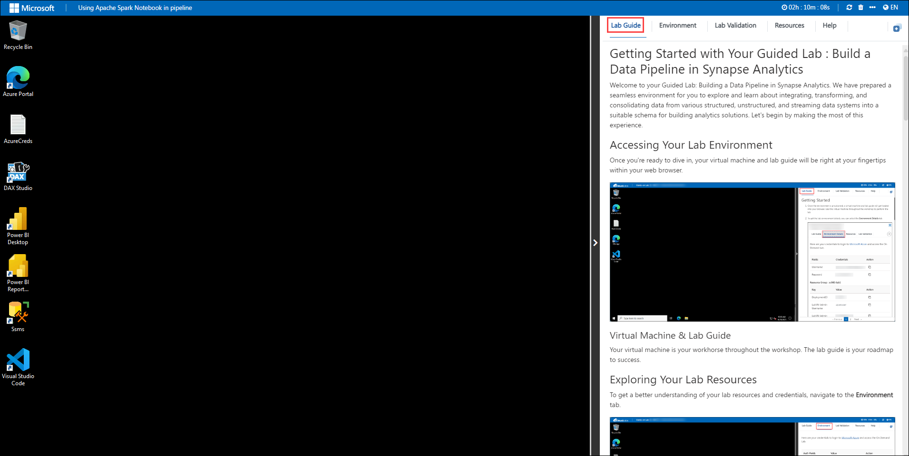
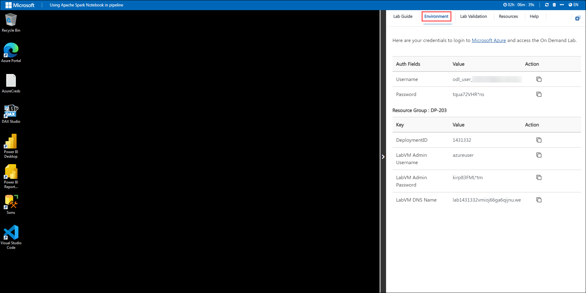
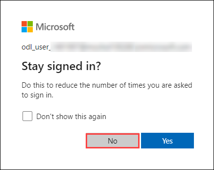
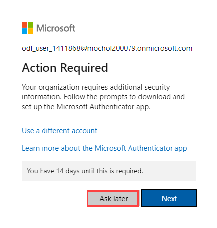
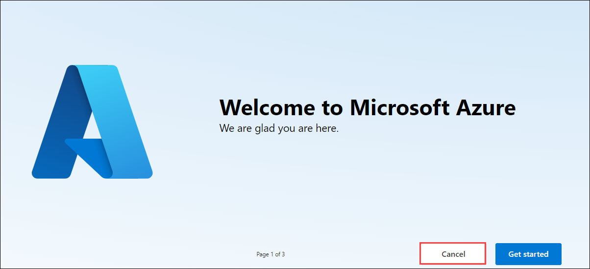

# Secure Hybrid Cloud

### Overall Estimated Duration: 240 Minutes

## Overview

In this hands-on lab, you will explore Microsoft Defender for Cloud, enabling robust cloud security management and threat protection. Microsoft Defender for Cloud provides a comprehensive platform for securing cloud resources, integrating security monitoring, policy management, and compliance enforcement. You will begin by enabling and configuring security features, setting up security policies, and linking compliance standards. You will then explore security alerts and incidents to understand threat detection before implementing advanced cloud defense mechanisms such as Just-In-Time (JIT) access, adaptive application control, and file integrity monitoring. The lab includes steps to analyze security recommendations, remediate vulnerabilities, and integrate Defender for Cloud with SIEM solutions for centralized security management. By completing this lab, you will gain practical experience in leveraging Microsoft Defender for Cloud to enhance security posture and protect cloud workloads effectively.

## Objective

This lab is aimed at providing learners hands-on experience with Microsoft Defender for Cloud by enabling security features, exploring dashboards, managing policies, and enhancing security posture. By the end of this lab, you will be able to:

- **Get started with Microsoft Defender for Cloud:** Learn how to enable Microsoft Defender for Cloud in your Azure subscription, log into the Azure Portal, and set up the default security policies necessary for monitoring and securing your cloud environment.

- **Explore Microsoft Defender for Cloud Dashboard:** Gain insights into the security posture of your cloud environment through various dashboards including Secure Score, Regulatory Compliance, and Inventory. Understand how to navigate these dashboards to view security alerts, assessed resources, and compliance status.

- **Manage Security Policies:** Dive into the creation, modification, and assignment of security policies including Azure Policy integration, creating exemptions, enforcing policies, and developing custom policies to fit specific organizational needs.

- **Understand Regulatory Compliance:** Explore the Regulatory Compliance dashboard to assess and improve your environment's compliance with various standards. Learn to add new compliance standards and create custom benchmarks for tracking compliance.

- **Improve Security Posture:** Utilize vulnerability assessments for containers, automate security responses through workflow automation, and query secure scores using Azure Resource Graph for a comprehensive view of your security health across multiple subscriptions.

- **Handle Security Alerts:** Validate alerts, manage alert suppression to reduce noise from irrelevant alerts, and use the Microsoft Graph Security API to access security alert data programmatically.

- **Export Security Data:** Configure continuous export of security data to Log Analytics or other SIEM solutions for integrated monitoring and analysis. Learn to set up integration with Microsoft Sentinel for advanced security incident management.

- **Implement Advanced Cloud Defense:** Use Just-In-Time VM access to minimize the attack surface, apply adaptive application controls to manage software execution, and enable File Integrity Monitoring to detect unauthorized changes in your environment.

## Prerequisites

Participants should have:

- **Security Fundamentals:** Understanding of cybersecurity principles, including threat detection, vulnerability management, and security policy enforcement.

- **Knowledge of Azure Security Services:** Experience with Azure services related to security, such as Azure Policy, Azure Monitor, or Azure Sentinel.

- **SQL for Security Data Analysis:** Skills in querying and analyzing security logs and data using SQL, particularly in the context of security event analysis.

- **Basic Networking Concepts:** Understanding of network security concepts, including firewalls, network segmentation, and access controls in cloud environments.

- **Cloud Platform Familiarity:** Hands-on experience with Azure, including working with Azure Virtual Machines, Azure Container Registry, and Azure Log Analytics.

## Architecture

The architecture for securing cloud environments with Microsoft Defender for Cloud involves a comprehensive security framework built around Azure's cloud infrastructure. It leverages Azure's scalable and resilient cloud services to monitor and protect resources across various layers. At its core, the setup includes continuous security monitoring where data from Azure services like Virtual Machines, Azure Container Registry, and SQL databases is collected and analyzed for threats. Microsoft Defender for Cloud uses this data to generate security alerts, recommendations, and compliance reports. Security policies are enforced through Azure Policy, ensuring that configurations meet security standards. For advanced threat detection, it integrates Adaptive Application Control and Just-In-Time access for VMs, reducing the attack surface. Additionally, it employs Azure Sentinel for SIEM capabilities, providing centralized security management with workflow automation for incident response. This architecture ensures robust security posture management, compliance tracking, and threat mitigation across the cloud environment, facilitating a secure, scalable, and efficient security solution.

## Architecture Diagram

   

## Explanation of Components

The architecture for this lab involves the following key components:

- **Microsoft Defender for Cloud:** A comprehensive security management platform that provides continuous monitoring, threat detection, and security recommendations for cloud resources, ensuring compliance and protection against vulnerabilities.

- **Security Policies and Compliance:** Managed through Azure Policy, these enforce security configurations across cloud resources, ensuring alignment with industry standards and regulatory frameworks while enhancing governance.

- **Threat Detection and Security Alerts:** Microsoft Defender for Cloud continuously analyzes data from Azure services such as Virtual Machines, Azure Container Registry, and SQL databases to detect anomalies, generate security alerts, and provide actionable recommendations.

- **Just-In-Time (JIT) Access:** A security feature that minimizes exposure to potential threats by restricting access to Virtual Machines, allowing temporary access only when necessary, reducing the attack surface.

- **Adaptive Application Control:** An AI-driven security mechanism that defines and enforces rules on allowed applications within cloud environments, preventing unauthorized or malicious software from running on virtual machines.

- **Azure Sentinel Integration:** A cloud-native SIEM and SOAR solution that aggregates security data, enables real-time threat intelligence, and automates incident response workflows, providing centralized security monitoring and investigation capabilities.

## Getting Started with Lab
 
Once you're ready to dive in, your virtual machine and lab guide will be right at your fingertips within your web browser.
 

### Virtual Machine & Lab Guide
 
Your virtual machine is your workhorse throughout the workshop. The lab guide is your roadmap to success.
 
## Exploring Your Lab Resources
 
To get a better understanding of your lab resources and credentials, navigate to the **Environment** tab.
 

 
## Utilizing the Split Window Feature
 
For convenience, you can open the lab guide in a separate window by selecting the **Split Window** button from the Top right corner.
 

 
## Managing Your Virtual Machine
 
Feel free to start, stop, or restart your virtual machine as needed from the **Resources** tab. Your experience is in your hands!
 

## **Lab Duration Extension**

1. To extend the duration of the lab, kindly click the **Hourglass** icon in the top right corner of the lab environment. 

    

    >**Note:** You will get the **Hourglass** icon when 10 minutes are remaining in the lab.

2. Click **OK** to extend your lab duration.
 
   

3. If you have not extended the duration prior to when the lab is about to end, a pop-up will appear, giving you the option to extend. Click **OK** to proceed.
 
## Let's Get Started with Azure Portal
 
1. On your virtual machine, click on the Azure Portal icon as shown below:
 
   .png)

 
2. You'll see the **Sign into Microsoft Azure** tab. Here, enter your credentials:
 
   - **Email/Username:** <inject key="AzureAdUserEmail"></inject>
 
       
 
3. Next, provide your password:
 
   - **Password:** <inject key="AzureAdUserPassword"></inject>
 
      
 
4. If prompted to stay signed in, you can click "No."

    

5. If **Action required** pop-up window appears, click on **Ask later**.

   

6. If a **Welcome to Microsoft Azure** pop-up window appears, simply click "Cancel" to skip the tour.

    

## Support Contact
 
The CloudLabs support team is available 24/7, 365 days a year, via email and live chat to ensure seamless assistance at any time. We offer dedicated support channels tailored specifically for both learners and instructors, ensuring that all your needs are promptly and efficiently addressed.

Learner Support Contacts:
- Email Support: cloudlabs-support@spektrasystems.com
- Live Chat Support: https://cloudlabs.ai/labs-support

Click "Next" from the bottom right corner to embark on your Lab journey!
 
   .png)
 
### Happy Learning!!