# **Getting Started with Your AIW-Security-Immersion Workshop**
 
Welcome to your AIW-Security-Immersion workshop! We've prepared a seamless environment for you to explore and learn about Azure services. Let's begin by making the most of this experience:
 
## **Accessing Your Lab Environment**
 
Once you're ready to dive in, your virtual machine and lab guide will be right at your fingertips within your web browser.
 
   .png)

### **Virtual Machine & Lab Guide**
 
Your virtual machine is your workhorse throughout the workshop. The lab guide is your roadmap to success.
 
## **Exploring Your Lab Resources**
 
To get a better understanding of your lab resources and credentials, navigate to the **Environment Details** tab.
 
   .png)
 
## **Utilizing the Split Window Feature**
 
For convenience, you can open the lab guide in a separate window by selecting the **Split Window** button from the Top right corner.
 
   .png)
 
## **Managing Your Virtual Machine**
 
Feel free to start, stop, or restart your virtual machine as needed from the **Resources** tab. Your experience is in your hands!
 
   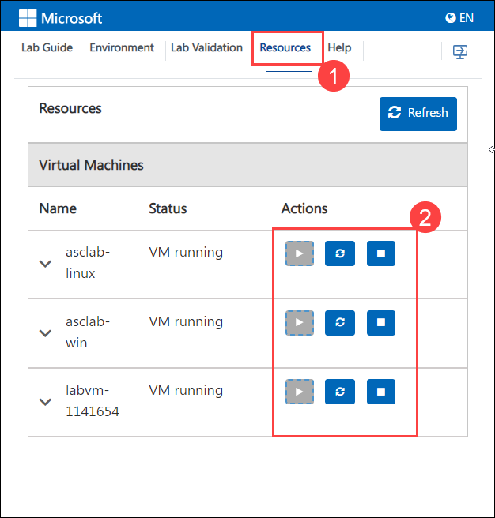
 
## **Let's Get Started with Azure Portal**
 
1. On your virtual machine, click on the Azure Portal icon as shown below:

   .png)

2. You'll see the **Sign into Microsoft Azure** tab. Here, enter your credentials:
 
   - **Email/Username:** <inject key="AzureAdUserEmail"></inject>
   
        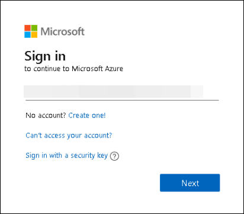 
 
3. Next, provide your password:
 
   - **Password:** <inject key="AzureAdUserPassword"></inject>
 
        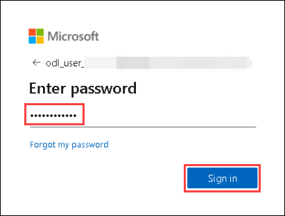 
 
1. You may get a **Help us protect your account** box, on that click on **Ask later**.

    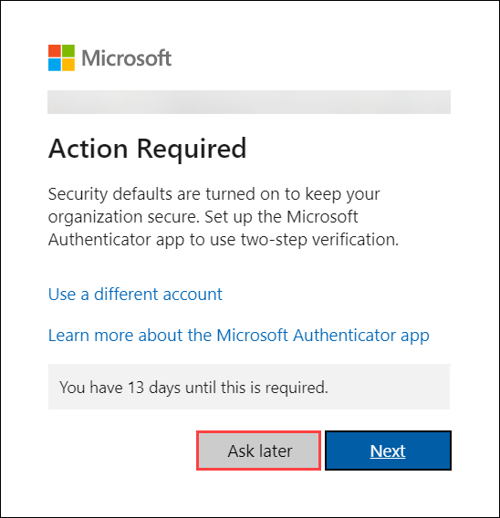 
 
1. First-time users are often prompted to request access to **Stay Signed in**. If you see any such pop-up window, click on **No**.

1. If you see any additional pop-up like, You have free **Azure Advisor recommendations!** Close the window to continue the lab. 

## Exercise 2: Enabling Microsoft Defender for Cloud

In this exercise, you will be getting started with the functionality of Microsoft Defender for Cloud and how to enable Microsoft Defender for Cloud on a subscription.

### Subscription upgrade and agent installation

1. Type **Microsoft Defender for Cloud** in the search box on top of the **Azure Portal** and click to open it.

    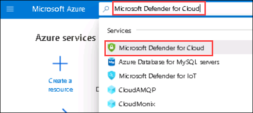

1. Click on the **Getting started (1)** from the left pane. Click on the **Upgrade (2)** tab, select your **Log Analytics workspace as asclab-la-XXXXX (3)** and click **Upgrade (4)**.

    > **Note:** If you are not able to see Log Analytics workspace then it means your subscription is already upgraded, In this case, you can skip steps 2, and 3 and continue from step 4. Also, you might have to wait for a few seconds to have the upgrade button visible.

    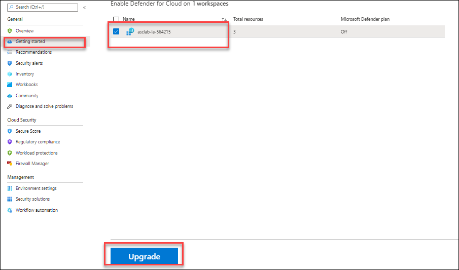    

1. Click on **Install agents**. 

    
   
    > **Note:** If the button is greyed out, then it's already set to **On** and agents are already installed in this case you can move on to the next step.

    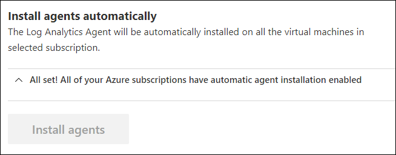

### Configure the data collection settings in Microsoft Defender for Cloud

1. Go to the **Microsoft Defender for Cloud** and Click on the **Environment settings** page and select your **Azure subscription**.

    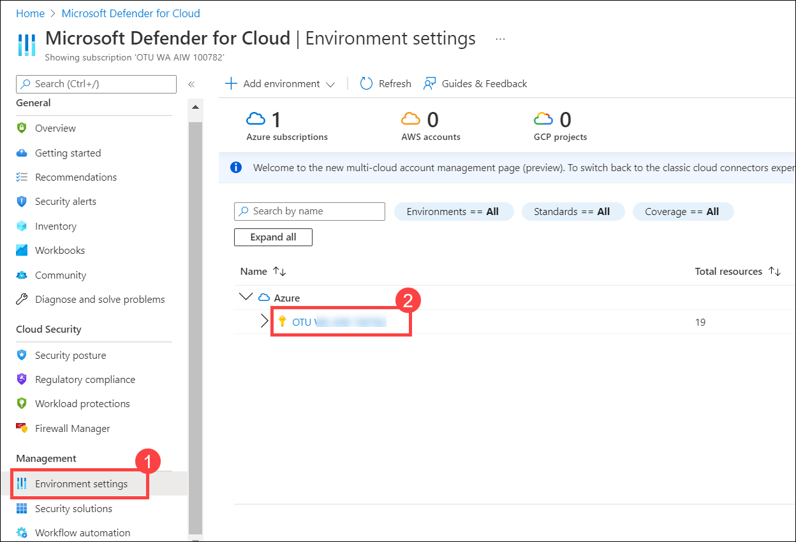

1. From **Settings | Defender Plans** page, Navigate to  **Settings & monitoring**.

    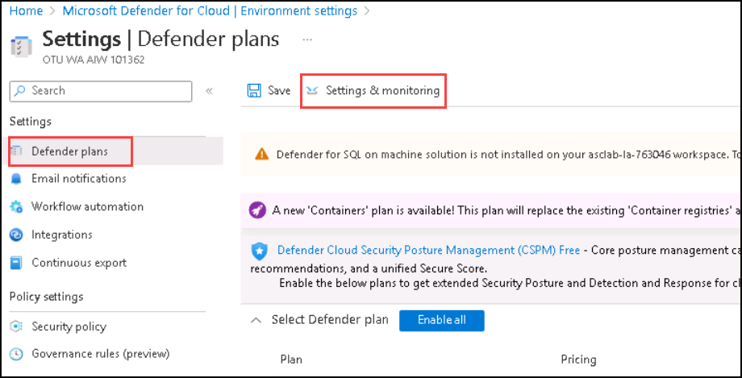

1. On the **Settings & monitoring** toggle the status of **Log Analytics agent/Azure Monitor agent** to **On** (if it is not already set to On). Click on **Edit configuration** under the **Configuration** header of the Log Analytics agent/Azure Monitor agent.

    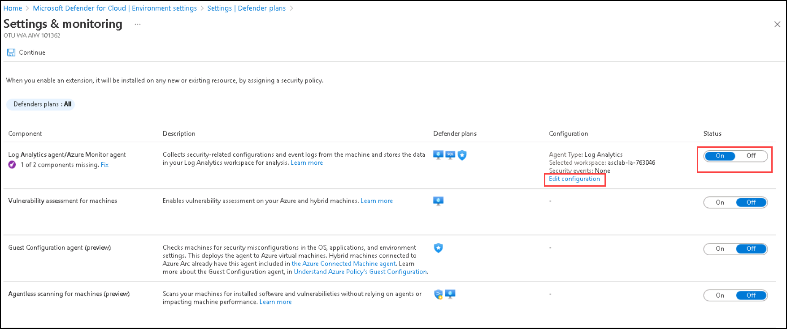
    
1. A new window of Auto-provisioning configuration is opened. Select **Log Analytics Agent (Default)** for **Agent type**, under **Workspace selection** select **Custom workspace** and choose your workspace from the drop-down menu and click **Apply**.

     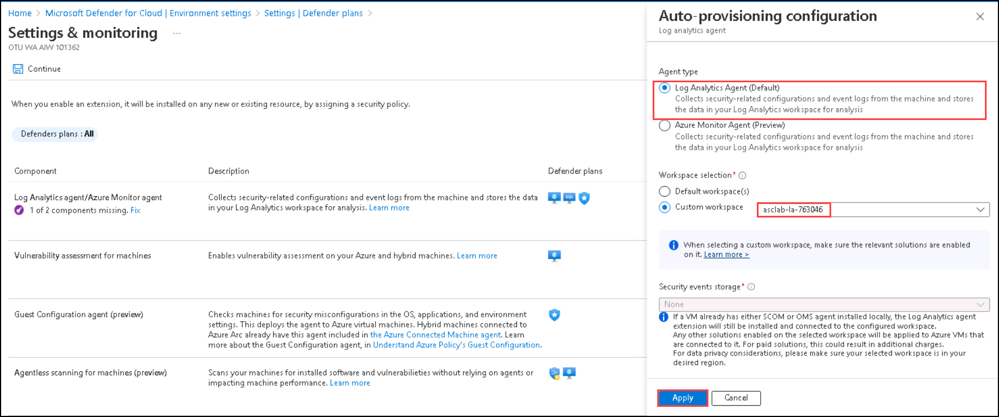
  

1. Once all the configurations are made, click on **Continue**.
    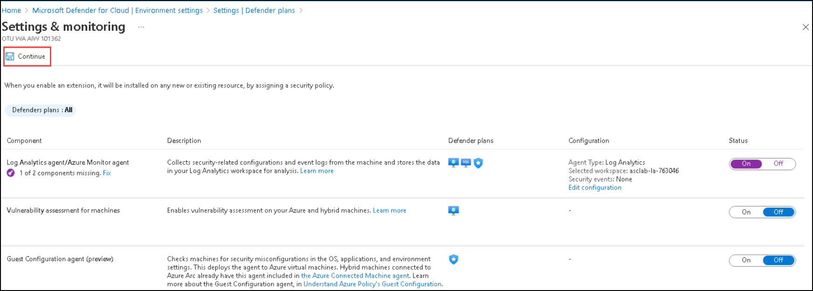
    
1. Click on Save. 

    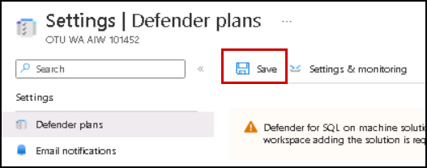

 

> Please notice:
> * To get the full functionality of Microsoft Defender for Cloud, both subscription and Log Analytics workspace should be enabled for Defender. Once you enable it,  the required Log Analytics solutions will be added to the workspace.
> * Before clicking on the Upgrade button, you can review the total number of resources you are going to enable on Microsoft Defender for Cloud.
> * You can enable the Microsoft Defender for Cloud trial for 30 days on a subscription-only, if not previously used.

## Exercise 3: Creating Microsoft Defender for Cloud Default policy.

In this exercise, You will create the Microsoft Defender for Cloud default policy in security policy under  Microsoft Defender for Cloud.

1. From Azure Portal, search for **Microsoft Defender for Cloud** and select it.
   
1. In Microsoft Defender for Cloud blade Click on the  **Environment Settings** and select your subscription.

    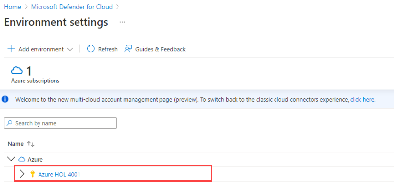
   
1. Click on **Security Policy (1)** You'll notice that in **Default initiative** (2) the **Microsoft Defender for Cloud Default policy (3)** has been created automatically. Explore the policy by clicking on the policy.

    

   > **Note:** This policy is enabled by default on your subscription as per Microsoft Defender for Cloud recommendations. This is the default set of policies monitored by Microsoft Defender for Cloud. It is automatically assigned as part of onboarding to Microsoft Defender for Cloud. The default assignment contains only audit policies. For more information, please visit https://aka.ms/ascpolicies. Also if you see one more policy with an ASC default name, please ignore that.
   > **Note**: Incase if you don't see the default policy, follow the below steps:
     
     - Under **Default initiative**, click on **Assign Policy**

        
        
     - Under **Basics** tab, enter the **Assignment name** as **Microsoft Defender for Cloud default <Subscription ID>**.
      
       
      
    - Click on **Review + Create**, followed by **Create**.
    
## Summary

  In this module, you have learned how to enable Microsoft Defender for Cloud. Now you can move on to the next module by clicking on the Next button at the bottom right of this page.

 
