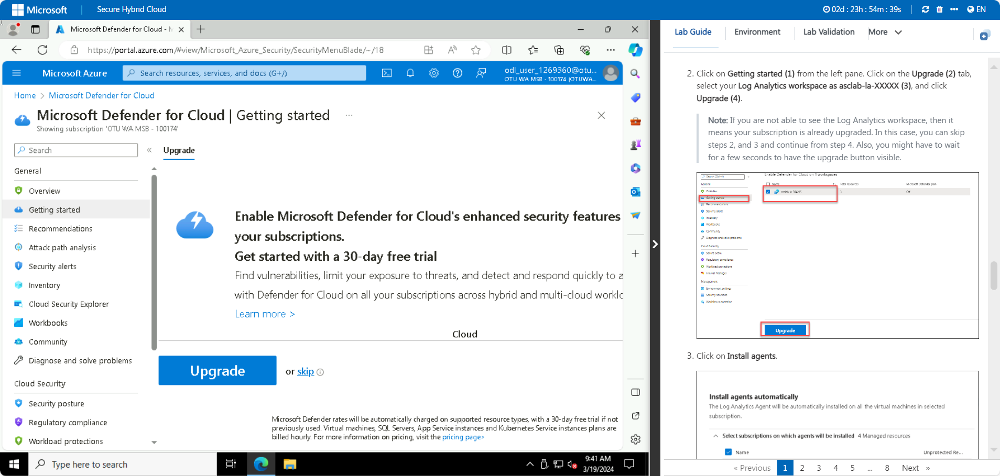
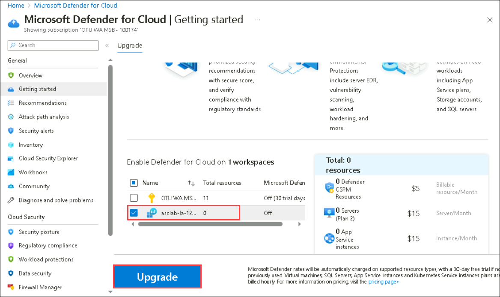
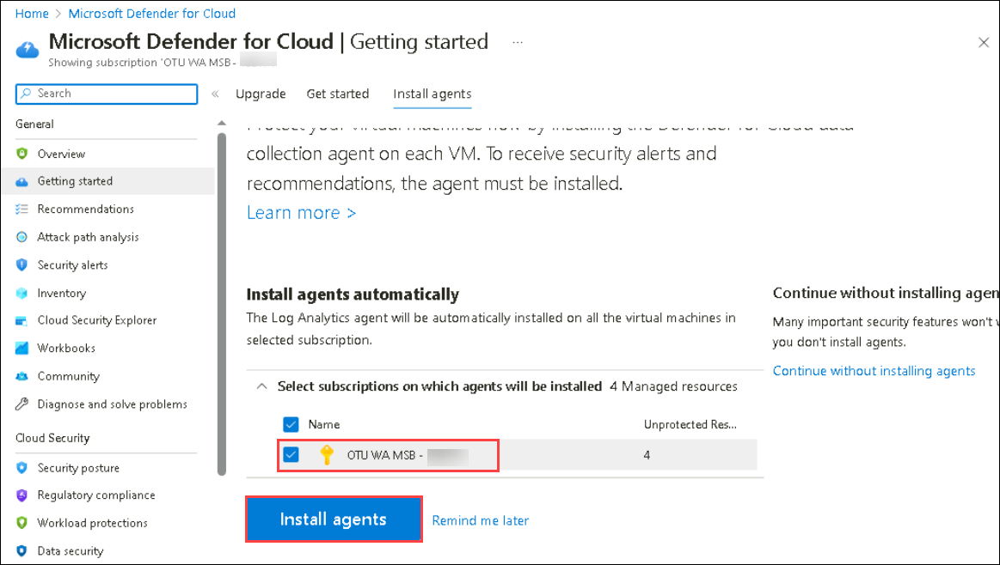
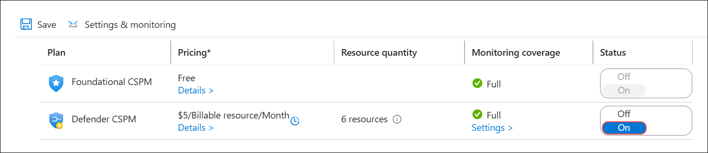
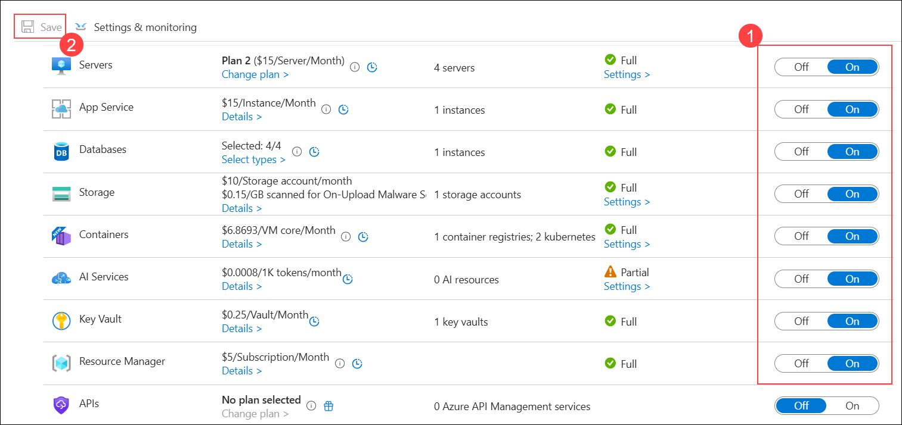
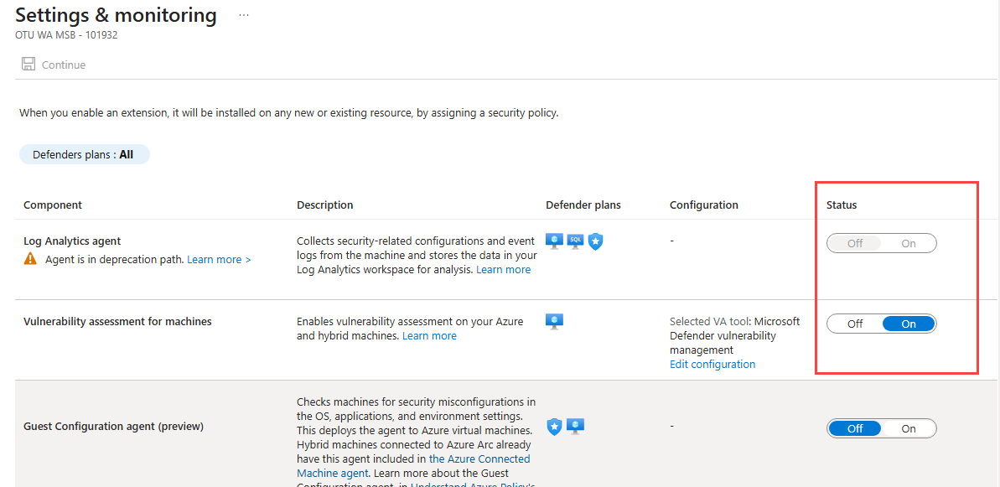
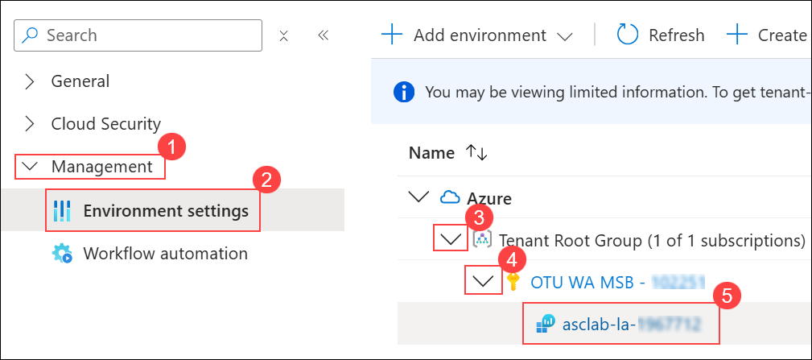
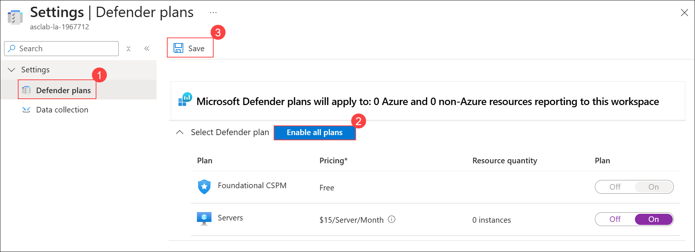

# Module 1 – Getting Started with the Environment

## Overview

In this module, you will learn how to enable Microsoft Defender for Cloud in your subscription

## Objectives

You will be performing the following activities to achieve the goal:

  - Exercise 1: Enabling Microsoft Defender for Cloud
  - Exercise 2: Creating Microsoft Defender for Cloud Default Policy

## Exercise 1: Enabling Microsoft Defender for Cloud

In this exercise, you will be getting started with the functionality of Microsoft Defender for Cloud and how to enable Microsoft Defender for Cloud on a subscription.

### Subscription upgrade and agent installation

1. Type **Microsoft Defender for Cloud** in the search box on top of the **Azure Portal** and click to open it.

    

1. Click on **Getting started (1)** from the left pane. Click on the **Upgrade (2)** tab, scroll down select your **Log Analytics workspace as asclab-la-XXXXX (3)**, and click **Upgrade (4)**.

    > **Note:** If you are not able to see the Log Analytics workspace, then it means your subscription is already upgraded. In this case, you can skip steps 2, and 3 and continue from step 4. Also, you might have to wait for a few seconds to have the upgrade button visible.

    

     

1. Refresh the browser and under Install agents tab, select your subscription and click on **Install agents**. 

    
   
    > **Note:** If the button is greyed out, then it's already set to **On** and agents are already installed. In this case, you can move on to the next step.

    

### Configure the data collection settings in Microsoft Defender for Cloud

1. Go to the **Microsoft Defender for Cloud** page, click on the **Environment settings** page, and select your **Azure subscription**.

    
    
1. Once all the configurations are made, click on **Save**. 

    

    

1. From the **Settings | Defender Plans** page, navigate to **Settings & monitoring**.

    

1. On the **Settings & monitoring** tab, toggle the status of **Log Analytics agent** to **On**.

    

1. In the **Microsoft Defender for Cloud** page, do the following:

   - Expand **Management (1)**.
   - Select **Environment settings (2)**.
   - Expand **Tenant Root Group (3)**.
   - Expand your **subscription (4)**.
   - Select the workspace **(5)**.

        

1. On the **Defender plans** page, select **Defender plans (1)**, click **Enable all plans (2)**, and then click **Save (3)**.

    

 

> Please notice:
> * To get the full functionality of Microsoft Defender for Cloud, both the subscription and Log Analytics workspace should be enabled for Defender. Once you enable it,  the required Log Analytics solutions will be added to the workspace.
> * Before clicking on the Upgrade button, you can review the total number of resources you are going to enable on Microsoft Defender for Cloud.
> * You can enable the Microsoft Defender for Cloud trial for 30 days on a subscription-only basis if it has not previously been used.

## Exercise 2: Creating Microsoft Defender for Cloud Default Policy

In this exercise, you will create the Microsoft Defender for Cloud default policy in the security policy under Microsoft Defender for Cloud.

1. From the Azure Portal, search for **Microsoft Defender for Cloud** and select it.

    
   
1. In Microsoft Defender for Cloud Blade, click on the **Environment Settings** and select your subscription.

    
   
1. Click on **Security policies (1)** under Settings You'll notice that **Microsoft cloud security benchmark (2)** has been created automatically. Explore the policy by clicking on the policy.

    
   
   > **Note**: Verify that the Toggle button status for the Microsoft cloud security benchmark is set to **On**. If the status option isn't visible, try zooming out in your browser.
## Summary

In this module, you have learned how to enable Microsoft Defender for Cloud. Now you can move on to the next module by clicking on the Next button at the bottom right of this page.
