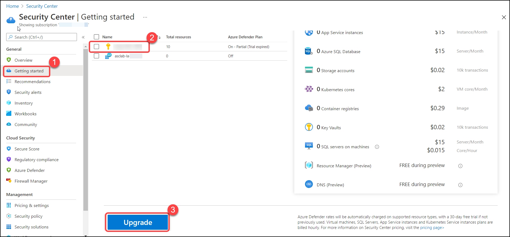
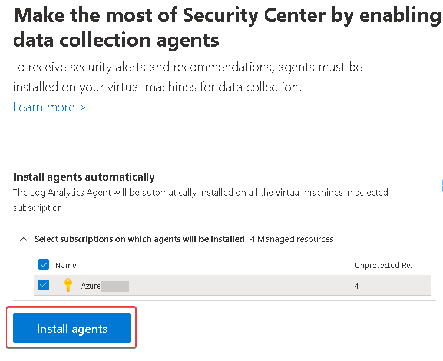
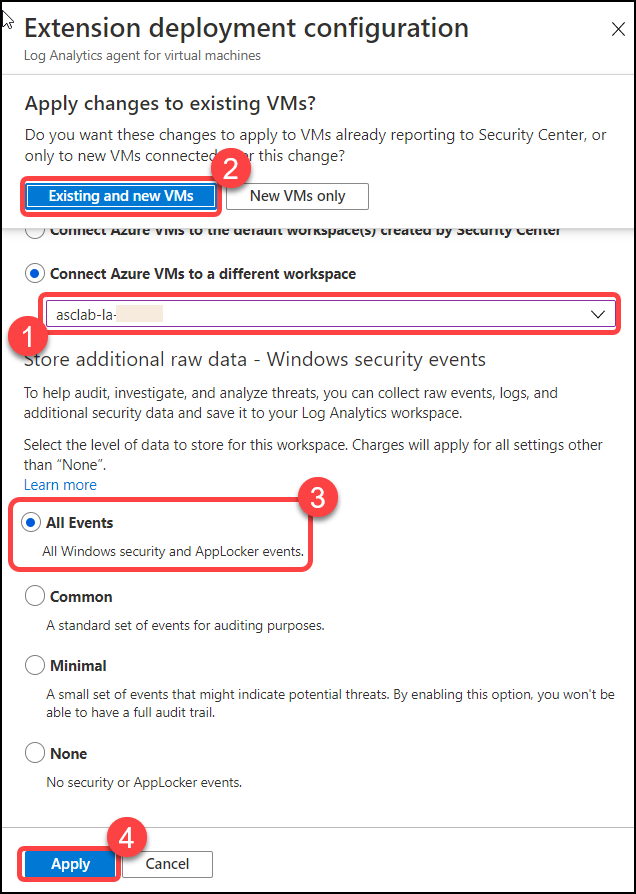

# Module 1 – Getting started with the Environment

## Overview

In this exercise, you will learn how to enable Azure Defender in your subscription

You will be performing the following activities to achieve the goal.

  - Login to Azure Portal to access your subscription
  - Upgrade your subscription to enable Azure Defender Plan
  - Configure data collection in ASC

## Exercise 1: Log in to Azure Portal

In this exercise you will learn how to login to the Azure Portal in the JumpVM using user credentials provided under the Environment Details to access the Azure Portal

### Instructions 

1. After the environment is provisioned successfully your browser will load up the **Lab Guide** along with a virtual machine called **JumpVM**. This virtual machine will be your platform throughout the course of the workshop. In case you do not see the JumpVM load up on the left side of the screen, navigate to the **Virtual Machines** tab on the top right of the **Lab Guide** and check the status of the virtual machine. Alternately, you can directly RDP into JumpVM using the credentials provided in the **Environment Details** tab.

2. All user credentials for accessing the **Azure Portal** can be viewed under the **Environment Details** tab for ease of access. Do note that the same information will also be sent to your registered email address. 

3. The Lab Guide can also be opened on a separate window by selecting the **Split Window** icon in the bottom right corner. This will result in the window detaching from the right side providing more on-screen space for your virtual machine.

### Login to Azure Portal 

1. In the JumpVM, Launch **Azure Portal** using the desktop icon.  

2. Now you should be on the **Microsoft Azure** login screen. Enter the following username and click on **Next**.  

   * Email/Username: <inject key="AzureAdUserEmail"></inject> 

    

3. Enter the following password and click on **Sign in**. 

   * Password: <inject key="AzureAdUserPassword"></inject> 

    

4. First time users are often prompted requesting access to **Stay Signed in**. If you see any such pop-up window, click on **No**.

5. If you see any additional pop-up like, You have free **Azure Advisor recommendations!** Close the window to continue the lab. 

6. Click on **Maybe Later** on the **Welcome to Microsoft Azure** window and skip the tour.

## Exercise 2: Enabling Azure Defender

In this exercise you will be getting started with functionality of Azure Security Center and Azure Defender and how to enable Azure Defender on a subscription.

### Subscription upgrade and agents installation

1. Type **Security Center** in the search box on top of the **Azure Portal** and click to open it.

2. Click on the **Getting started** from the left pane. Click on the **Upgrade Tab**, select your subscription and click **Upgrade**.

3. Click on **Install agents**, if the button is greyed out, then it's already set to **On**.

4. Return to Azure security Center blade and click on **Pricing & settings** from the left pane.

5. Your subscription should be listed here and the Azure Defender plan should appear **On** (if it does not, close your browser session and open a new one).

> Notice that you enabled Azure Defender at a subscription level, but Log Analytics workspace pricing is still set **Off** (means Azure Defender is OFF).

### Configure the data collection settings in ASC

1.	Type **Security Center** in the search box on top of the **Azure Portal** and click to open it.

2. Click on the **Pricing and Settings** from the left pane, select the Log Analytics workspace named **asc-lab-{DeploymentID}**

    **Note**: Deployment ID can be obtained from the Lab **Environment Details** Tab.

3. On the **Azure Defender Plans** page, select **Azure Defender on** and click **Save**. Now both subscription and Log Analytics workspace should be set to **On** for the Azure Defender plan.

4. Go back to the **Pricing & Setting** and drill down into your **Azure subscription**.

5. Navigate to **Auto provisioning**.

6. On the **Auto provisioning - Extensions** page, set **Log Analytics agent for Azure VMs** to **On** (if it is not already set to On)

7. Click on **Edit configuration**.

8. On the workspace configuration section, use the **Connect Azure VMs to a different workspace** option to select your workspace **asc-lab-{DeploymentID}**.

9. When **Apply changes to existing VMs** popup window is prompted, select **Existing and new VMs**.

10. Under **Store additional raw data - Windows security events** section, select **All Events** option.

11. Click on **Apply**.

12. And finally, click on **Save**.

 

> Please notice:
> * To get the full functionality of Azure Security Center and Azure Defender, both subscription and Log Analytics workspace should be enabled for Defender. Once you enable it,  the required Log Analytics solutions will be added to the workspace.
> * Before clicking on the Upgrade button, you can review the total number of resources you are going to enable on Azure Defender.
> * You can enable Azure Defender trial for 30-days on a subscription-only, if not previously used.
> * To enable Azure Defender on a subscription, you must be assigned the role of Subscription Owner, Subscription Contributor, or Security Admin.

## Summary

  In this module, you have learned how to enable Azure Defender. Now you can move on to the next module by clicking on the Next button at the bottom right of this page.
