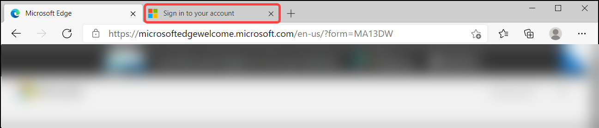

# Module 1 – Getting started with the Environment

## Exercise 1: Log in to Azure Portal

### Instructions 

 
 

1. On the left side of the screen, a virtual machine (JumpVM) is already loaded. You have to use this virtual machine throughout the workshop to perform the lab. If you are unable to view the Virtual Machine, check if the virtual machines are running by Navigating to the Virtual Machines tab on top right of the lab guide. Also, you can directly RDP into the Virtual Machine using the Details of labvm provided in the Environment Details tab.

 
 

2. To get the lab environment details, you can select the **Environment Details** tab. Additionally, the credentials will also be emailed to your email address provided at registration. 

  

3. You can also open the Lab Guide on Separate full window by selecting the **Split Window** icon in the bottom right corner. 

  

### Login to Azure Portal 

 
 

1. In the JumpVM, Launch Azure Portal using the shortcut available on desktop.  

    

2. Select **Get started** for Edge browser prompts. 

 
 

    

    

3. On the next window, click on **Confirm**. 

 
 

    

    

4. Please close the pop-up by clicking **Continue without signing-in** . 

 
 

    

    

5. Now, you will see two tabs opened by default in the edge browser, close the first tab named **Microsoft Edge**. 

 
 

    

    

6. On the **Sign into Microsoft Azure** tab, you will see the login screen, enter the following email/username, and, then click on **Next**.  

   * Email/Username: <inject key="AzureAdUserEmail"></inject> 

    

    

      

7. Now enter the following password and click on **Sign in**. 

   * Password: <inject key="AzureAdUserPassword"></inject> 

    

    

      

8. If you see the pop-up **Stay Signed in?**, click on No 

 
 

9. If you see the pop-up **You have free Azure Advisor recommendations!**, close the window to continue the lab. 

 
 

10. If a **Welcome to Microsoft Azure** popup window appears, click **Maybe Later** to skip the tour.

## Exercise 2: Enabling Azure Defender

### Subscription upgrade and agents installation
1. Open **Azure Portal** and navigate to **Security Center** blade.

2. Click on **Getting started** page from the left pane, On the **Upgrade** Tab, select subscription (Azure subscription 1) and press **Upgrade**.

3. Click on **Install agents**, if the button has been grayed out, then it's already set to **On**.

4. Return to Azure security Center blade and Click on **Pricing & settings**.

5. Your subscription (Azure subscription 1) should be listed and Azure Defender plan should be **On (partial)** (if it does not, close your browser session and open a new one).

> Notice that you enabled Azure Defender at a subscription level, but Log Analytics workspace pricing is still set on Free (means Azure Defender is OFF).

### Configure the data collection settings in ASC
1. On **Pricing and Settings** page, press on the Log Analytics workspace named **asc-lab-xxx**

2. On the Azure Defender Plans page, select **Azure Defender on** and press **Save**. Now both subscription and Log Analytics workspace should be set to **On** for Azure Defender plan.

3. Go back to the **Pricing & Setting** and drill down into your **Azure subscription** (Azure subscription 1).

4. Navigate to **Auto provisioning**

5. On the **Auto provisioning - Extensions** page, set **Log Analytics agent for Azure VMs** to **On** (if it's not already set to On)

6. Click **Edit configuration**.

7. On the workspace configuration section, use the **Connect Azure VMs to a different workspace** option to select your workspace **asc-lab-xxx** (which has been created by the ARM template).

8. Under **Store additional raw data - Windows security events** section, select **All Events** option.

9. Click on **Apply**.

10. Click on **Save**.

 

> Please notice:
> * To get the full functionality of Azure Security Center and Azure Defender, both subscription and Log Analytics workspace should be enabled for Defender. Once you enable it, under the hood the required Log Analytics solutions will be added to the workspace.
> * Before clicking on the Upgrade button, you can review the total number of resources you are going to enable Azure Defender on.
> * You can enable Azure Defender trial for 30-days on a subscriptions only if not previously used.
> * To enable Azure Defender on a subscription, you must be assigned the role of Subscription Owner, Subscription Contributor, or Security Admin.

### Summary

  * In this module, you have learned how to enable Azure Defender. Now you can move on to the next module.
