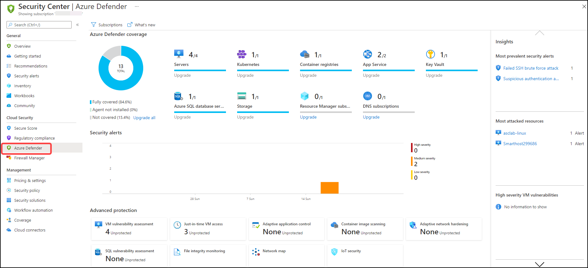
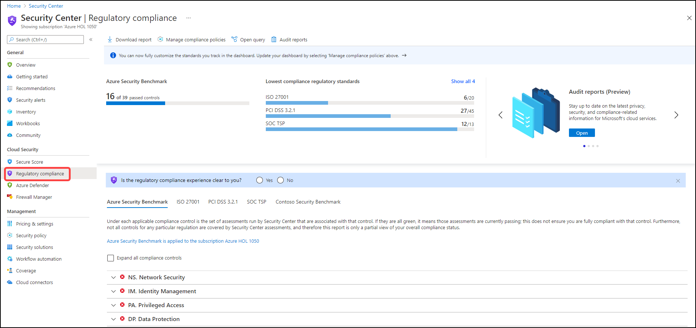
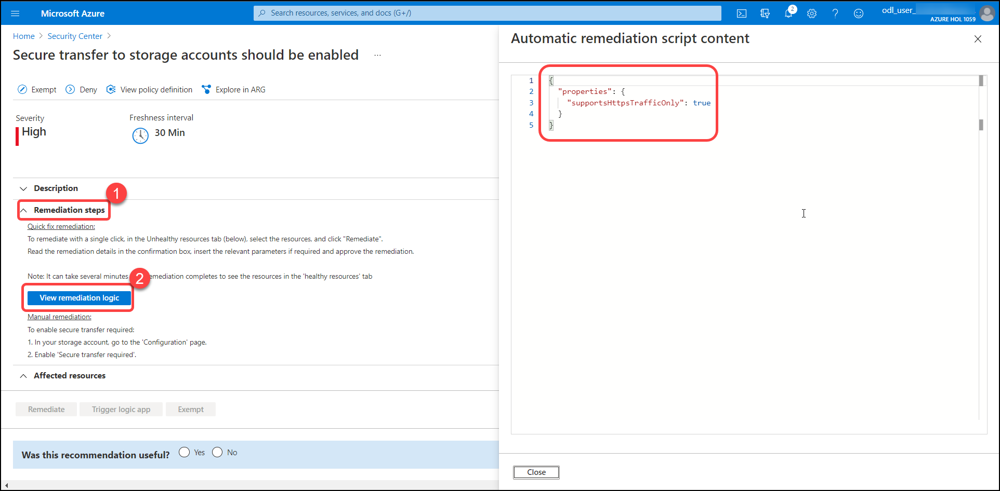
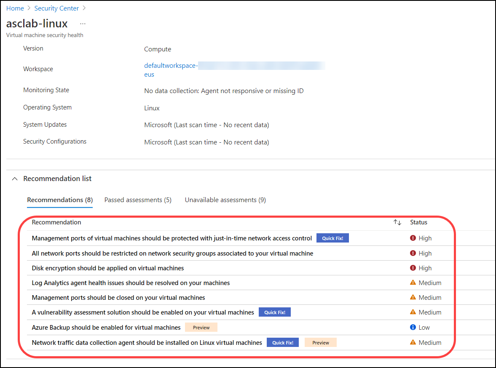

# Module 2 - Exploring Azure Security Center

### Overview

In this exercise, you will explore the Azure Security Center Dashboard features overview.

You will be performing the following activities to achieve the goal.

* Overview of Security Center dashboard features **Azure Secure Score, Regulatory Compliance and Azure Defender**.
* Exploring Security Controls and Recommendations
* Exploring the Inventory capability

### Exercise 1: Understanding Azure Security Center dashboard

1.	Launch **Azure Portal** using the desktop icon on the JumpVM and login with the Azure credentials from the Lab **Environment Details** tab if not logged in already.

2.	Type **Security Center** in the search box located on the top of the **Azure Portal** page and click to open it.

3.	The Security Center Overview page provides a unified view for security professionals. This page contains detailed insights on the security posture on its dedicated dashboard and includes multiple independent cloud security pillars such as- **Azure Secure Score, Regulatory Compliance and Azure Defender**.

> ❗ Important: <br>
> It takes few hours for all tiles on the Overview Page to update.


4.	Note that the **Subscription** icon on the **top menu bar** allows you to view and filter subscriptions. In this lab, we will use only one subscription, but for your reference, selecting different/additional subscriptions will adjust the interface to reflect the security posture for the specified subscription.

5.	Click on the **What’s new** button – a new tab will open with the latest release notes where you can stay updated on the new features, bug fixes and more.

6.	Note the **high-level numbers** at the top menu; This view allows you to see a summary of your subscriptions, assessed resource, active recommendations and security alerts.


7.	From the top menu bar, **click** on **Azure subscriptions**.

8.	On the **Coverage** page, note that your Subscription is listed as **fully covered** – which means that your subscription is covered by Azure Defender. (you should also see a message: *Looking good! The subscriptions below are fully protected*)


> ⭐ Good to know: <br>
> This page shows a list of subscriptions and their coverage type. You can use this page to find subscriptions that are not covered by Azure Security Center and identify “shadow IT” subscriptions.

9.	Go back to the **Overview** page, and look at the **Secure Score** tile, you can see your current score along with the number of completed controls and recommendations. Clicking on this tile will redirect you to drill down view across subscriptions.


> ⭐ Good to know: <br>
> The higher the score, the lower the identified risk level.

10.	On the **Azure Defender** tile, you can see the coverage of your connected resources (for the currently selected subscriptions) and the recent alerts, color-coded by severity. Your current resource coverage should be **100%** which means **full protection**. Clicking on this tile will redirects you Azure Defender dashboard.





11.	On the **Regulatory Compliance** tile, you can get insights into your compliance posture based on continuous assessment of both Azure and hybrid cloud environments. This tile shows the following standards which are SOC TSP, ISO 27001, PCI DSS 3.2.1 and Azure Security Bench. Clicking on this tile will redirect you to Regulatory Compliance dashboard – where you can add additional standards and explore the current ones.



12.	The next tile on the overview page is the **Assessed resources** which is essentially the **Inventory** – it shows the number of unmonitored VMs alongside the total covered resources - **you should expect to have zero unmonitored VMs**.
Resources are divided by their health status. Clicking on this tile will redirects you to the asset inventory dashboard where you can explore your resource and their security posture – see a dedicated exercise below.

> ❗ Important: <br>
> Unmonitored VMs are considered as virtual machines that have Log Analytics agent deployed, but the agent isn't sending data or has other health issues.


### Exercise 2: Exploring Secure Score and Recommendations

**Exploring Secure Score**

Previously, we explored the Secure Score tile on the overview page. Now let’s dive into this capability and the associated recommendations. Azure Security Center mimics the work of a security analyst, reviewing the security recommendations and applying advanced algorithms to determine how crucial each recommendation is. Azure Security Center constantly reviews the active recommendation and calculates the score based on them. All findings are aggregated into a single score (Secure Score) which measures your current security posture of your subscription/s; the higher the score, the lower the identified risk level.
Exploring secure score

1.	Type **Security Center** in the search box located on the top of the **Azure Portal** page and click to open it.

2.	From the left navigation pane, under the **Cloud Security** section, Select the **Secure Score** button.

3.	On the Secure Score page, **review your current overall secure score**.

> ⭐ Notice: <br>
> The score is shown as a percentage value, you can also see the points based on which the score is calculated, next to the percentage. See the following example:
> 
> 
> 
> For more information on how the score is calculated, [refer to the secure score documentation page](https://docs.microsoft.com/en-us/azure/security-center/secure-score-security-controls#how-your-secure-score-is-calculated).

4.	The middle of the page contains the **subscriptions with the lowest scores** – this section helps in prioritizing work on the subscriptions. Since this demo is based on a single subscription, you will see only one.

5.	The bottom section lists the subscriptions and their current scores. To view the recommendations behind the score, click on **view recommendations**.

**Exploring Security Controls and Recommendations**

1.	Type **Security Center** in the search box located on the top of the **Azure Portal** page and click to open it. From the left navigation pane, under the **General** section, Select the **Recommendations** button.

2.	On the recommendations page, pay attention to the first part of the page; the **summary view**. It includes the current score, progress on the recommendations (both completed security controls and recommendations) and resource health (by severity).

2.	From the top menu, click on **Download CSV report** button – this allows you to get a snapshot of your resources, their health status and the associated recommendations. You can use this file for pivoting and reporting.

3.	The second part of the page contains a **list of all recommendations grouped by security controls**:

> ⭐ Notice: <br>
> -	Each security control is a logical group of related security recommendations and represents a "security risk" that you should prioritize and mitigate.
> -	Each control has its own score which contributes to the overall secure score.
> -	Address the recommendations in each control, focusing on the controls worth the most points.
> -	To get the max score, fix all recommendations for all resources in a control.
> To understand how the score and the downstream recommendations are calculated, please visit our official [documentation](https://docs.microsoft.com/en-us/azure/security-center/secure-score-security-controls#calculations---understanding-your-score "Understanding your score calculation").

4.	On the right side, **switch the toggle button to OFF** to disable the group by controls view – now you should get a flat view of all recommendations. **Switch it back to ON**.


5.	Look for the **Encrypt data in transit** security control. Notice its max score of 4 and the potential increase for the score. You should have more than three recommendations within this control.

    **Note**: It takes few hours for all the data to be loaded, In case if you don't see above option in the list that means it is not populated yet in the recommendations. You can continue to next exercise and verify this after some time

6.	Click on the **Secure transfer to storage accounts should be enabled** recommendation.

> ⭐ Notice: <br>
> You can observe for few recommendations Quick Fix option is also available. Quick Fix allows you to remediate a group of resources quickly whenever possible with a single click. This option is only available for supported recommendations and enables you to quickly improve your secure score and increase the security in your environment.

7.	On the top section, notice the following:

* Title of the recommendation: **Secure transfer to storage accounts should be enabled**
* Top menu controls: **Exempt**, **Deny**
* Severity indicator: **High**
* Refreshens interval on supported recommendations: **30 Min**


8. The next important part is the **Remediation Steps** which contains the remediation logic. As you can see, you can remediate the selected resource/s either by following the step-by-step instructions, use the provided ARM template, or REST API to automate the process.

* Click on the **view remediation logic*
* Notice the automatic remediation script content (ARM Template):

```json
{
  "properties": {
    "supportsHttpsTrafficOnly": true
  }
}
```





9.	In the bottom section, **select a resource** (the single storage account on the unhealthy tab) and **click Remediate**.

10. On the right pane, review the implications for this remediation and press **Remediate 1 resource**.

11. Wait for a notification: ✅ **Remediation successful** - Successfully remediated the issues on the selected 
resources. Note: It can take several minutes after remediation completes to see the resources in the 'healthy resources' tab.

12.	Return to recommendations list. Expand the "Manage access and permissions" security control, you can now see recommendations flagged as in preview. Those aren’t included in the calculation of your score. They should be still remediated so that when the preview period ends, they will contribute towards your final score.

### Exercise 3: Exploring the Inventory capability

Asset inventory dashboard allows you to get a single pane of glass view to all your resources covered by Azure Security Center. It also provides per-resource visibility to all Security Center’s information and additional resource details including security posture and protection status. Since this dashboard is based on Azure Resource Graph (ARG), you can run queries across subscriptions at a large scale, quickly and easily.

1.	Type **Security Center** in the search box located on the top of the **Azure Portal** page and click to open it. From the left navigation pane, under the **General** section, Select the **Inventory** button.

2.	Hover to the **Summaries strip** at the top of the page.


   **Note**: The numbers on the images will vary according to time, So you might wont see same numbers.

3.	Notice the total number of resources, The total number of resources are the ones that are connected to the Security Center and NOT the total number of resources that you have in your subscriptions/s

4.	Notice the number of **unhealthy resources**, The unhealthy resources are the resources with actionable recommendations based on the selected filter.

5.	Notice the **unmonitored resources**, The unmonitored resources indicates if there are resources with Log Analytics agent deployed but with health issues. Since we enabled the auto-provisioning in the previous module, all existing VMs are covered and connected = monitored.

6.	Use the **Filter by name** box to search for **linux**. You should now see a filtered view containing your desired resource: *asclab-linux*

7.	Hover on the **recommendations** column to see a tooltip with the active recommendations. You should expect to see **active vs total recommendations** – these are the recommendations you must attend.

8.	Open the resource health pane by selecting the resource. Click on **asclab-linux**. Alternately. you can also right-click on any resource and select **view resource**.


9.	On the resource health pane for **asclab-linux**, review the virtual machine information alongside the recommendation list.



   **Note**: It will take few hours for all the recommendations to get loaded.

10.	Go back to the Inventory page and clear the search keyword **linux**. Then from the filter menu, select the **Resource Group** filter and then **asclab-aks** (Unselect remaining). Using this filter, you can see all resources related to the predefined Kubernetes resources which are monitored with active recommendations.


> Notice! The entire grid can be filtered and sorted

11.	From the filter menu, select the **Resource Group** filter and then **select all**. Again from the filter menu, select **Recommendations**, uncheck **select all** option and then select the **Auditing on SQL Server should be enabled**. You can also use the search area within the filter to better find across the list. When you are done exploring remember to clear your filter.

    **Note**: If you don't see **Auditing on SQL Server should be enabled** in search that means it is not loaded yet to recommendations, Note down this step number and verify this after some time.

12.	Tags is a very common asset management feature within Azure. With the help of this feature, resources can be tagged using a Tag name and value. These assigned tags can organize your assets and categorize them with the help of filters. Let us now assign the following Tags:

* Filter the **Resource type** column to include only **App Services**.
* **Select** the two app service named as *asclab-fa-xx* and *asclab-app-xx*. (Here **xx** is the unique id of resource).
* From the top menu, click **Assign tags**
* Assign `Environment` as the name and  `Production` as the value.
* Click **Save**.

    **Note**: If you don't see App Services in Resource type filter that means it is not loaded yet to recommendations, Note down this step number and verify this after some time.


13.	From the filter pane, remove the **Resource type** filter then go to add filter and notice the **Security findings** filter – it allows you to find all resources that are prone to a specific vulnerability. You can also search for CVE, KB ID, name and missing update.

14.	From the filter pane, remove the **Security findings** filter if you added in previous step then select **Azure Defender** and set value to **On**. On the **Resource Group** select **asclab** (Unselect remaining). From the top menu bar, click on **Download CSV report**. You will get a snapshot to work on it offline already filtered. You can also right-click on any of the resources and upgrade to Azure Defender plan (when applicable).


15.	From the top menu, click on **Open query**. On the resource graph explorer blade, click on **Run Query**. You should now have the same list of resources and columns as in the previous step. This query is editable for your needs and here it gets very powerful.


16.	Save the query for later use by clicking on **Save as** from the top menu. You can use it to create periodic reports. Name the report as *asc-filtered-query* and select **save**.

> ⭐ Good to know: <br>
> Inventory dashboard is fully built on top of Azure Resource Graph (ARG) which stores all of ASC security posture data and leveraging its powerful KQL engine.
> It enables you to reach deep insights quickly and easily on top of ASC data and cross-reference with any other resource properties.

### Summary

  In this module, you have explored **Azure Security Center dashboard**, **Secure Score and Recommendations** & **Inventory capability**. 
  
  Now you can move on to the next module by clicking on the Next button at the bottom right of this screen.
