# Module 3 - Security Policy

## Overview

In this module, we will guide you through the current Microsoft Defender for Cloud policies set by Azure. Also, we will walk you through the methods to enable or disable the Security policies.

## Objectives
In this module, you will perform: 

- Exercise 1: Overview of the Microsoft Defender for Cloud Policy
- Exercise 2: Explore Azure Policy
- Exercise 3: Create resource exemption for a recommendation
- Exercise 4: Create policy enforcement and deny
- Exercise 5: Create a custom policy

### Exercise 1: Overview of the Microsoft Defender for Cloud Policy

In this exercise, you will get an overview of an index of Azure Policy built-in policy definitions related to Microsoft Defender for Cloud and about initiatives, policies, and how they relate to Microsoft Defender for Cloud's recommendation.

1. From the Azure Portal, search for **Microsoft Defender for Cloud** and select it.

    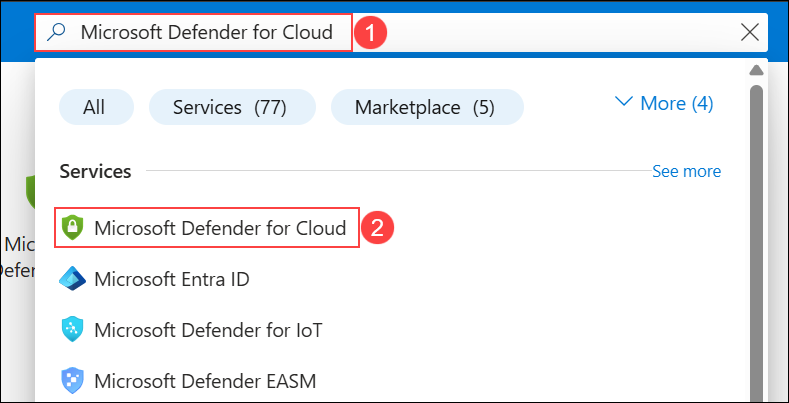

1. From **Microsoft Defender for Cloud** blade, Select **Environment settings**. Here, you'll be able to see the subscription.

    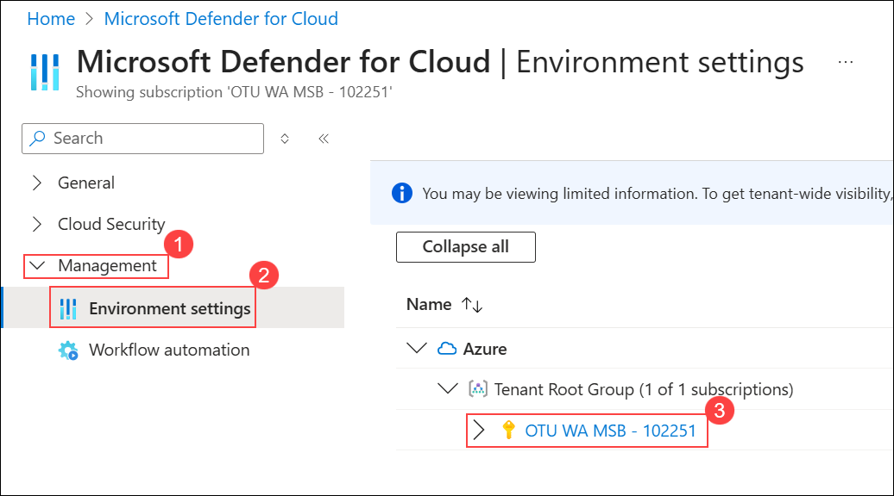
   
1. Click on **Security policies (1)** under Settings. By default, there is one security policy assignment which is **Microsft cloud security benchmark**.

    

    > **Note:** This policy is enabled by default on your subscription as per Microsoft Defender for Cloud recommendations. This is the default set of policies monitored by Microsoft Defender for Cloud. It is automatically assigned as part of onboarding to Microsoft Defender for Cloud. The default assignment contains only audit policies. For more information, please visit https://aka.ms/ascpolicies. Also, if you see one more policy with an ASC default name, please ignore that.

1. To view the policy, click on **Microsft cloud security benchmark** and select **View in Azure Policy** and then click on **Assign**.

    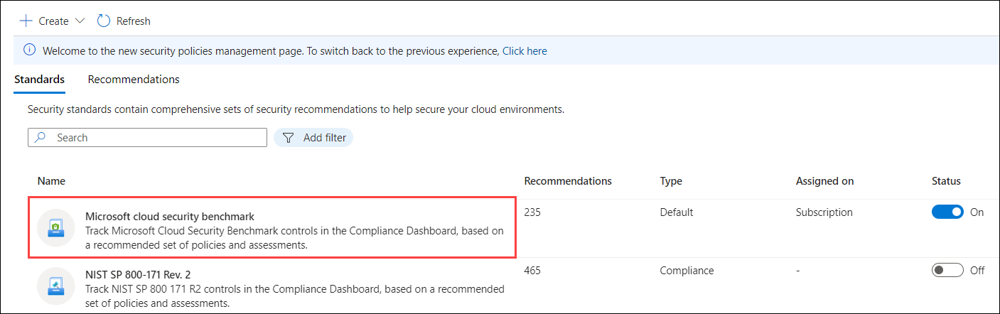

    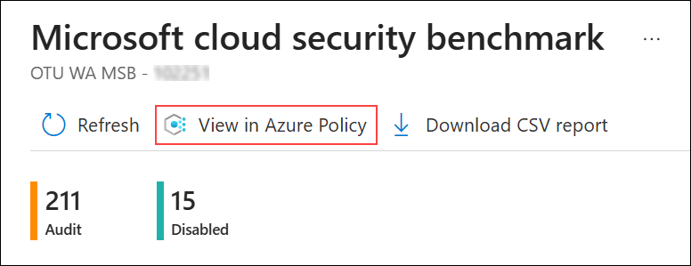

     > **Note:** The assignment name will have the GUID of the subscription in your lab environment.

1. Click on **Assign initiative**.

    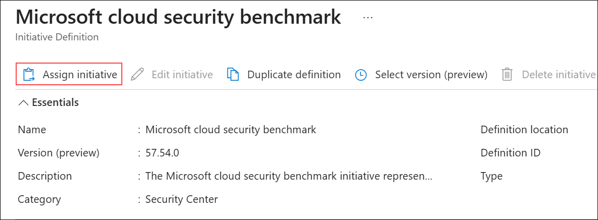

1. On the **Basics** tab, Click on **...** under Scope.

    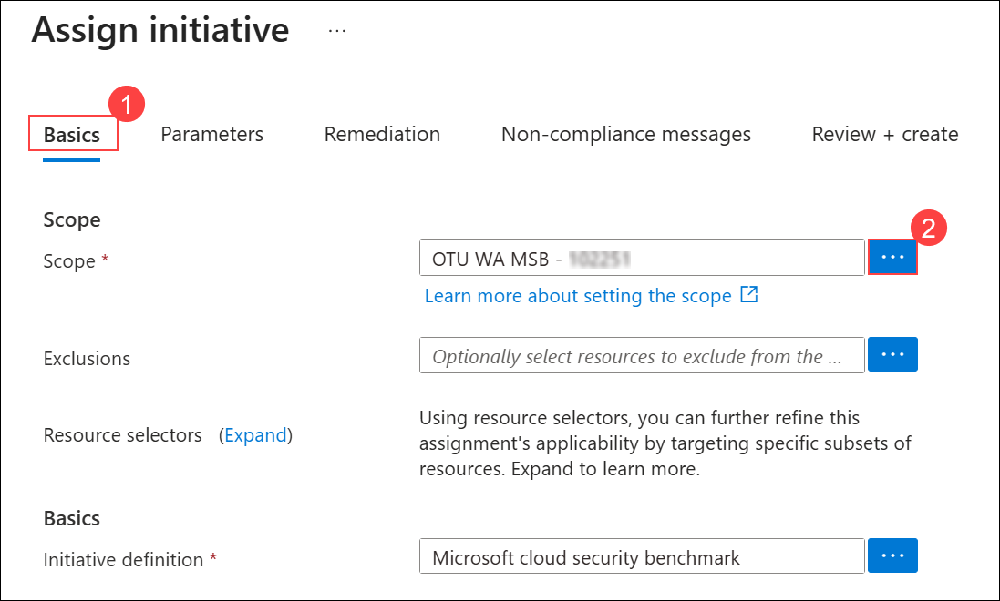

1. Under the **Scope** blade, select your **Subscription (1)** from the drop-down list, select Resource Group as **asclab (2)**, and click on **Select (3)**.

    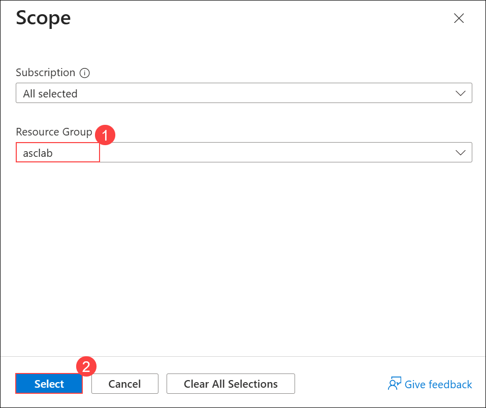

1. Click on **Next**.

    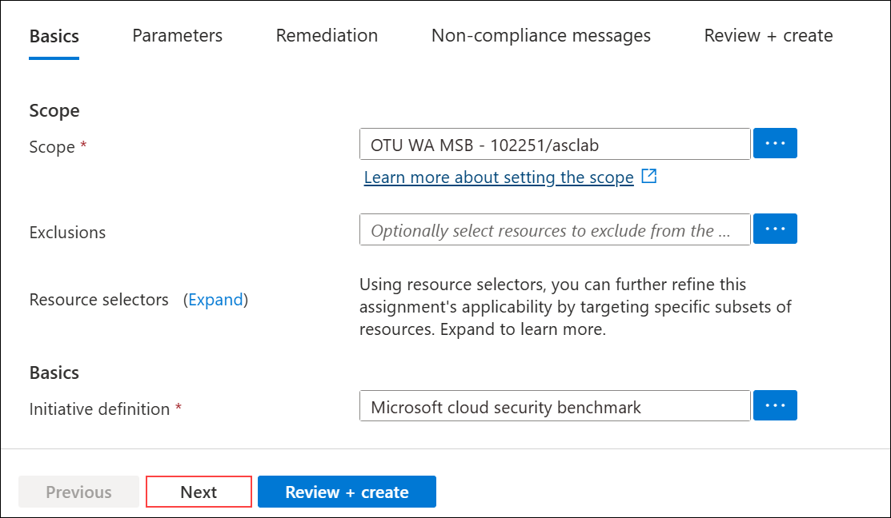

1. On the **Parameters (1)** tab, uncheck the box next to **Only show parameters that need input or review (2)** to view the parameters.

   > **Note:** This will take a while to load the required parameters.
   
    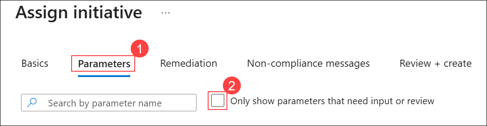
    
1. On the **Assign initiative** blade, scroll down and change the action to **AuditIfNotExists** for the parameter **Network Security Groups on the subnet level should be enabled**, to enable monitoring of NSGs on subnets, and click on **Review + create**.

    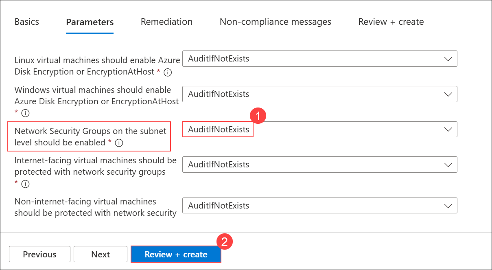

1. On the **Review + create** tab, review the configuration and click on **Create**.

    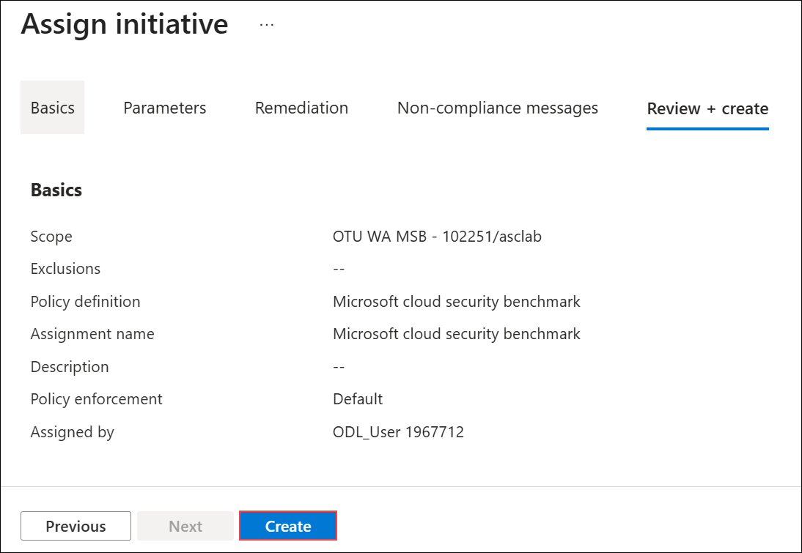

### Exercise 2: Explore Azure Policy

Azure Policy keeps track of compliance for your Azure resources based on policy definitions you assign, these are called policy assignments. By default, Microsoft provides many built-in definitions that you can leverage as you see fit.

In this exercise, you will be exploring azure policy and verify the built-in initiatives by microsoft defender for cloud.

1. Type **Policy** in the search box located at the top of the **Azure Portal** page and click on it. Alternately, open a new browser tab in the **labvm-<inject key="DeploymentID" enableCopy="false"/>** and navigate to this link ```https://portal.azure.com/#blade/Microsoft_Azure_Policy/PolicyMenuBlade```.

    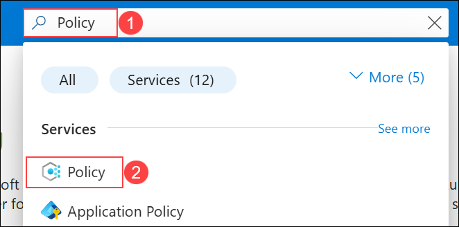

1. In the **Policy** blade, do the following:

   - Expand **Authoring (1)**.
   - Select **Definitions (2)**.
   - Set **Definition type** to **Initiative (3)**.
   - Open the **Category** filter (4).
   - Search for **Security Center (5)**.
   - Select **Security Center (6)**.
   - Click **Apply (7)**.

        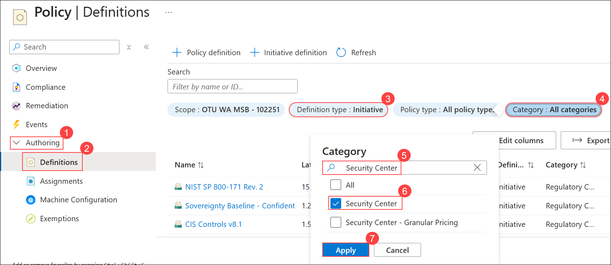	

1. You can now see built-in initiatives used by Microsoft Defender for Cloud which includes :
    -	*Azure Security Benchmark*
    -	*Configure Azure Defender to be enabled on SQL Servers and SQL Managed Instance*
    -	*Configure Advanced Threat Protection to be enabled on open-source relational databases*

        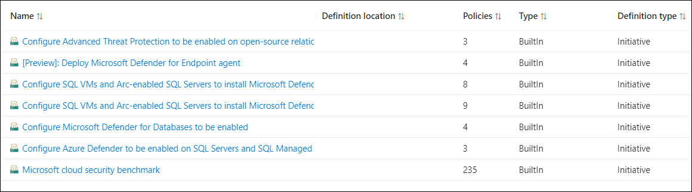

1. Notice the number of policies included in each initiative (policies column).

1. To see current assignments, click on **Assignments** from the left navigation pane under **Authoring**. Policy initiatives have a different name for the assignments, for example:

    - *ASC Default*

1. Click on **ASC Default** to see the assignment details.

   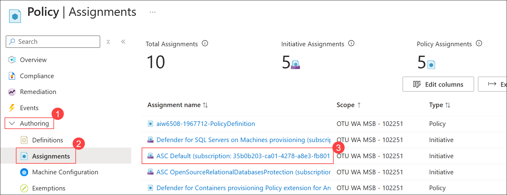 

### Exercise 3: Create resource exemption for a recommendation

Resource exemption will allow increased granularity for you to fine-tune recommendations by providing the ability to exempt certain resources from evaluation.

In this exercise, you will create an exemption by clicking the ellipsis menu on the right side and then selecting Create an exemption.

   > **Note:** Exemptions is a premium Azure policy capability that's offered for Azure Defender customers with no additional cost. For other users, charges may apply in the future.

1. Type **Microsoft Defender for Cloud** in the search box located at the top of the **Azure Portal** page and click on it.

1. Select **Recommendations (1)** from the left navigation pane. Search and select the **Management ports should be closed on your virtual machines (2)** recommendation from the **All recommendations** tab, select the **asclab-win** resource. You can search it using the search box.

    > **Note**: If you don't see the above recommendation that means it is not loaded yet to the control list and it could take up to 24 hours for all the recommendations to show up. It is possible that during lab time, this may not show up – which is the case sometimes. You can note down this step number then continue to the next exercise and verify this later.

    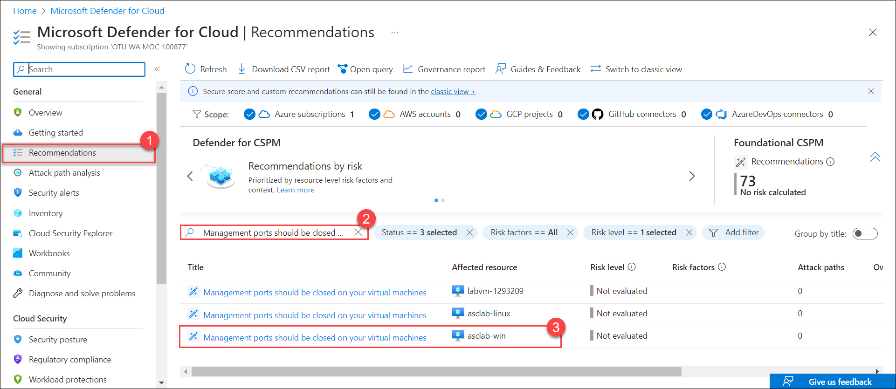

1. From the right-navigation pane click on **Exempt**.

    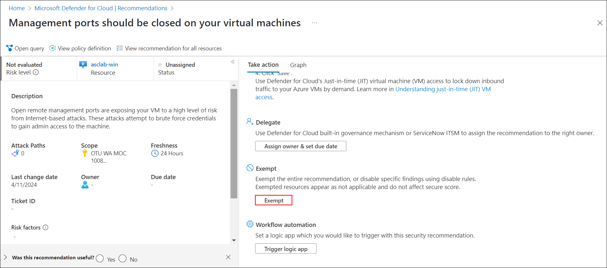

1. The **Exempt pane** opens:
    - Name: **ASC-Management ports should be closed on your virtual machines**.
    - Check the **Set an expiration date** option and set the datetime for two days ahead at 12:00 AM.
    - Select **Waiver (risk accepted)** as exemption category.
    - Enter **ASC-Management ports should be closed on your virtual machines** for the Exemption description and click on **Create**.

        

        > Good to know: <br>
        > **Mitigated** - This issue isn't relevant to the resource because it's been handled by a different tool or process than the one being suggested
        > **Waiver** - Accepting the risk for this resource

1. It might take up to **30 min for the exemption to take effect**. Once this happens:
    - The resource doesn't impact your secure score.
    - The resource is listed in the Not applicable tab of the recommendation details page
    - The information strip at the top of the recommendation details page lists the number of exempted resources:

        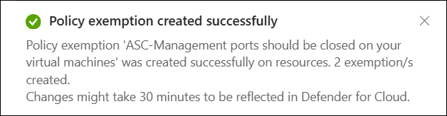

1. Refresh the tab and open the **Not applicable resources** tab to review your exempted resource – you can see our resource along with the reason/description value.

    

1.	Exemption rules are based on Azure Policy capability. Therefore, you can track all your exemptions from Azure Policy Blade as well.

1. In the search box located at the top of the Azure Portal page, search for **Policy** and click on it. 

    

1. Next, select Exemptions from the left navigation pane. Notice your newly created exemption listed there.

    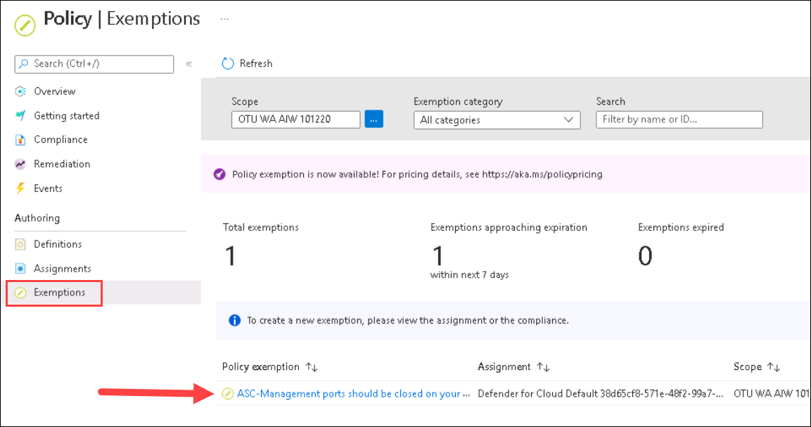

### Exercise 4: Create policy enforcement and deny

In this exercise, you will learn how to use Azure Policy to do some of the more common tasks related to assigning, denying, and managing policies across your organization.

1. In the search box located at the top of the Azure Portal page, search for **Microsoft Defender for Cloud** and click on it.

1. Select **Recommendations** under **General**, search and select the **Secure transfer to storage accounts should be enabled**. You can search it using the search box.

    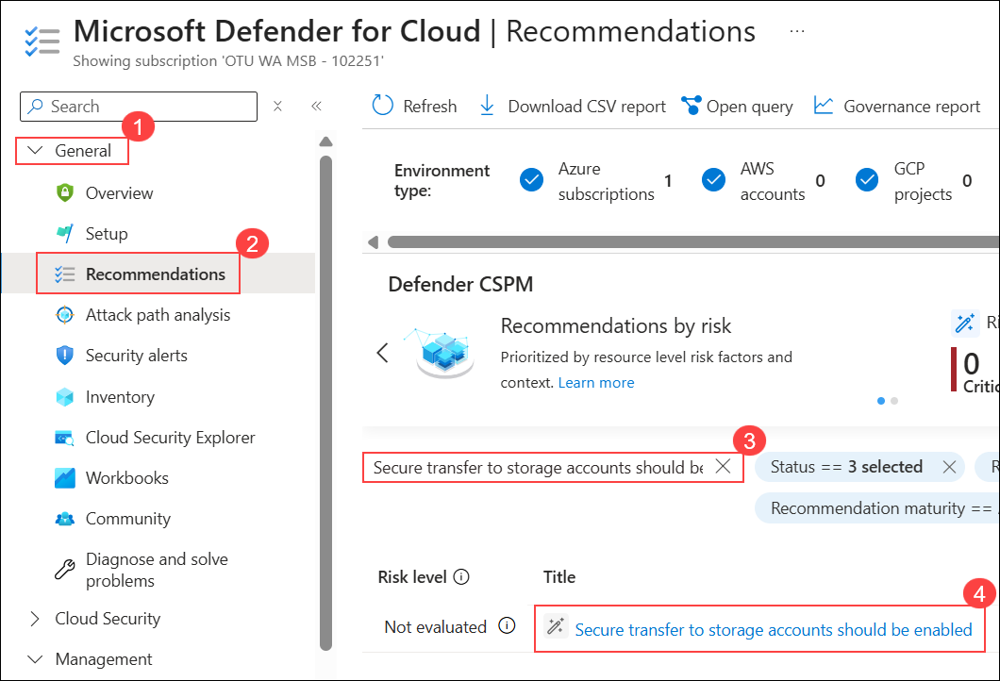

   > **Note**: If you don't see the above recommendation that means it is not loaded yet and it could take up to 24 hours for all the recommendations to show up. It is possible that during lab time, this may not show up – which is the case sometimes. You can note down this step number then continue to the next exercise and verify this later.

1. From the right-navigation pane, scroll down and click on **Deny** button. 

   > ❗ Important: <br>
   > Security misconfigurations are a major cause of security incidents.

     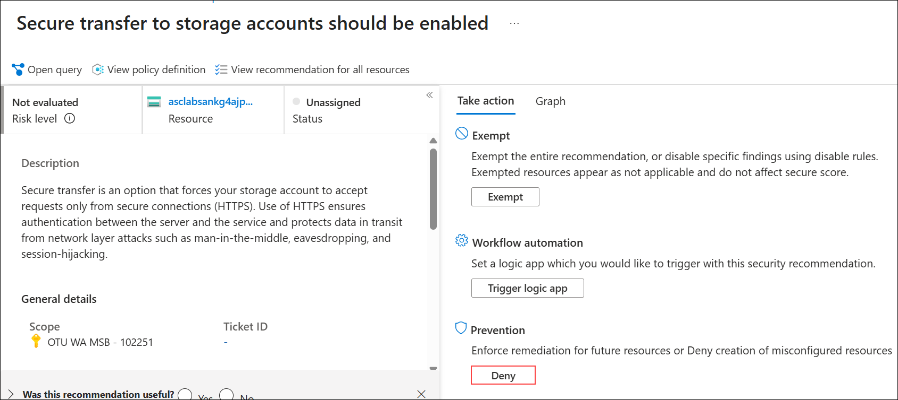

1. On the **Deny - Prevent resource creation**, select your subscription (which is currently set to audit mode). This allows you to ensure that from now on, a storage account without the security transfer feature turned on will be denied. Click on **Change to Deny**.

   **Note**: If you are unable to edit the query. Click on the eclipse select **change to Audit** and retry the step

    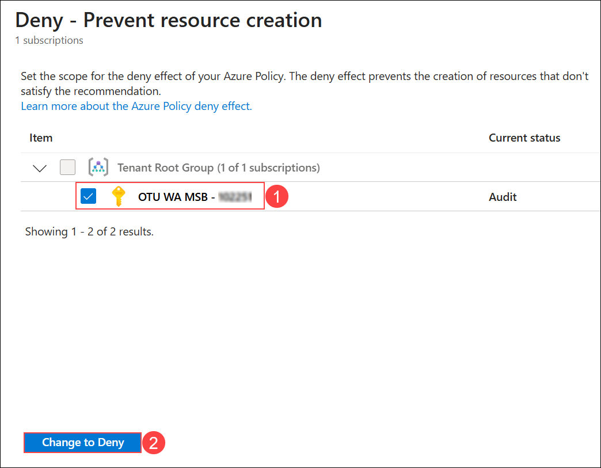

1. Go back to the **recommendations view**, type **Auditing** in the search box,. Click on the recommendation **Auditing on SQL server should be enabled**.

   > **Note**: If you don't see the above recommendation, that means it is not loaded yet, and it could take up to 24 hours for all the recommendations to show up. It is possible that during lab time, this may not show up – which is the case sometimes. You can note down this step number then continue to the next exercise and verify this later.

    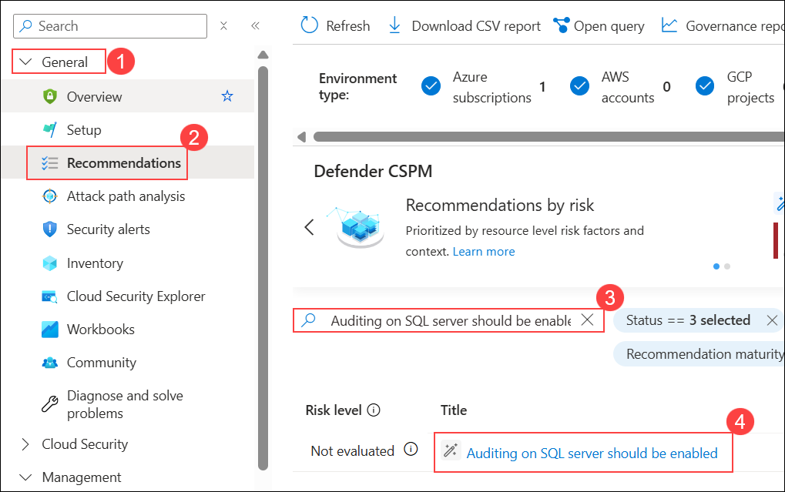

    

1. On the **Auditing on SQL server should be enabled** page, from the top menu bar, click on the **Enforce** button. This option allows you to take advantage of Azure policy’s DeployIfNotExist effect and automatically remediate non-compliant resources upon creation.

    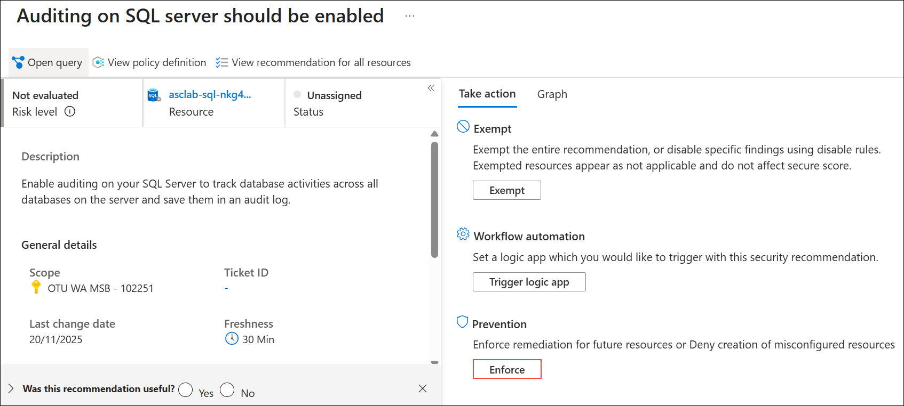

1. Once the **Configure SQL servers to have auditing enabled** pane opens with all of the policy configuration options, select the following configuration settings:

    * Under the **Basics** tab under the Scope header, select the ellipse icon **(...)** to select your subscription and  select the **asclab** for resource group and click on the **Select**.
    * Then click on **Next**.

        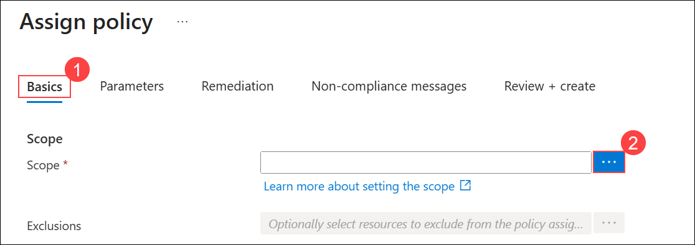  

        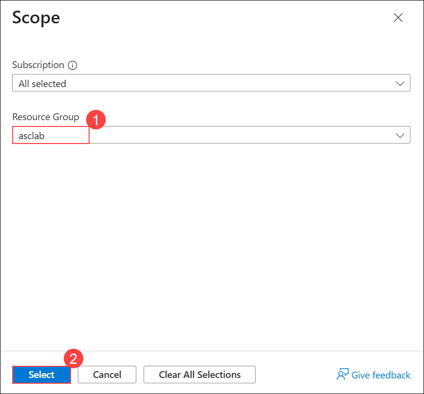     

        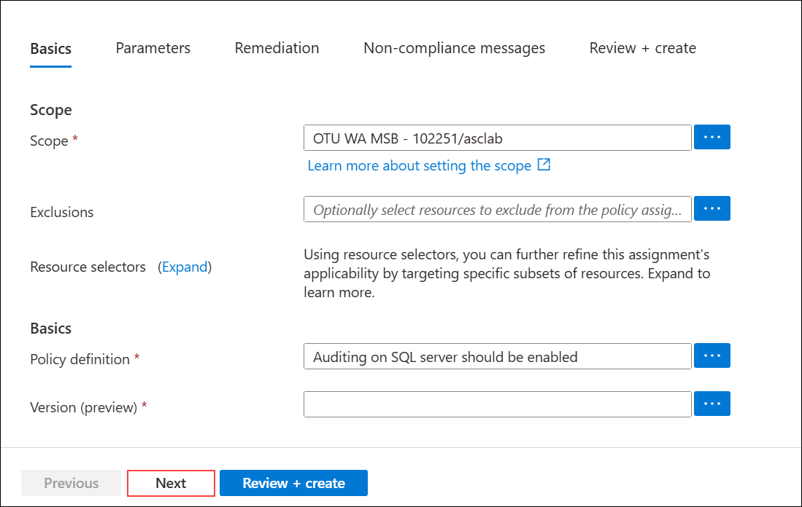

1. In the **Parameters** tab, leave the *Effect* and *Retention days* with default values.

     - **Uncheck** Only show parameters that need input or review
     - Leave options to default.
     - Select **Review + create** to assign the policy to your subscription.

        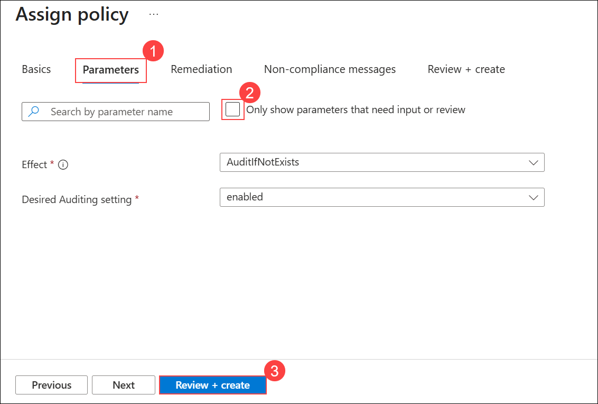

1. Click on **Create**.

    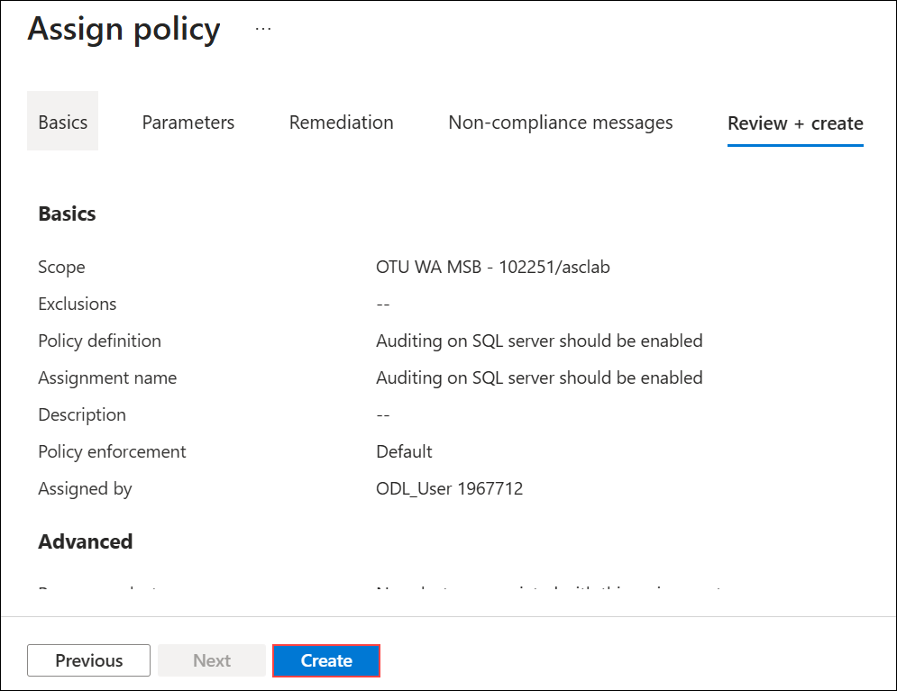

1. On the **Auditing on SQL server should be enabled** page, perform the following steps:

    - Select the **SQL Server resource (1)** found on the **unhealthy resources** tab of **Affected resources** named **<inject key="SQL Server" props="{\&quot;enableCopy\&quot;:true,\&quot;style\&quot;:{\&quot;fontWeight\&quot;:\&quot;bold\&quot;}}" />** 
    - click on **Fix (2)**
    - Select the **asclab-la-XXXXXX (3)** workspace from the dropdown
    - Click **Fix 1 resource (4)**
    
    By performing the above mentioned operations, you can now ensure that your existing resources and new ones will be enabled for auditing. Auditing on your SQL Server helps you track database activities across all databases on the server and save them in an audit log.
    <br>
        
      
1.	[Click here](https://docs.microsoft.com/en-us/azure/security-center/secure-score-security-controls#security-controls-and-their-recommendations "Security controls and their recommendations") to review a list of security controls and their recommendations.


### Exercise 5: Create a custom policy

A custom policy definition allows customers to define their own rules for using Azure. Whatever the business driver for creating a custom policy, the steps are the same for defining the new custom policy.

In this exercise, you will be creating a custom initiative using azure policy and will learn to assign it. 

***Create a custom initiative using Azure Policy***

1. In the search box located at the top of the Azure Portal page, search for **Policy** and click on it. 

    

1. Select **Definitions** from the left navigation pane, from the top menu, select **+ Initiative definition** to add a new initiative

    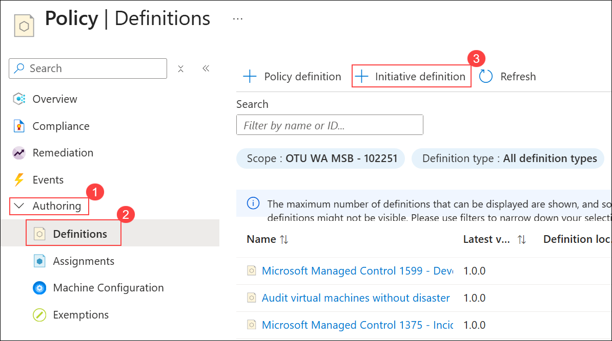

1. On the New Initiative definition page, select the following:
    - Initiative Location: Select your Subscription
    - Name: **Contoso Security Benchmark**
    - Description: **Baseline for security policies to appear alongside the built-in recommendations**
    - Category: Select **Create new** and type: **Contoso**
    - Click **Next**
  
        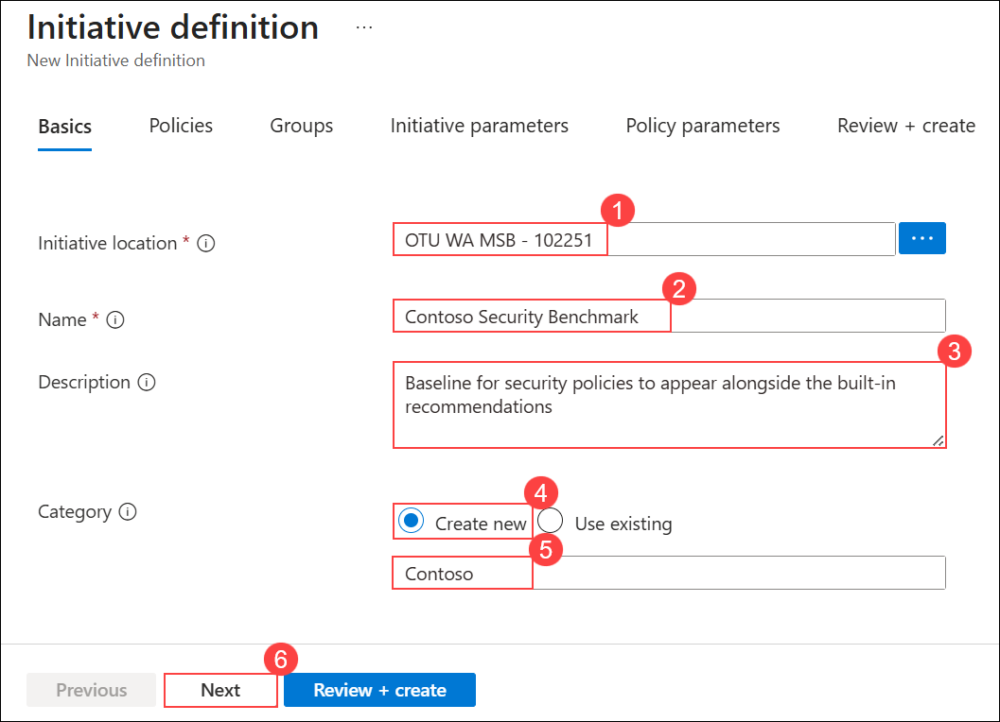

1. On the Policies tab, select **Add policy definition(s) (1)**.

    

1. The Add policy definition(s) pane opens: <br>
Add each policy one by one:
      Search and select the **below policy definitions (2)** and click on **Add (4)**
    - *Function apps should use managed identity*
    - *Public network access on Azure SQL Database should be disabled*
    - *Storage accounts should restrict network access*

        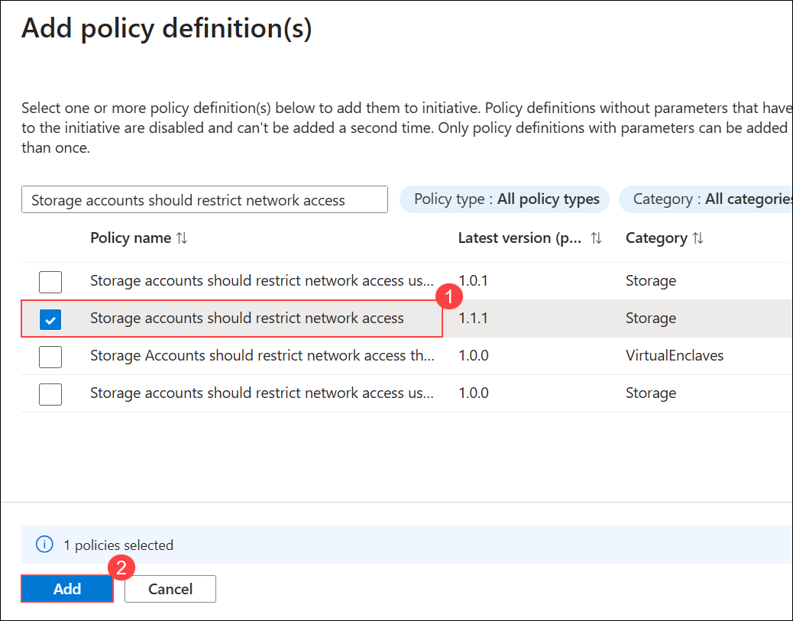

1. Select **Review + create (5)** and click on **Create**.

    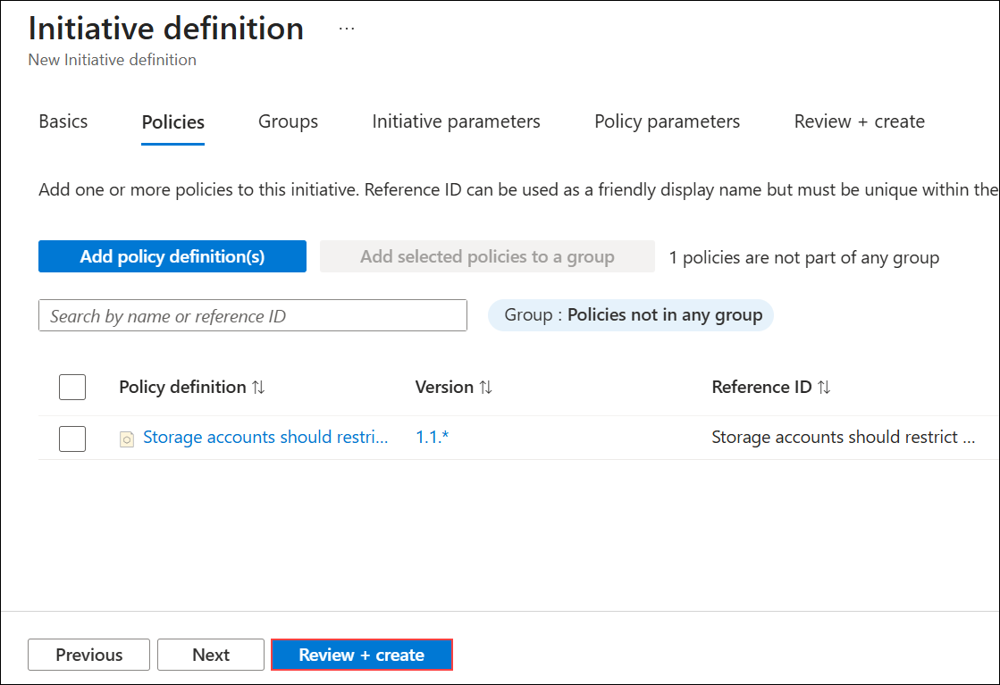

***Add a custom initiative to your subscription***

1. From Azure Portal, search for **Microsoft Defender for Cloud** and select it.

    

1. From **Microsoft Defender for Cloud** blade, Select **Environment settings**. Here you'll be able to see the subscription.

    
   
1. In **Environment Settings** page, Select your subscription.

    
   
1. Click on **Security policies (1)**. In the search bar, search for **Contoso Security Benchmark (2)**. Click on the toggle button to change the status to **On (3)**.

    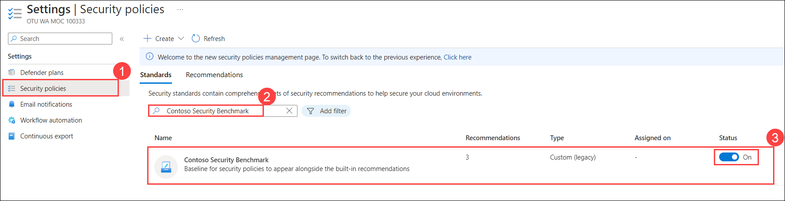

1. Click on **...** for Contoso Security Benchmark and select **View in Azure Policy**. In the Contoso Security Benchmark page, select **Assign**.

    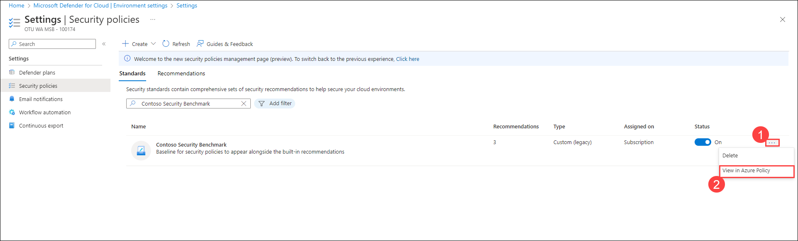

    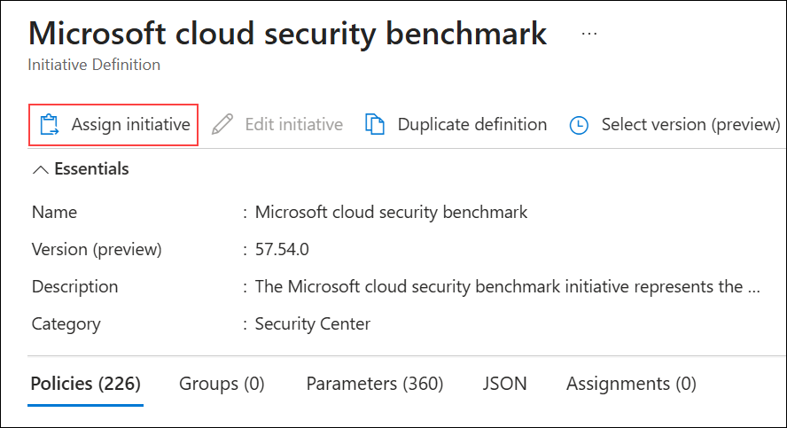

1. In the Basics tab of Contoso Security Benchmark, under scope provide your subscription and select **Review + create** and then **Create**.

    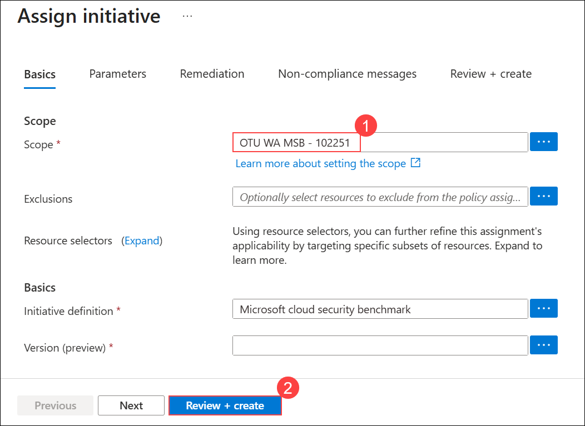

    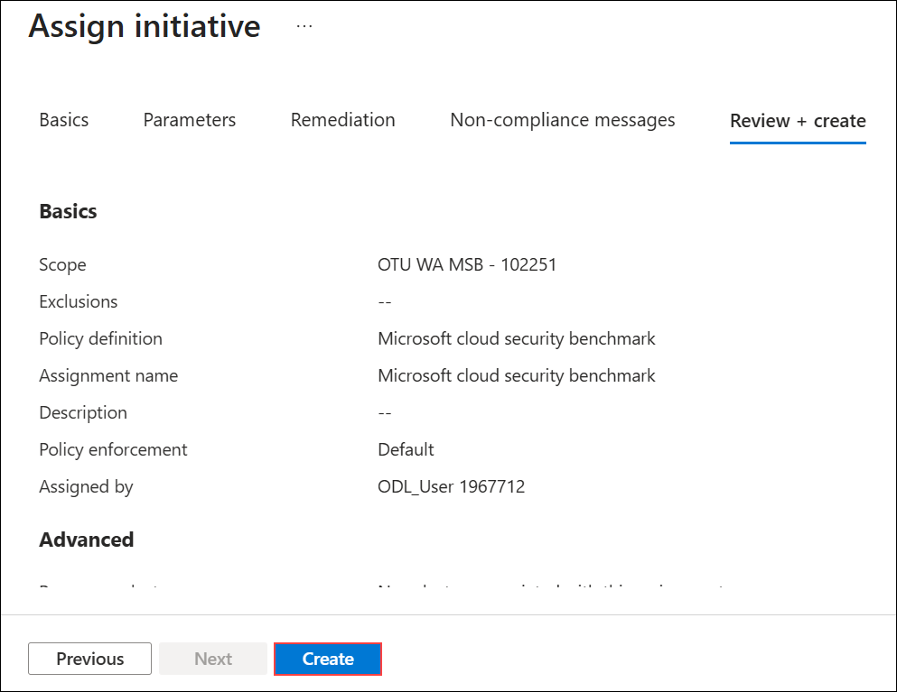
   
1. Your custom initiative is now assigned.

<validation step="a2288896-f055-4f0f-8a29-98cda7aadcd2" />

   > **Congratulations** on completing the task! Now, it's time to validate it. Here are the steps:
   - Navigate to the Lab Validation Page, from the upper right corner in the lab guide section.
   - Hit the Validate button for the corresponding task. If you receive a success message, you can proceed to the next task. 
   - If not, carefully read the error message and retry the step, following the instructions in the lab guide.
   - If you need any assistance, please contact us at labs-support@spektrasystems.com. We are available 24/7 to help you out.

### Summary

In this module, you have completed Exploring **Microsoft Defender for Cloud** features, **ASC default policy, Azure Policy, Created resource exemption, Created policy enforcement and deny,** and **Created custom policy**.

Now you can move on to the next module by clicking on the Next button at the bottom right of the screen.
