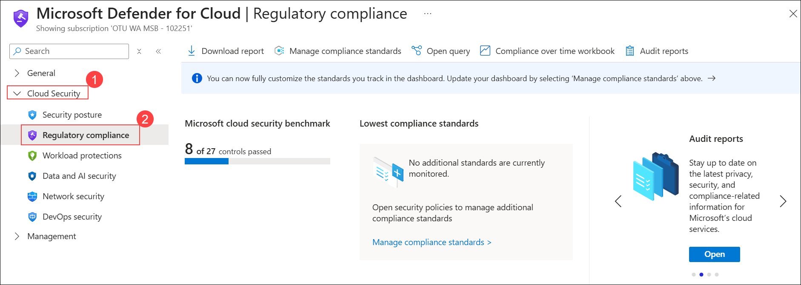
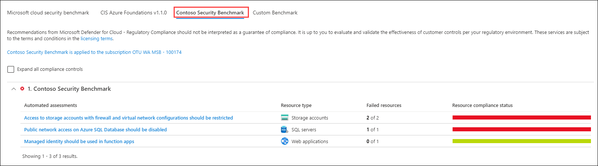
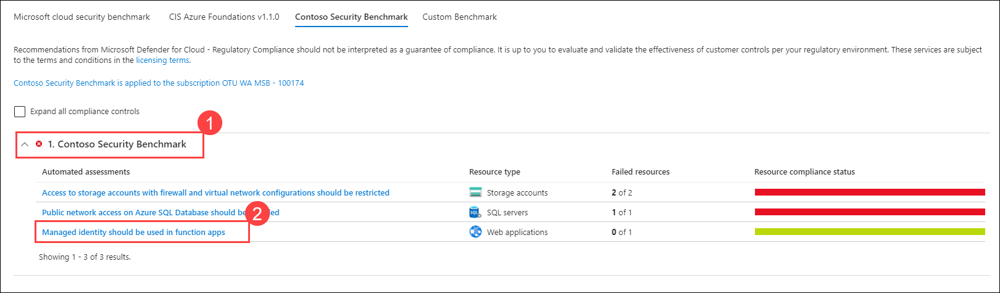
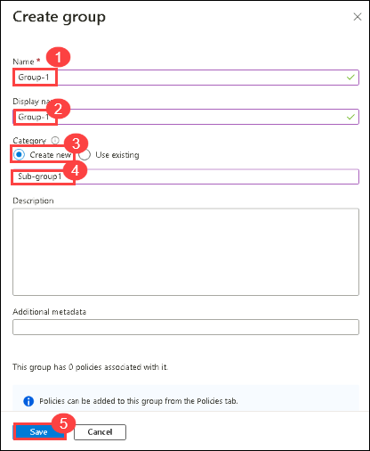
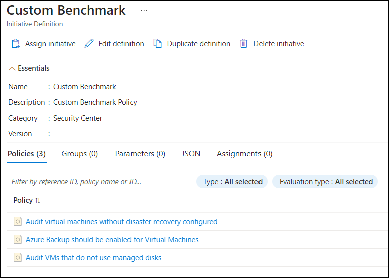
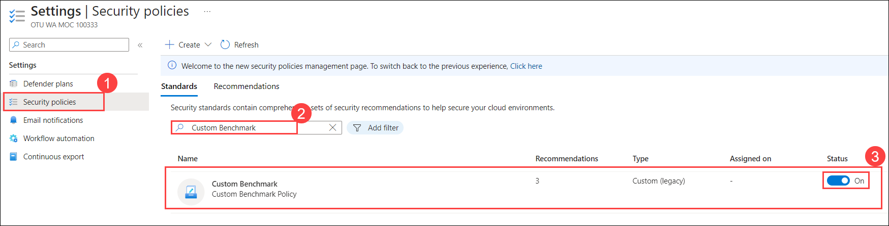
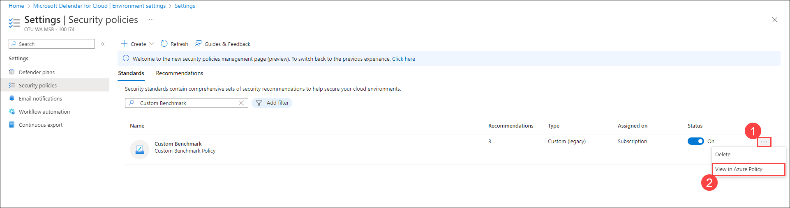
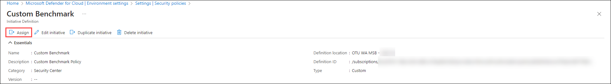
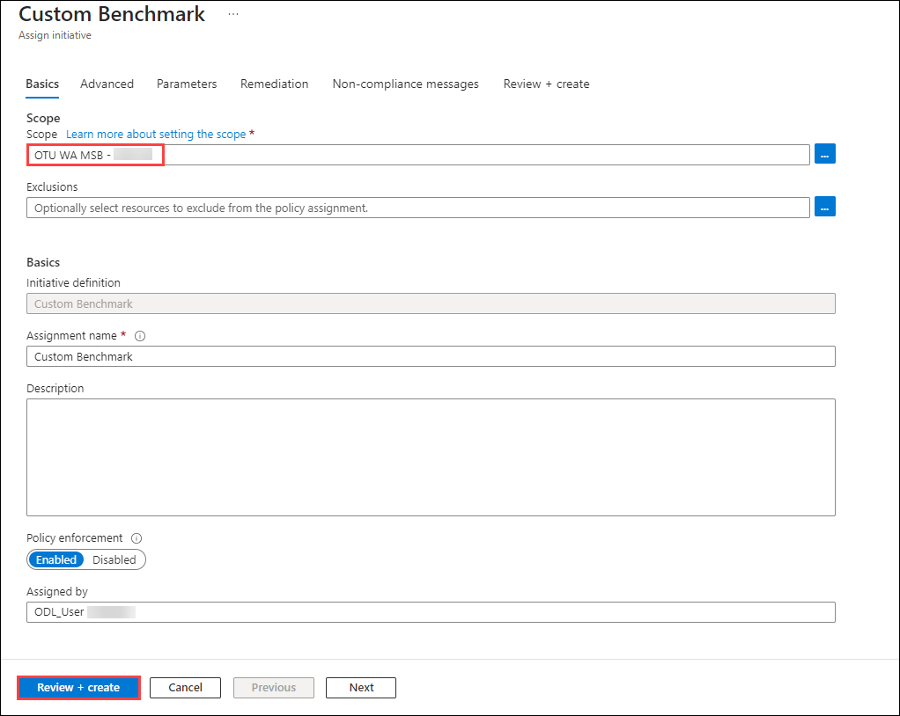

# Module 4 - Regulatory Compliance

### Overview

In this module, you will learn about Regulatory Compliance features

## Objectives

You will be performing the following activities to achieve the goal:

* Exercise 1: Understanding Regulatory Compliance Dashboard
* Exercise 2: Adding new standards
* Exercise 3: Creating your own benchmark

### Exercise 1: Understanding Regulatory Compliance Dashboard

Microsoft Defender for Cloud helps streamline the process of meeting regulatory compliance requirements using the regulatory compliance dashboard. The regulatory compliance dashboard shows the status of all the assessments within your environment for your chosen standards and regulations. As you act on the recommendations and reduce risk factors in your environment, your compliance posture improves.

Microsoft Defender for Cloud continuously assesses your hybrid cloud environment to analyze the risk factors according to the controls and best practices in the standards applied to your subscriptions.

In this exercise, you will get a walkthrough on regulatory compliance dashboard in Microsoft defender for cloud.

1. Navigate to **Microsoft Defender for Cloud** in the Azure portal (perform if not already on the Microsoft Defender for Cloud).

    

1. On the overview page, select the **Regulatory Compliance (1)** tile (this pillar is also available on the left side under the Cloud Security section). Once the **Regulatory Compliance dashboard (2)** opens, you can see the compliance standards currently assigned to your subscription.

    

1. On the main page, select the **Contoso Security Benchmark** standard. Notice the different compliance controls mapped to assessments.

   > **Note**: It might take up to 24 hours to reflect the Contoso security benchmark after adding the custom initiatives. If this is not available for you, you can skip this exercise and continue with the next exercise and can check on this later.

    

1. Expand the **Contoso Security Benchmark** compliance control. Click on the **Managed identity should be used in function apps**

    
   
1. Under **Managed identity should be used in your function app** tab, expand **Affected resources**.

    
   
1. Now under **Healthy resources (1)**, you can observe the **Function app (2)**.

    

1. Return to the dashboard. Here, you can export the regulatory standard compliance status report as a PDF or CSV file. From the top menu bar, click on **Download report**.

    

1. On the Report standard dropdown menu, select **Microsoft cloud security benchmark** and format as **PDF*. Click on **Download**.

    

1. A local PDF file is now stored on your machine. Open the **Microsoft Cloud security benchmark Compliance Report** and explore it – This report summarizes the status of those assessments on your environment, as mapped to the associated controls.

### Exercise 2: Adding new standards

You can add additional industry standards (represented as compliance packages) such as IST SP 800-53 R4, SWIFT CSP CSCF-v2020, UK Official, and more.

In this exercise, you will be enabling CIS Microsoft Azure Foundations Benchmark v1.1.0 policy.

1. On **Regulatory Compliance** page, select **Manage compliance policies** from the top menu bar.

    

2. Select your **Subscription** under the Environment settings.

    
   
3. Select **Security policies (1)** in the search bar, search for **CIS Microsoft Azure Foundations Benchmark v1.1.0 (2)** and click on the toggle button to change the status to **On (3)**

    

### Exercise 3: Creating your own benchmark

Once you create your custom initiative, Microsoft Defender for Cloud allows you to add it as a security policy and provides two main benefits:
* Security requirements represented as custom recommendations, listed under the recommendation list.
* Track compliance status using the regulatory compliance dashboard.

In this exercise, you will be creating your own bechmark and will be assigning it.

1. In the search box located at the top of the Azure Portal page, search for Policy and click on it.

    

1. From the left pane of the **Policy** page, select **Definitions**.

1. From the top menu, select **+ Initiative definition** to create a new policy set definition.

    

1. Under the **Basics** tab, enter the following steps:

   - Initiative Location: Select your **Subscription (1)**
    
   - Name: Enter **Custom Benchmark (2)**

   - Description: Enter **Custom Benchmark Policy (3)**

   - Category: Click **Use existing (4)** and Select **Security Center (5)** from drop-down list.

   - Click on **Next (6)**

        

1. On the **Initiative definition** blade click on **Groups**, In this section you can define your groups and subgroups to be used in your initiative. To add a new group, click on **Create group**.
   
1. Under **Create group**, enter the following details:

    - Name: **Group-1 (1)**
    - Display name: **Group-1 (2)**
    - Category: Click on **Create new (3)** and enter the name as **Sub-group1 (4)**. You can also provide a description. Please note that additional metadata can be used as well. The location of the policy metadata object that has additional details about the control and compliance domain.
    
    - Click on **Save (5)** to create the new group.  

        
  
1. Repeat the process to create an additional group, for example, **Group 2**.

1. Now you should have two groups to help you organize your policies within the initiative.

1. On the **Initiative definition** blade, click on the **Policies** tab. Here you can add policy definitions, both built-in and custom. Click **Add policy definition(s)**. Select your desired policies, If you create a benchmark, you can also leverage existing policy definitions from the **Microsoft managed** tab. For example, you can choose the following policies and select **Add**:
   
    -	Audit virtual machines without disaster recovery configured
    -	Azure Backup should be enabled for Virtual Machines
    -	Audit VMs that do not use managed disks

    

1. Every policy on the list, has its definition name, reference ID and the associated group. However, you do need to define a group for each policy. To do so, click on the **… (1)** to open the context menu and select **Edit groups (2)**.

    

1. Make sure all policies are associated with a group. Please notice that policies can be associated with multiple groups. Here we are selecting **Group 1 (1)** and selecting **Save (2)**.

     

1. You can assign policy and initiative parameters to be used during the assignment process. Skip this section and click on **Review + create** to validate your settings. Then, click on **Create**

1. You should now see your new initiative listed here **Custom Benchmark** along with the additional metadata (scope, category, etc.)

    

1. To assign your new security policy, type **Microsoft Defender for Cloud** in the search box located at the top of the **Azure Portal** page and click on it.

    
     
1. From **Microsoft Defender for Cloud** blade, Select **Environment settings**. Here you'll be able to see the subscription.

    
   
1. On the **Environment Settings** page, select your subscription.

    
   
1. Select **Security policies (1)**, in the search bar search for **Custom Benchmark (2)**, click on the toggle button to change the status to **On (3)**

    

1. Click on **...** for Contoso Benchmark and select **View in Azure Policy**. In the Contoso Benchmark page, select **Assign**.

    

    

1. In the Basics tab of Contoso Security Benchmark, under scope provide your subscription and select **Review + create** and then **Create**.

    
   
1. Your custom initiative is now assigned.

<validation step="43e608d1-6cbd-48c7-b0f4-c513e7959b3c" />

> **Congratulations** on completing the task! Now, it's time to validate it. Here are the steps:
 
- Navigate to the Lab Validation Page, from the upper right corner in the lab guide section.
- Hit the Validate button for the corresponding task. If you receive a success message, you can proceed to the next task. 
- If not, carefully read the error message and retry the step, following the instructions in the lab guide.
- If you need any assistance, please contact us at labs-support@spektrasystems.com. We are available 24/7 to help you out.
    <validation step ="01bad42a-6d4b-485f-82db-daba1ae8150b" />

## Summary

In this module, you have completed Exploring **Microsoft Defender for cloud** features - **Regulatory Compliance dashboard**, **Added new standards** and **Created your own benchmark**.

Now you can move on to the next module by clicking on the Next button at the bottom right of the screen.
