# Module 5 - Improving your Secure Posture

## Overview

This module will walk you through the process of using the vulnerability assessment for Virtual Machines and Containers, along with the usage of Workflow Automation and data query.

## Objectives

- Exercise 1: Vulnerability Assessment for Containers
- Exercise 2: Automate recommendations with workflow automation
- Exercise 3: Accessing your secure score via ARG

### Exercise 1: Vulnerability Assessment for Containers

Microsoft Defender for Cloud scans images in your Azure Container Registry (ACR) that are pushed and imported into the registry, it also contains any other images pulled within the last 30 days. Then, it exposes detailed findings per image. All vulnerabilities can be found in the following recommendations: **Vulnerabilities in Azure Container Registry images should be remediated (powered by Qualys).**

In this exercise, you will work on vulnerablity assessment for containers by uploading a image to your conatiner registry.

To simulate a container registry image with vulnerabilities, we will use ACR task commands and a sample image:

1. Search for **Container registries** in the search box located on the top of the **Azure Portal** page and click on it, or click [here](https://portal.azure.com/#blade/HubsExtension/BrowseResource/resourceType/Microsoft.ContainerRegistry%2Fregistries).

    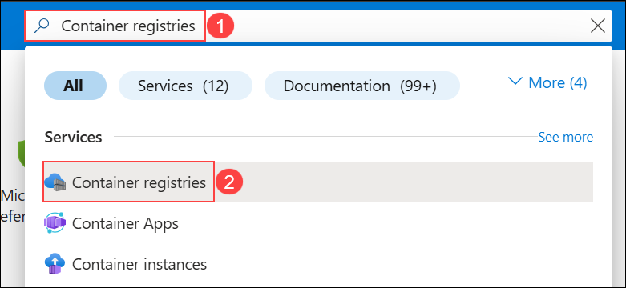

1. Copy the name or your container registry, for example: *asclabcrktfvrxcne4kki*

    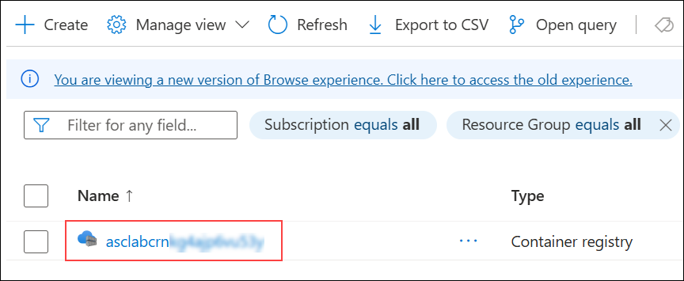

1. In the Azure portal, open the **Cloud Shell** pane by selecting the toolbar icon directly to the right of the search textbox or clicking on [Azure Cloud Shell](https://shell.azure.com/).

    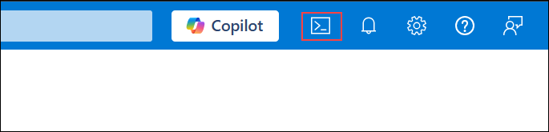

1. If prompted to select either Bash or PowerShell, select **Bash**.

    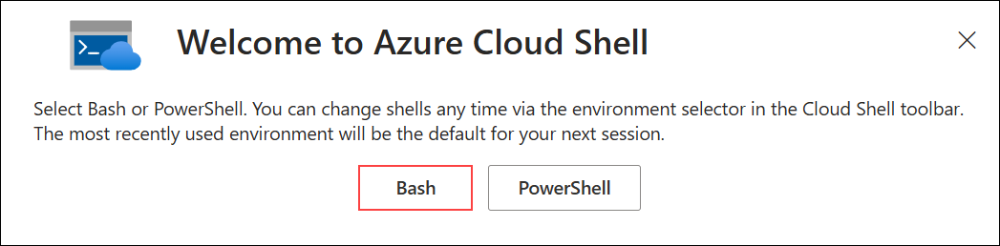

1. On the **Getting started** window, select **Mount storage account (1)**, choose the **subscription (2)**, and click **Apply (3)**.

    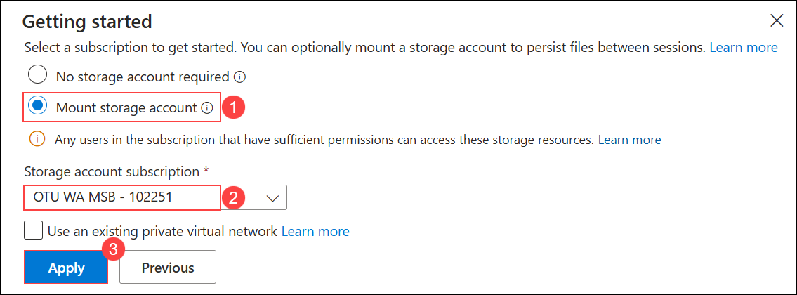

1. On the **Mount storage account** screen, select **We will create a storage account for you (1)** and click **Next (2)**.

    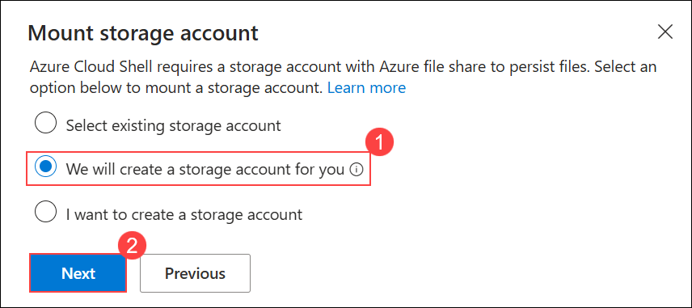

1. Build a Linux container image from the hello-world image hosted at Microsoft Container Registry and push it to the existing Azure Container Registry instance on your subscription:
 
   Run the following two script blocks:

    ```
    echo FROM mcr.microsoft.com/azuredocs/aci-helloworld > Dockerfile
    ```

   Modify the following script to include your container registry name in the placeholder <your container registry name>

    ```
    az acr build --image sample/hello-world:v1 --registry <your container registry name> --file Dockerfile .
    ```

    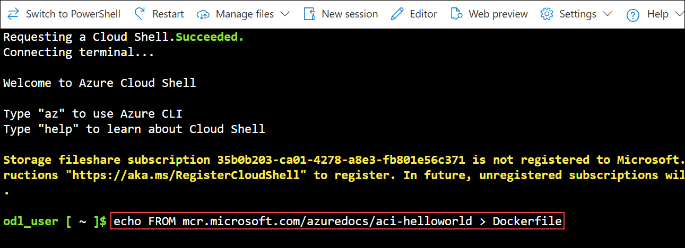

    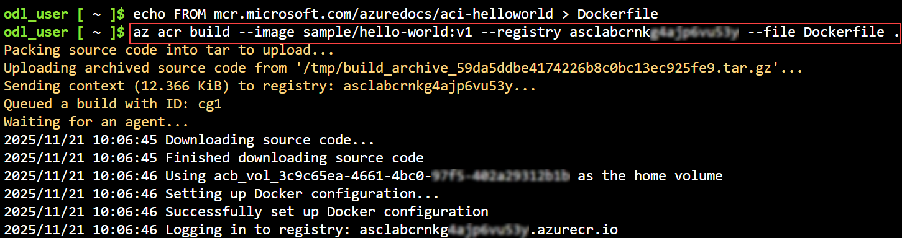

1. Wait for a successful execution message to appear. For example: Run ID: cf1 was successful after 10s.

    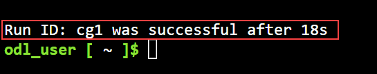

1. The scan completes typically within a few minutes, but it might take up to 15 minutes for the vulnerabilities/security findings to appear on the Recommendations page.

1. Search for **Microsoft Defender for Cloud** in the search box located on the top of the **Azure Portal** page and click on it.

1. Click on **Recommendations (1)** from the left side pane under the **General** section. Under All recommendations, search and select **Azure registry container images should have vulnerabilities resolved(2)**.
 
     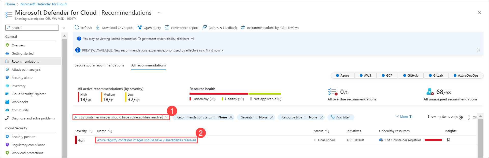

    > **Note**: If you don't see the above recommendation that means it is not loaded yet, and it could take up to 24 hours for all the recommendations to show up. It is possible that during lab time, this may not show up – which is the case sometimes. You can note down this step number, then continue to the next exercise and verify this later.

1. On the recommendation page, notice the following details in the upper section:

    - Unhealthy registries: **1/1**
    - Severity: **High**
    - Total vulnerabilities: **expect to see more than 2 vulnerabilities**

        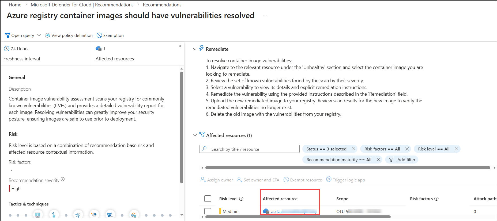

1. Expand the **Affected resources (1)** section and notice the **Unhealthy registries** count which shows **1 container registry (2)** (asclab**xxx** here xxx is unique ID).

     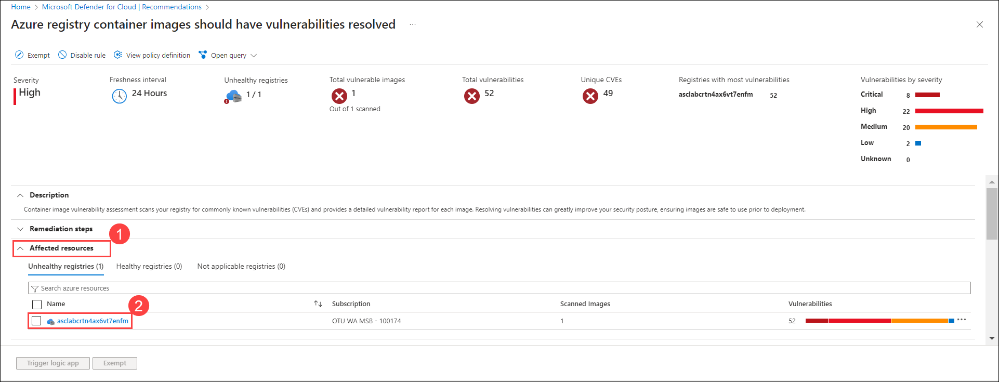

1. On the **Security Checks** section, notice the number of vulnerabilities.

1. Click on the first security check to open the **XXXXXX- User(s) with Blank Password** pane.

    >XXXXXX is the ID of the security finding.

     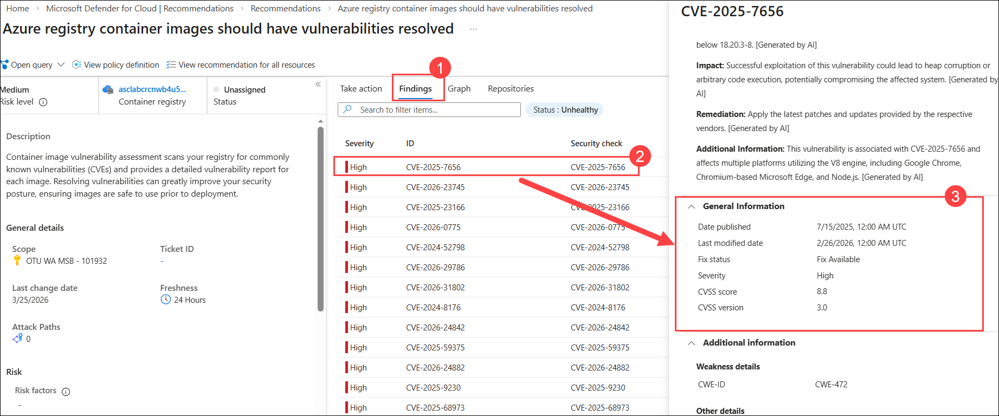

   Notice the vulnerability description, general information (containing the Cvss 2.0 base score, etc.), remediation steps/workaround, additional information, and the affected (vulnerable) image. **Close this window.**

### Exercise 2: Automate recommendations with workflow automation

Every security program includes multiple workflows for incident response. The process might include notifying relevant stakeholders, launching a change management process, and applying specific remediation steps. With the help of workflow automation, you can trigger logic apps to automate processes in real-time with Microsoft Defender for Cloud events (security alerts or recommendations). 

In this Exercise, you will create a new Logic App and then trigger it automatically using the workflow automation feature when there is a change with a specific recommendation.

**Create a new Logic App:**

1. Search for **Logic Apps** in the search box located on the top of the **Azure Portal** page and click on it, or [click here](https://ms.portal.azure.com/#blade/HubsExtension/BrowseResource/resourceType/Microsoft.Logic%2Fworkflows).

    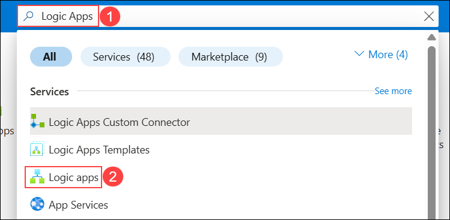
    
1. Click on **+ Add** to create a new Logic App.
    
    

1. On the **Create logic app** page, select **Consumption** plan and click on **select**.

    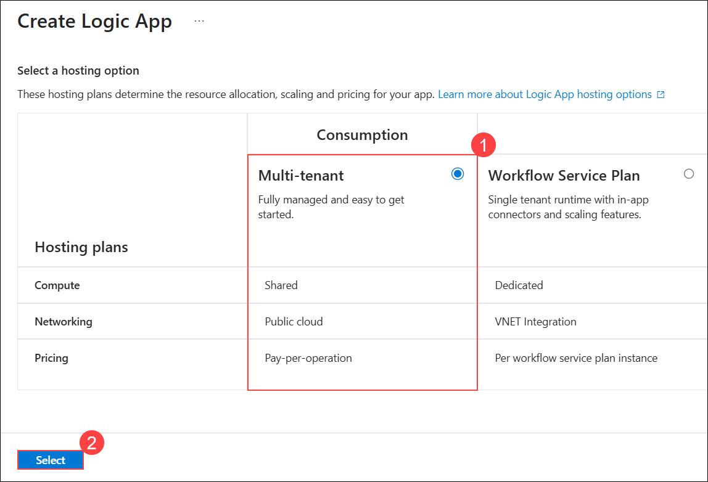

1. On the Basics tab, enter the following details:
     
     - Subscription: Select your **Subscription** 
      
     - Resource group:  **asclab** 
 
     - Logic app name: Enter **Send-RecommendationsChanges<inject key="DeploymentID" enableCopy="false"/>**.

     - Location: Select the location of your **Resource group**
        
     - Enable log analytics: Select **No**

     - Select **Review + create** and then click on **Create**.

        

1. When the **Deployment** is completed click on **Go to resource**

   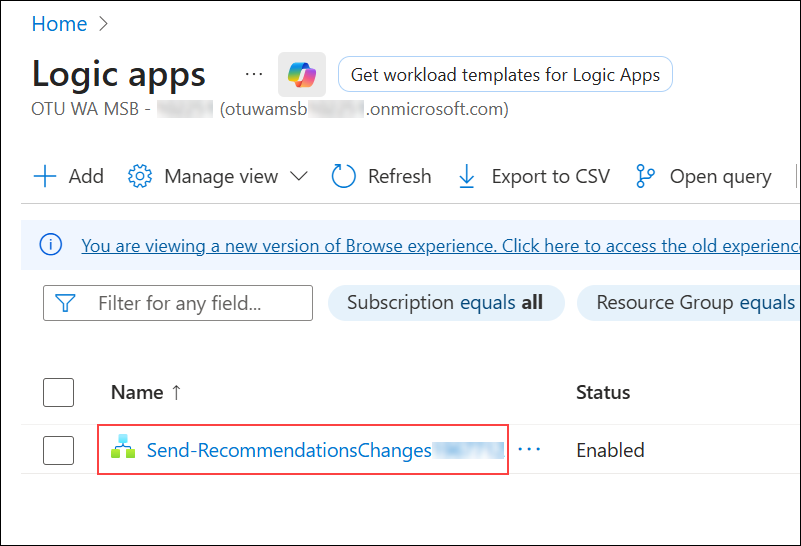

1. On the Logic App blade, expand **Development Tools (1)** and select **Logic app designer (2)**.

    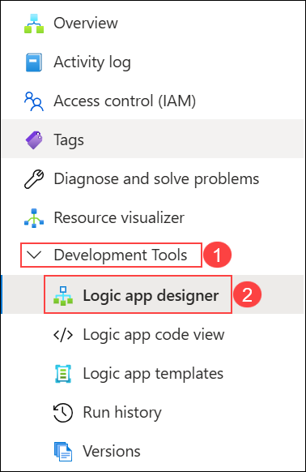
 
1. On the Logic App designer canvas, click **Add a trigger**.

   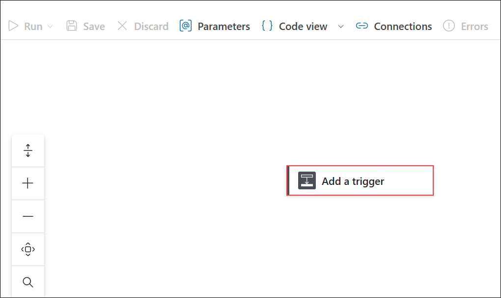

1. Search for **Security Center** in the search box and select **When a Microsoft Defender for Cloud Recommendation is created or triggered** from the list of **Triggers**

    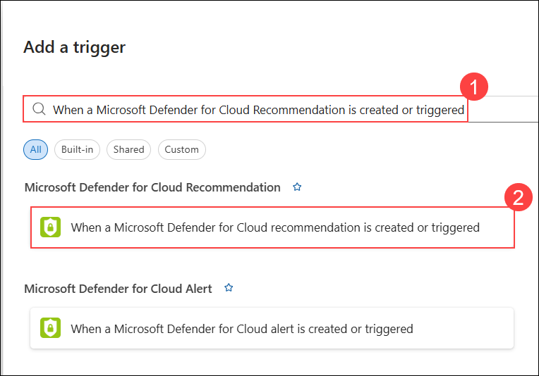

1. Below the trigger, click the **+ (1)** icon and select **Add an action (2)**.

    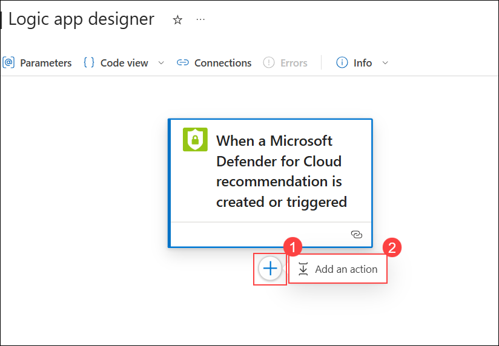

1. In the **Add an action** window, search for **Send an email (1)**, select **Office 365 Outlook (2)**, and choose **Send an email (V2) (3)**.
     
    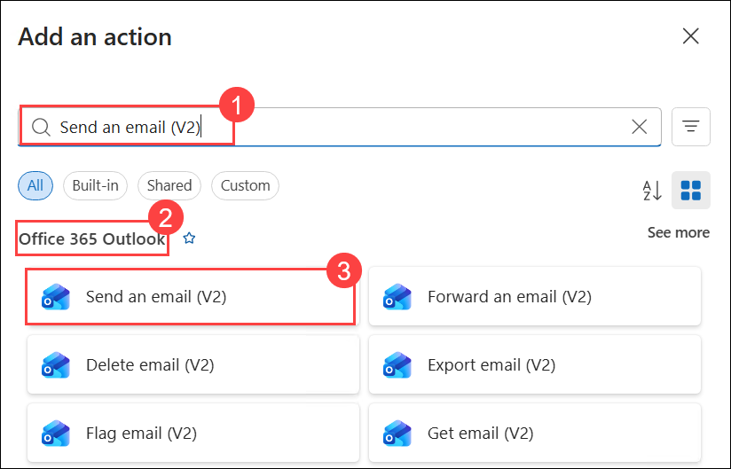

   > **Note:** You will need to sign into your Outlook.com (Use Odl user from Environment details) and grant permissions for the Logic App to send email using your account.

1. After signing in, enter the learner email in the **To (1)** field, type **Recommendation changed:** in the **Subject (2)** field, and use the dynamic content icon (3) to add recommendation details.
   
      * Email/Username: <inject key="AzureAdUserEmail"></inject> 

        

        > Later, you will use the same email address to check if you have received an email using the workflow automation feature.

1. In the dynamic content panel, search for **Properties Display Name (1)** and select **Properties Display Name (2)** to insert it into the email body.
     
    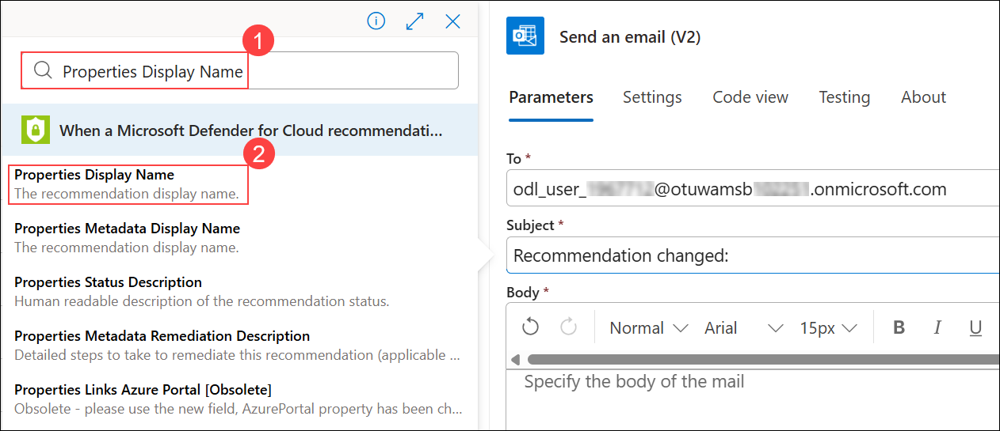

1. Click just after Recommendation changed: to get your cursor in the right place. In the dynamic content box, click on the **Dynamic content** tab and then search and select `Properties Display Name` in the list (click Add dynamic content if it doesn’t pop out automatically).

1. Click into the Body text box and type the following:

    - **Recommendation:**</br>
    - **Description:**</br>
    - **Status:**</br>
    - **Link to recommendation:**</br>

        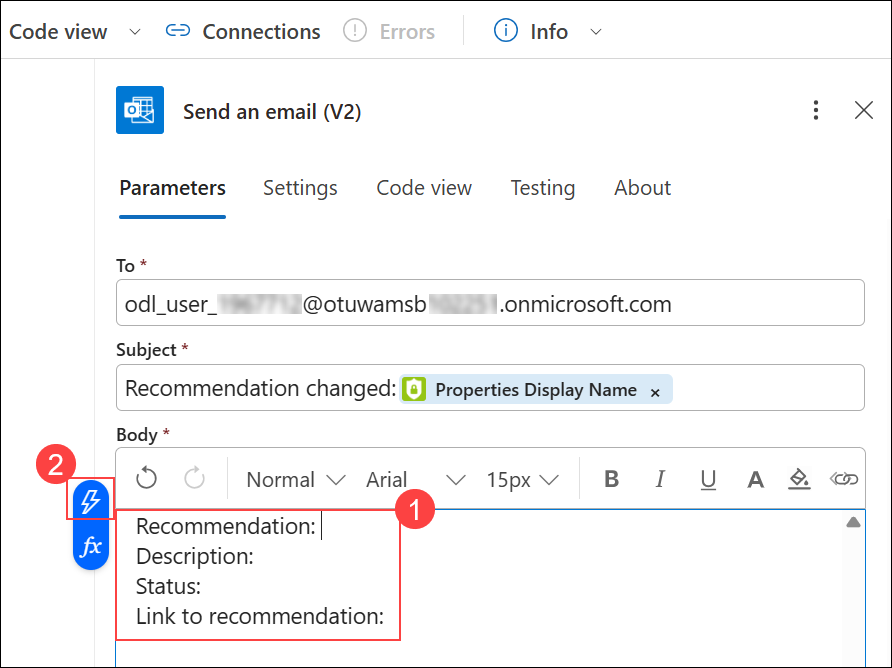

1. Click just after each section, to get your cursor in the right place. In the **dynamic content box**, match each line to the following content by searching and selecting in the list:

   - Recommendation: `Properties Display Name`</br>
   - Description: `Properties Metadata Description`</br>
   - Status: `Properties Status Code`</br>
   - Link to recommendation: `Properties Links Azure Portal Uri`</br>

        

1. Verify that Your Logic App looks like the below screenshot and then click on **Save** in the Logic App Designer.

    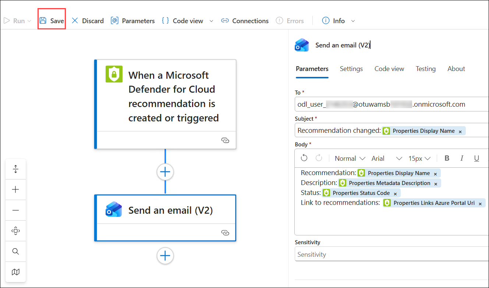

**Create a new workflow automation instance**

1. Search for **Microsoft Defender for Cloud** in the search box at the top of the **Azure Portal** page and click on it.

1. Select **Workflow automation (1)** under **Management** section from the left side pane, and click on **+ Add workflow automation (2)**.

    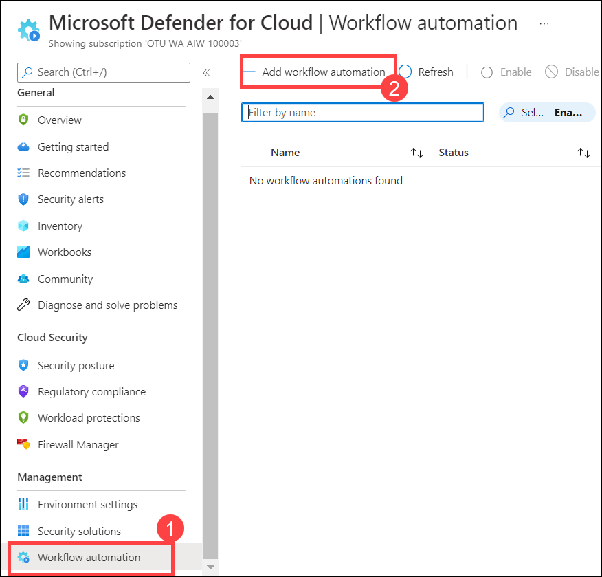

1. A pane appears on the right side. Enter the following for each field:
    
   - General:
   
     * Name: **Send-RecommendationsChanges**
     * Description: **Send email message when a recommendation is created or triggered**
     * Subscription: **Your Subscription**
     * Resource group: **asclab**

        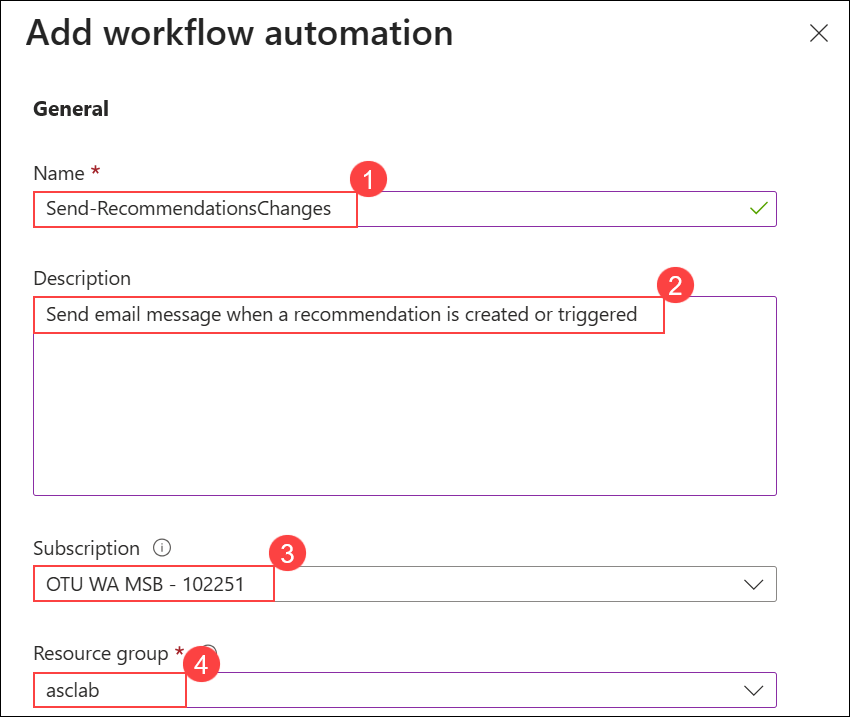
      
   - Trigger conditions:
   
     * Select Defender for Cloud data types: **Recommendation**
     * Recommendations name: **All recommendations selected**
     * Recommendation severity: **All severities selected**
     * Recommendation state: **All states selected**

        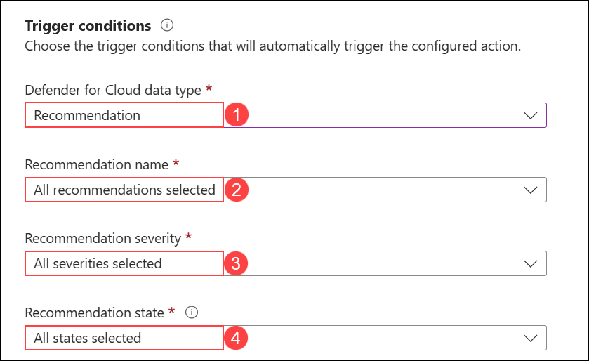
    
   - Actions:
   
     * Show Logic App instances from the following subscriptions: **Your Subscription**

     * Logic App name: **Send-RecommendationsChanges<inject key="DeploymentID" enableCopy="false"/>**
     
   Click **Create** to complete the task.

     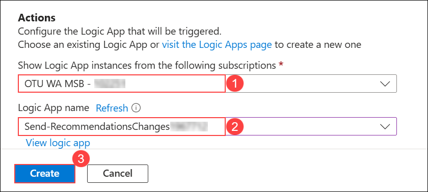

1. Wait for the message **"Workflow automation created successfully. Changes may take up to 5 minutes to be reflected"** to appear. From now on, you will get email notifications for recommendations.

   Once you start to get email notifications, you can disable the automation by selecting the workflow and clicking on **Disable**.

   > Please be aware that if your trigger is a recommendation that has "sub-recommendations" / "nested recommendations", the logic app will not trigger for every new security finding when the status of the parent has changed.

1. Once the automation is automatically triggered, you should expect the email message to look like the screenshot below:

    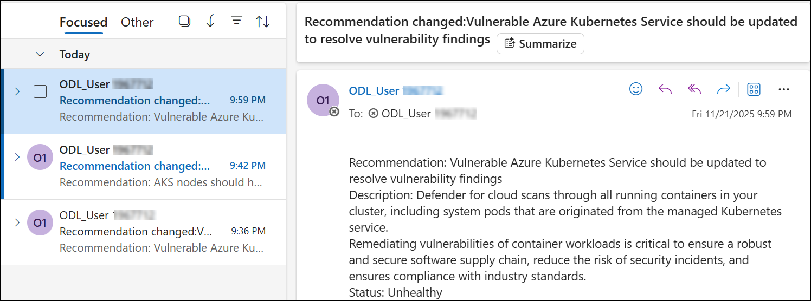

1. Test/trigger your automation manually:

   - On the Microsoft Defender for Cloud panel, click on **Recommendations (1)** from the **General** section.
   - **Search(2)** and select **Azure Kubernetes Service clusters should have the Azure Policy Add-on for Kubernetes installed (3)** and click on it.
   
      > Note: If you don't see the above recommendation that means it is not loaded yet and it could take up to 24 hours for all the recommendations to show up. It is possible that during lab time, this may not show up – which is the case sometimes. You can note down this step number then continue to the next exercise and verify this later.

     
     
   - In **Take action** tab under **Workflow automation** click on the **Trigger Logic App** button.

      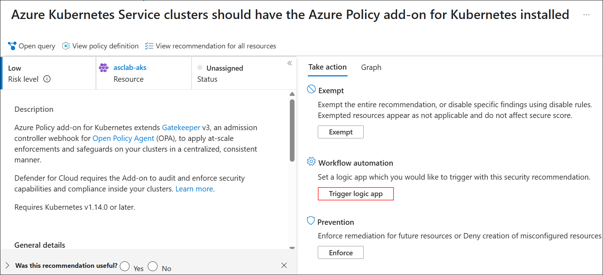
     
   - In the Trigger a logic app blade, select the Logic App you created in the previous step (Send-RecommendationsChanges<inject key="DeploymentID" enableCopy="false"/>) then click on **Trigger**.

       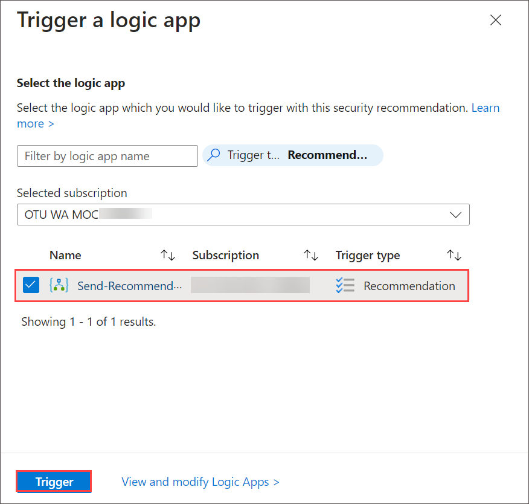
     
    - You should receive an email, verifying in your inbox. On the labvm-xxxxxx open a new tab in the web browser and navigate to https://outlook.office365.com.

<validation step="845d2579-8c67-4525-a137-b105568741c7" />

> **Congratulations** on completing the task! Now, it's time to validate it. Here are the steps:
 
- Navigate to the Lab Validation Page, from the upper right corner in the lab guide section.
- Hit the Validate button for the corresponding task. If you receive a success message, you can proceed to the next task. 
- If not, carefully read the error message and retry the step, following the instructions in the lab guide.
- If you need any assistance, please contact us at labs-support@spektrasystems.com. We are available 24/7 to help you out.
    
### Exercise 3: Accessing your secure score via ARG
Azure Resource Graph (ARG) provides an efficient and performant resource exploration with the ability to query at scale across a given set of subscriptions.

In this exercise, you will query and calculate your score for the security controls and accurately calculate the aggregated score across multiple subscriptions.

1. Search for **Resource Graph Explorer** in the search box located on the top of the **Azure Portal** page and click on **Resource Graph Explorer**.

    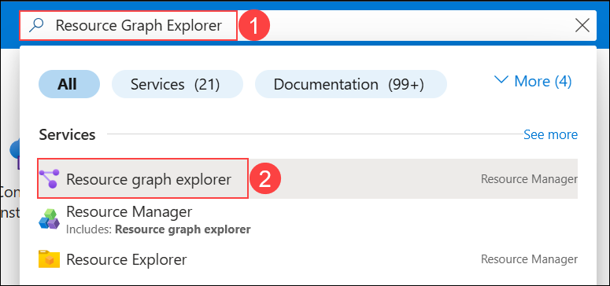

1. Paste the following KQL query and then select **Run query**.

     ```
     SecurityResources
     | where type == 'microsoft.security/securescores'
     | extend current = properties.score.current, max = todouble(properties.score.max)
     | project subscriptionId, current, max, percentage = ((current / max)*100)
     ```

    

   > **Note:** It could require up to few hours for ARG to provide the information. If you don't see any result, please return later to check again.

1. You should now see your subscription ID listed here, along with the current score (in points), the max score and the score in percentage.

1. To return the status of all the security controls, select **New query**. Next, paste the following KQL query and click on **Run query**:

     ```
     SecurityResources
     | where type == 'microsoft.security/securescores/securescorecontrols'
     | extend SecureControl = properties.displayName, unhealthy = properties.unhealthyResourceCount, currentscore = properties.score.current, maxscore = properties.score.max
     | project SecureControl , unhealthy, currentscore, maxscore
     ```

     

   > **Note:** It could require up to few hours for ARG to provide the information. If you don't see any result, please return later to check again.

More details on the [official article](https://docs.microsoft.com/en-us/azure/security-center/secure-score-security-controls) or on the [blog post](https://techcommunity.microsoft.com/t5/azure-security-center/querying-your-secure-score-across-multiple-subscriptions-in/ba-p/1749193)

## Summary

In this module, you have completed exploring more **Microsoft Defender for Cloud** features - **Vulnerability assessment for Containers**, **Automated recommendations with workflow automation** and **Accessed your secure score via ARG**.

Now you can move on to the next module by clicking on the Next button at the bottom right of the screen.
