# Module 6 - Microsoft Defender for Cloud and Security Alerts

### Overview

In this module, you will explore Microsoft Defender for Cloud's features

## Objectives

You will be performing the following activities to achieve the goal:

* Exercise 1: Alert validation
* Exercise 2: Alert suppression
* Exercise 3: Accessing Security Alerts using Graph Security API

### Exercise 1: Alert validation

In this exercise, we will cover the new Alert Simulation as Alerts are the notifications that the Security Center generates when it detects threats to your resources. It prioritizes and lists the alerts, along with the information needed to quickly investigate the problem. The Security Center also provides recommendations for how you can remediate an attack.

1. Search for **Microsoft Defender for Cloud** in the search box located at the top of the **Azure Portal** page and click on it. Next, select **Security alerts** under the **General** tab from the left side pane or by using this [link](https://portal.azure.com/?feature.argsecurityalerts=true&feature.customportal=false#blade/Microsoft_Azure_Security/SecurityMenuBlade/7)

2. Create an alert simulation for VM:
    - On the Security Alerts page, click on the **Sample alerts** button. You will be navigated to the **Create sample alerts (Preview)** window.
    
        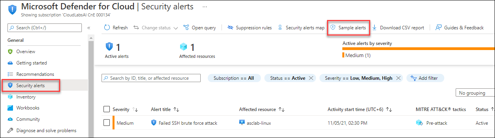
    
    - Select **Your Subscription**.
    - On the **Defender for Cloud plans**, keep only **Virtual Machines** selected.
    - Click on the **Create sample alerts** button to trigger the alert simulation for VMs.

        

3. You will see sample alert creation in progress; wait for the process to complete. Now you can track the progress by opening the notification center or on the activity log (this process usually takes 2 minutes to complete)

4. On the **Microsoft Defender for Cloud | Security alerts** page, you should now see 5 different sample events for a resource named `Sample-VM`. Each alert has the Sample alert banner next to it.

    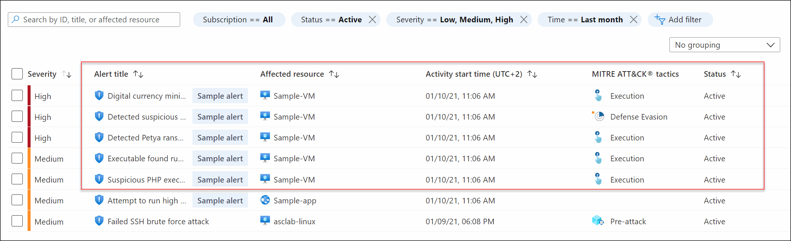

5. Click on the **Digital currency mining related behavior detected** alert.

6. After the details pane opens, notice the alert properties at the top (severity, status, and time) along with the alert's description and affected resources. At the bottom section, you can see the kill chain intent of the alert based on the MITRE ATT&CK® framework. This specific alert is in the execution phase.

    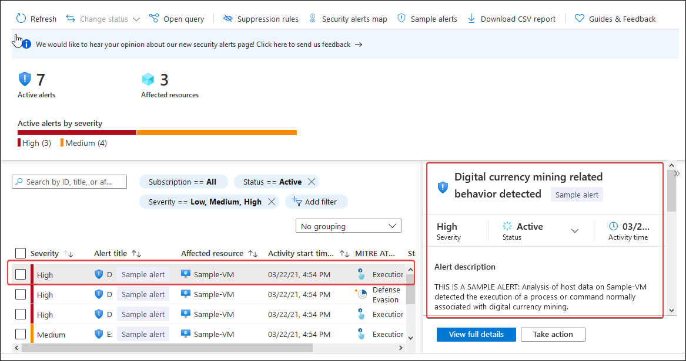

7. To explore the full details of the alert, click on **View full details**. When you are done, return to the **Security alerts** page.

    

8. Create an alert simulation for Key Vaults:
    - On the Security Alerts page, click on the **sample alerts** button.

        
     
    - Select **Your Subscription**.
    - On the Microsoft Defender  for Cloud plans, keep only **Key Vaults** selected.
    - Click the **Create sample alerts** button to trigger the alert simulation for Key Vaults.

        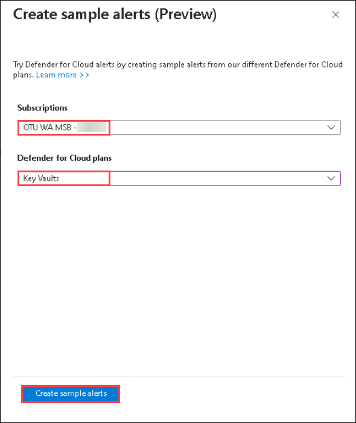
    
9. After the Sample alerts creating in progress appear, wait for the process to complete. You can track the progress by opening the notification center or on the activity log (this process usually takes 2 minutes to complete)

10. On the alerts page, you should now see 5 different sample events for a resource named `Sample-KV`. Each alert has the `Sample alert` banner next to it.

11. Select **Access from a TOR exit node to a Key Vault** alert then click on the **View full details** to see additional information related to the event.

     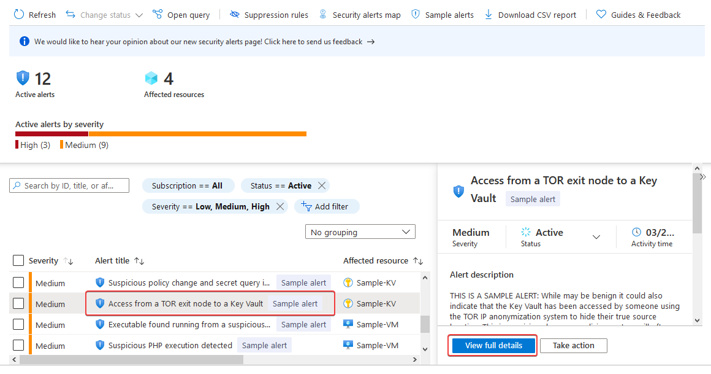

12. At the top menu, dismiss the alert by changing the status from Active to **Dismissed** and click on **OK**.

     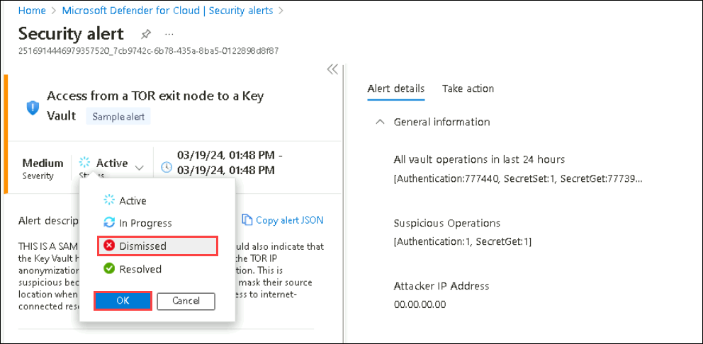

### Exercise 2: Alert suppression

When a single alert isn't interesting or relevant, you can manually dismiss it.
In the previous step, we used the dismiss option to manually dismiss a single alert. However, you can use the suppression rules feature to automatically dismiss similar alerts in the future.

In this exercise, you will be working on alert supression in Microsoft defender for cloud security alerts.

1. Search for **Microsoft Defender for Cloud** in the search box located on the top of the **Azure Portal** page and click on it, then select **Security alerts** under **General** from the left side pane.

2. Select **High volume of operations in a Key Vault** alert and then click on **Take action**.

    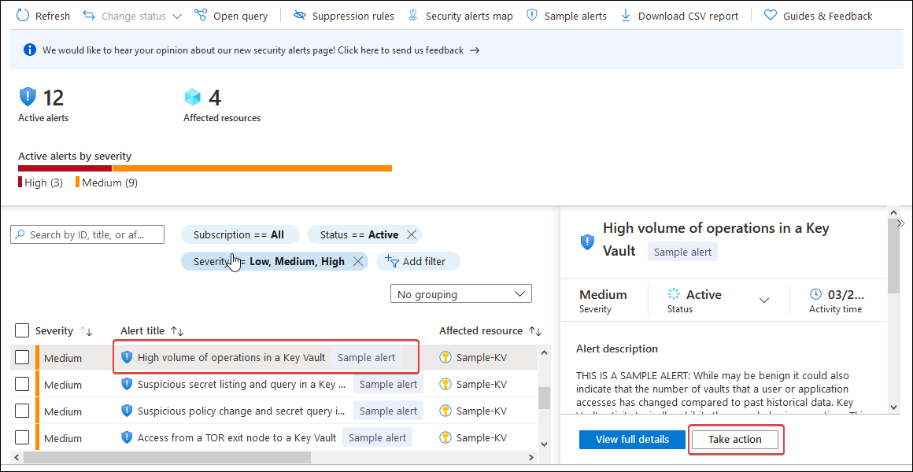

3. Expand the **Suppress similar alerts** under the Take action section and click on **Create Suppression Rule**.

    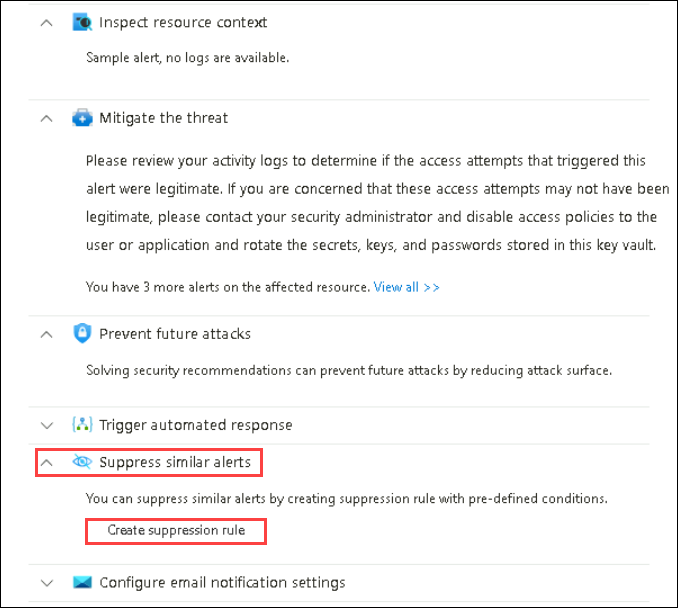

4. After the **New suppression rule** pane opens, enter the following details:

   - Subscription: **Select** your subscription (1)
   
   - Alerts: Select **All (2)** and click on the plus sign to add an entity.
        - Column 1: **Azure resource (3)**
        - Column 2: Select **Resource id (4)** from the dropdown
        - Column 3: Select **Contains (5)** from the dropdown
        - Column 4: Enter **asclab-kv (6)**

            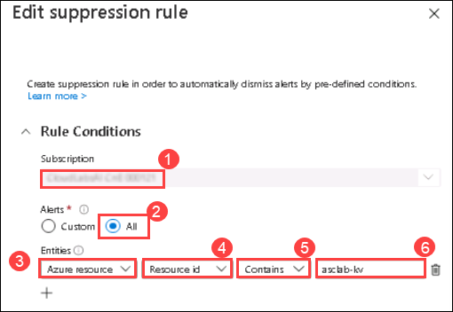

   - Rule name: Enter **Testing-AutoDismiss-KV (1)**
   
   - State: **Enabled (2)**
  
   - Reason: **Other (3)**
   
   - Comment: **Lab 6 exercise (4)**

   - Set rule expiration to be tomorrow (just a day ahead) **(5)**
  
   - Click on **Apply (6)** and wait 10 minutes for the new rule to be applied.

        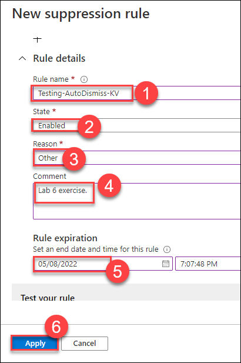

        > **Note:** You can create suppression rules on a management group level by using a built-in policy definition named Deploy - Configure suppression rules for Microsoft Defender for Cloud alerts in Azure Policy. To suppress alerts at the subscription level, you can use the Azure portal or REST APIs.

5. You can change your existing suppression rules or create new ones: On the **Security alerts** page from the top menu, select **Suppression rules**. 

    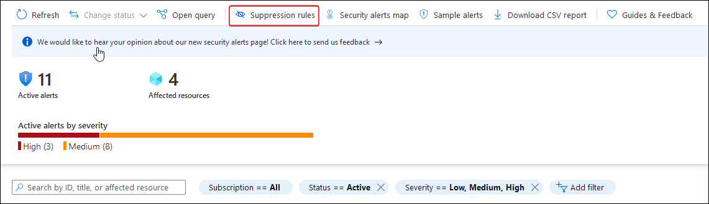

6. Click on the rule you have recently created: `Testing-AutoDismiss-KV` and change the expiration to a month ahead of the current date. Next, click on **Apply**.

    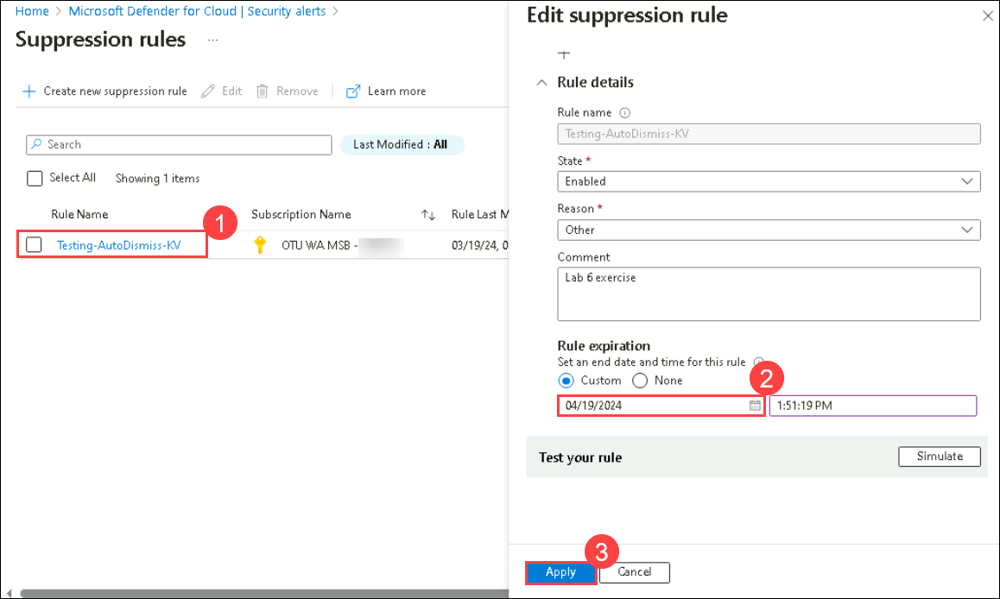
  
    > **Note**: If you receive any pop-up stating the **Warning** alert, click on **OK**

7. To view the dismissed alerts: Navigate to Security Alerts on the main page and to the filters section. Change the **Status (1)** filter value to show only **Dismissed (2)** items and click **Ok (3)**.

     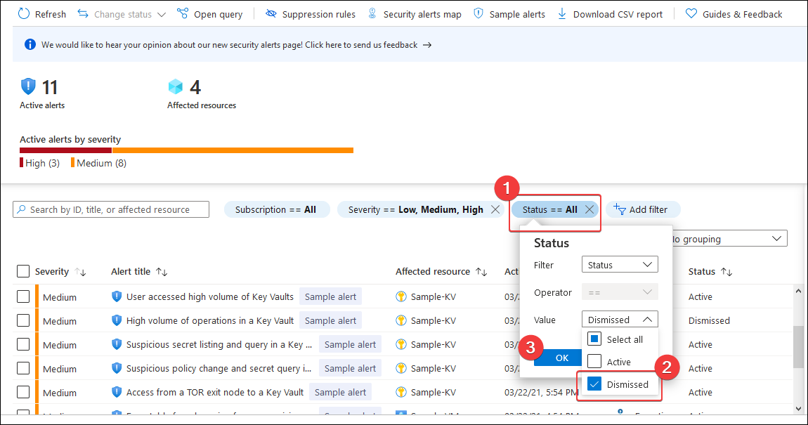

### Exercise 3: Accessing Security Alerts using Graph Security API

You can also query security alert data using REST APIs, such as the Microsoft Graph Security API, which provides a unified interface and schema to integrate with security solutions from Microsoft and Partners.

In this exercise, we will use one of the endpoints that allows retrieving a list of alert objects.

1. In your **labvm-xxxxxx** open a new browser window and navigate to the https://docs.microsoft.com/en-us/graph/api/alert-list?view=graph-rest-1.0 page.

2. Scroll down to the **Example** section for a request or alternatively you can open this URL: https://docs.microsoft.com/en-us/graph/api/alert-list?view=graph-rest-1.0&tabs=http#example in your **labvm-xxxxxx** browser window.

3. On the HTTP tab, review the endpoint URL: `https://graph.microsoft.com/v1.0/security/alerts`.

4. Click on **Try It (1)**, then click on the **User icon (2)** to login. You need to log in using the credentials provided in the **Environment Details** tab.

    

    .png)

5. Click on **Accept** to allow access.

    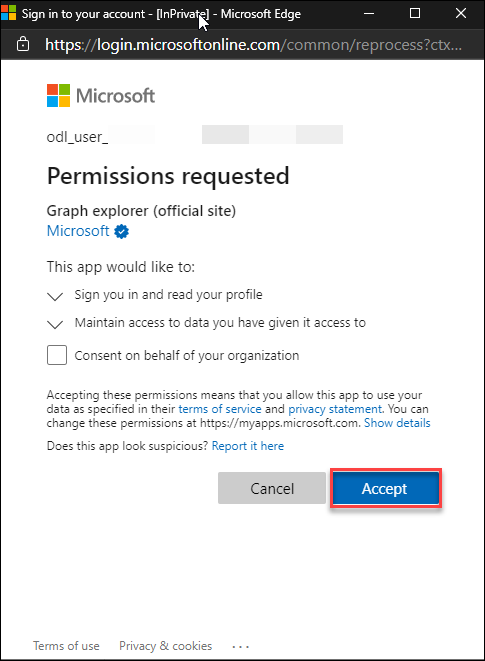

6. Now click on **Modify permissions** and wait for two permissions to load. Scroll to the right side of permissions, then click on **Consent**, do this for both permissions. When prompted for login, login using credentials provided in the **Environment Details** tab, click on **Accept** for each permission to get **Consented**

   > **Note**: If you are not able to get **Consented**, please resize the browser window.
 
    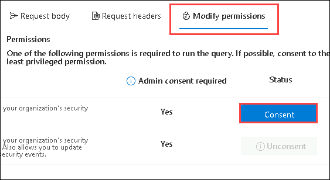

7. Verify that the status is grayed out for both permissions.

    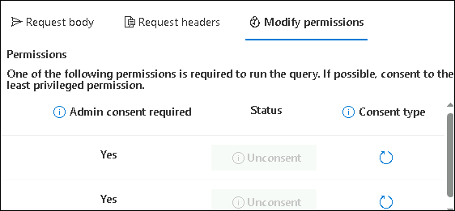
    
8. Replace the endpoint URL with the following endpoint URL:`https://graph.microsoft.com/v1.0/security/alerts?$top=5` **(1)**. This query returns a list of the top five security alerts using the Graph Security API.

    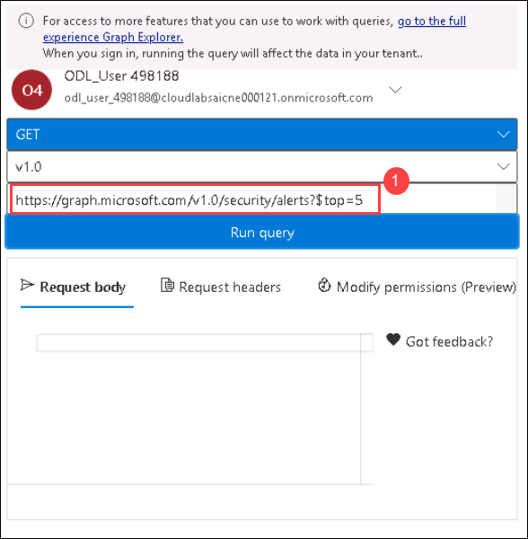    

9. Click on the **Run query** button. You should now see a sample response preview in JSON format.

    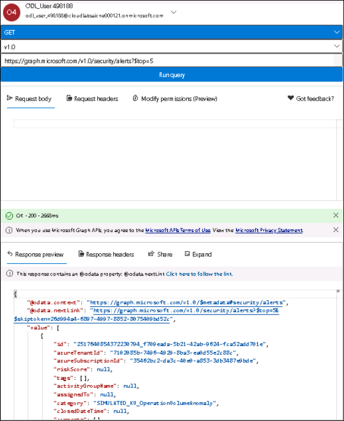

<validation step="cd679082-eaa7-49e2-b577-20883e9e74cb" />

> **Congratulations** on completing the task! Now, it's time to validate it. Here are the steps:
 
- Navigate to the Lab Validation Page, from the upper right corner in the lab guide section.
- Hit the Validate button for the corresponding task. If you receive a success message, you can proceed to the next task. 
- If not, carefully read the error message and retry the step, following the instructions in the lab guide.
- If you need any assistance, please contact us at labs-support@spektrasystems.com. We are available 24/7 to help you out.
    
## Summary

In this module, you have completed exploring more **Security Center** features - **Alert validation**, **Alert suppression** and **Accessed Security Alerts using Graph Security API**.

Now you can move on to the next module by clicking on the Next button at the bottom right of the screen.
