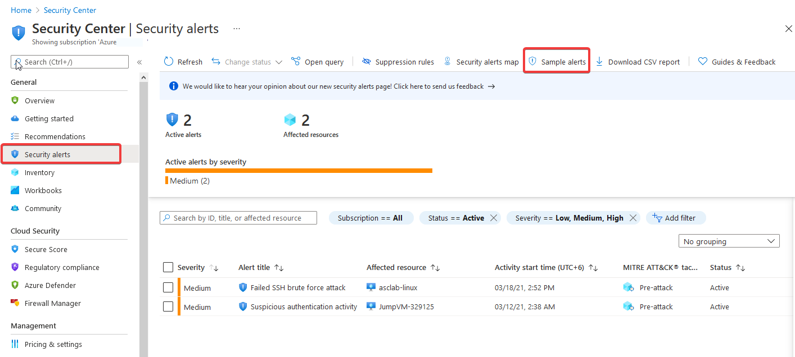
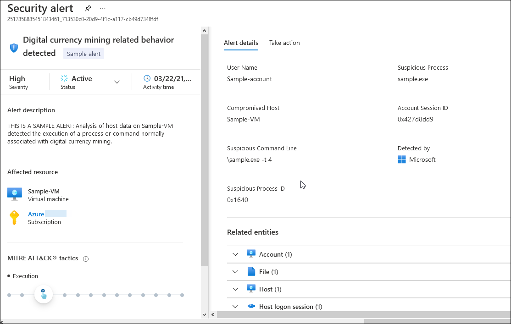
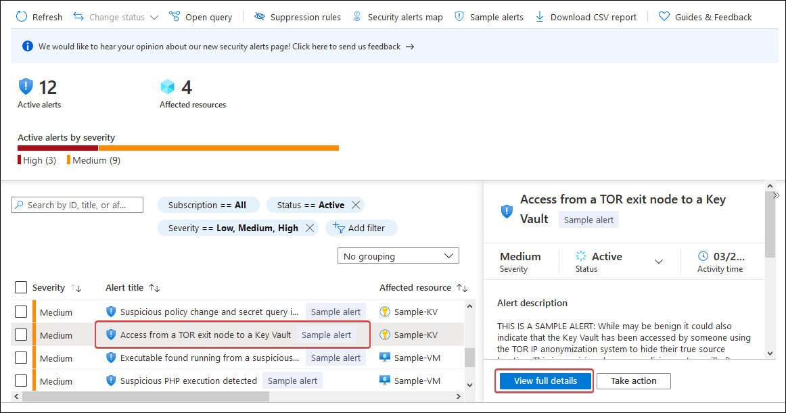
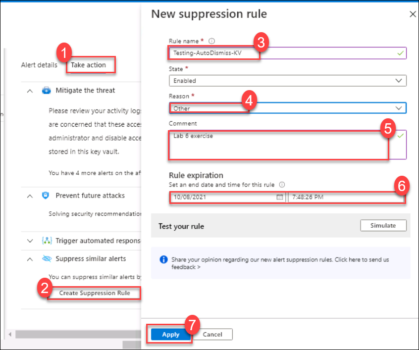
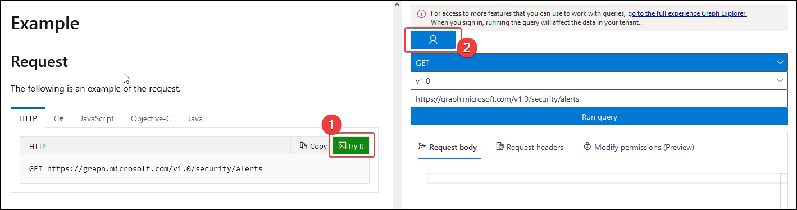
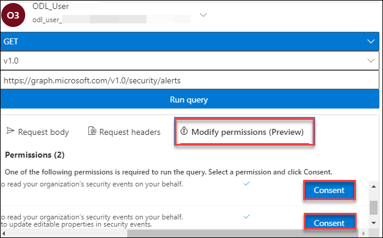
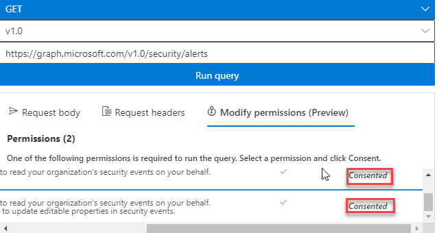
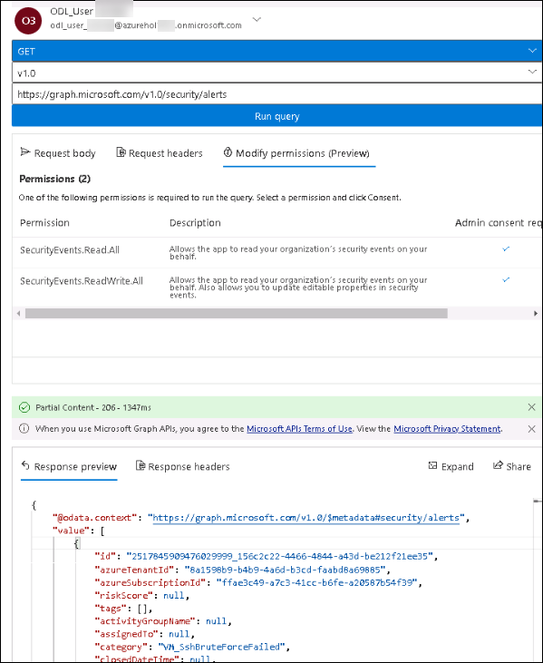

# Module 6 - Azure Defender and Security Center Alerts

### Overview

In this exercise, you will explore Azure Defender and Security Center features

You will be performing the following activities to achieve the goal.

* Creating Sample Alerts
* Creating suppression rule to automatically dismiss similar alerts
* Accessing Security Alerts using Graph Security API

### Exercise 1: Alert validation

In this exercise, we will cover the new Alert Simulation as Alerts are the notifications that Security Center generates when it detects threats on your resources. It prioritizes and lists the alerts along with the information needed to quickly investigate the problem. Security Center also provides recommendations for how you can remediate an attack.

1.	Launch **Azure Portal** using the desktop icon on the **labvm-xxxxxx** and login with the Azure credentials from the Lab **Environment Details** tab if you are not logged in already.

2.	Type **Security Center** in the search box located on the top of the **Azure Portal** page and click on it. Next, select **Security alerts** under **General** tab from left side pane or by using this [link](https://portal.azure.com/?feature.argsecurityalerts=true&feature.customportal=false#blade/Microsoft_Azure_Security/SecurityMenuBlade/7)

3.	Create an alert simulation for VM:
    - On the Security alerts page, click on the **Sample alerts** button. You will be navigated to **Create sample alerts (Preview)** window.
    
    
    
    - Select **Your Subscription**.
    - On the **Azure Defender plan**s, keep only **Virtual Machines** selected.
    - Click on the **Create sample alerts** button to trigger the alert simulation for VMs.

    

4.	You will see Sample alerts creation in progress, wait for the process to complete. Now you can track the progress by opening the notification center or on the activity log (this process usually takes 2 minutes to complete)

5.	On the **Security Center | Security alerts** page, you should now see 5 different sample events for a resource named `Sample-VM`. Each alert has the Sample alert banner next to it.

    

6.	Click on the **Digital currency mining related behavior detected** alert.

7.	After the details pane opens, notice the alert properties at the top (severity, status, and time) along with the alerts description and affected resources. At the bottom section, you can see the kill chain intent of the alert based on the MITRE ATT&CK® framework. This specific alert is at the *Execution* phase.

    

8.	To explore the full details of the alert, click on **View full details**. When you are done return to the **Security alerts** page.

    

9.	Create an alert simulation for Key Vaults:
    - On the Security alerts page, click on the **sample alerts** button.
    - Select **Your Subscription**.
    - On the Azure Defender plans, keep only **Key Vaults** selected.
    - Click **Create sample alerts** button to trigger the alert simulation for Key Vaults.
    
10.	After the Sample alerts creating in progress appear, wait for the process to complete. You can track the progress by opening the notification center or on the activity log (this process usually takes 2 minutes to complete)

11.	On the alerts page, you should now see 5 different sample events for a resource named `Sample-KV`. Each alert has the `Sample alert` banner next to it.

12.	Click on the **Access from a TOR exit node to a Key Vault** alert.

13.	Click on the **View full details** to see additional information related to the event.

14.	At the top menu, dismiss the alert by changing the status from Active to **Dismissed** and click on **OK**.

> Note: You can choose to trigger sample alerts for additional Azure Defender plans.

### Exercise 2: Alert suppression

When a single alert isn't interesting or relevant, you can manually dismiss it.
In the previous step, we used the dismiss option to manually dismiss a single alert. However, you can use the suppression rules feature to automatically dismiss similar alerts in the future.

1.	Type **Security Center** in the search box located on the top of the **Azure Portal** page and click on it, then select **Security alerts** under **General** from the left side pane.

2.	Select **High volume of operations in a Key Vault** alert and then click on **Take action**.

3.	Expand the **Suppress similar alerts** under the Take action section and click on **Create Suppression Rule**.

4.	After the **New suppression rule** pane opens, provide a rule name: *Testing-AutoDismiss-KV*.

5.	On the reason field, select **Other** and leave a comment: *Lab 6 exercise*.

6.	Set rule expiration to be tomorrow (just a day ahead). **Click Apply and wait 10 minutes for the new rule to be applied.**

    

> Note: you can create suppression rules on a management group level by using a built-in policy definition named Deploy - Configure suppression rules for Azure Security Center alerts in Azure Policy. To suppress alerts at the subscription level, you can use the Azure portal or REST APIs.

7. You can change your existing suppression rules or create new ones: On the **Security alerts** page from the top menu, select **Suppression rules**. 

8. Click on the rule you have recently created: `Testing-AutoDismiss-KV`.

9. Change the expiration to be a month ahead from the current date. Next, click on **Apply**.

10. To view the dismissed alerts: Navigate to Security alerts the main page and to the filters section. Change the **Status (1)** filter value to show only **Dismissed (2)** items and click **Ok (3)**.

### Exercise 3: Accessing Security Alerts using Graph Security API

You can also query security alerts data using REST APIs, such as the Microsoft Graph Security API that provides a unified interface and schema to integrate with security solutions from Microsoft and Partners.

In this exercise, we will use one of the endpoints which allow retrieving a list of alert objects.

1.	In your **labvm-xxxxxx** open a new browser window and navigate to https://docs.microsoft.com/en-us/graph/api/alert-list?view=graph-rest-1.0 page.

2.	Scroll down to the **Example** section for a request or aletrnatively you can open this URL https://docs.microsoft.com/en-us/graph/api/alert-list?view=graph-rest-1.0&tabs=http#example in your **labvm-xxxxxx** browser window.

3.	On the HTTP tab, review the endpoint URL: `https://graph.microsoft.com/v1.0/security/alerts`.

4.	Click on **Try It (1)** then click on the **User icon (2)** to login. You need to login using the credentials provided in the **Environment Details** tab.

.png)

5.  Click on **Accept** to allow access.

6.  Now click on **Modify Permissions (Preview)** and wait for two permissions to load. Scroll to the right side of permissions then click on **Consent**, do this for both permissions. When prompted for login, login using credentials provided in the **Environment Details** tab, click on **Accept** for each permission to get **Consented**

    > **Note** : If you are not able to get **Consented**, please resize the browser window.

7.  Verify both permissions are **Consented**

8.	Click on the **Run query** button. You should now see a sample response preview in JSON format.

### Summary

In this module, you have completed exploring more **Security Center** features - **Alert validation**, **Alert suppression** and **Accessed Security Alerts using Graph Security API**.

Now you can move on to the next module by clicking on the Next button at the bottom right of the screen.
