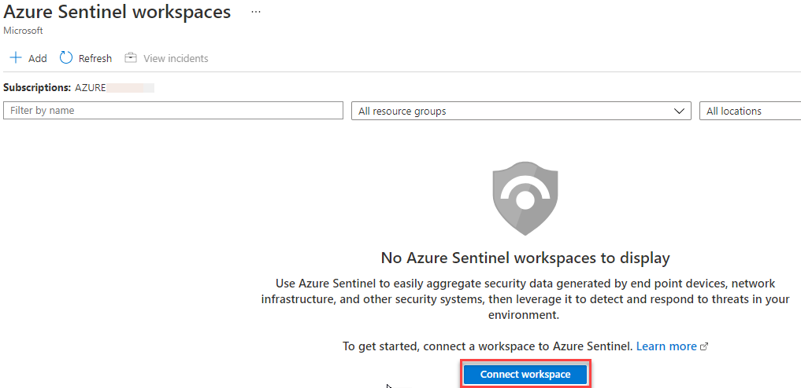
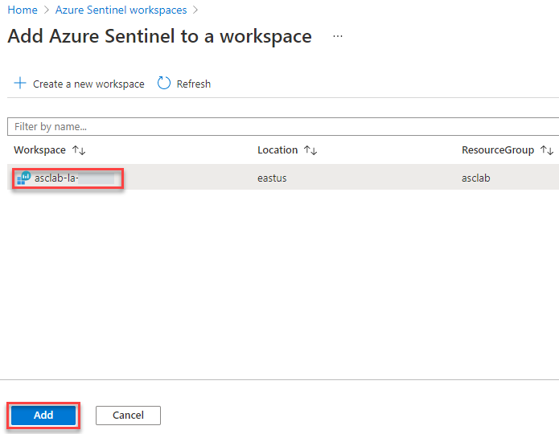

# Module 7 – Exporting ASC information to a SIEM

## Overview

In this module, you will configure the continuous export for Log Analytics workspace, exporting security alerts, recommendations, secure score, and security findings. Moreover, you will learn how to enable the integration between Azure Security Center and Azure Sentinel.

### Exercise 1: Using continuous export

Azure Security Center generates detailed security alerts and recommendations. You can view them in the portal or through programmatic tools. You might also need to export some or all of this information for tracking with other monitoring tools in your environment.

Continuous export lets you fully customize what will be exported, and where it will go. Even though the feature is called continuous, there's also an option to export weekly snapshots of secure score or regulatory compliance data.

1.	Launch **Azure Portal** using the desktop icon on the **JumpVM** and login with the Azure credentials from the Lab **Environment Details** tab

2.	Type **Security Center** in the search box located on the top of the **Azure Portal** page and click on it. Next, click on **Pricing & settings** under **Management** tab in left sidebar.

3.	Select **Your Subscription**.

4.	From the Azure Defender plans sidebar, click on **Continuous export**.

5.	Here you can configure the streaming export setting of Security Center data to multiple export targets either Event Hub or Log Analytics workspace.

6.	Select the **Log Analytics workspace** option.

7.	On the Exported data types, select **Security recommendations, Secure score (Preview) and Security alerts** – as you can see, all recommendations, severities, controls, and alerts are selected.

8.	On the Export configuration, select a resource group: *asclab*

9.	On the Export target, select the target Log Analytics workspace: *asclab-la-{DeploymentID}*

    **Note**: Deployment ID can be obtained from the Lab Environment Details tab.

10.	Click on the **Save** button on the top menu.

> Note: Exporting Security Center's data also enables you to use experiences such as integration with 3rd-party SIEM and Azure Data Explorer.

11.	Type **Log Analytics workspaces** in the search box located on the top of the **Azure Portal** page and click on it or [click here](https://portal.azure.com/#blade/HubsExtension/BrowseResource/resourceType/Microsoft.OperationalInsights%2Fworkspaces).

12.	Click on the **asclab-la-{DeploymentID}** workspace.

13.	From the workspace’s sidebar, click on the **Logs** button under **General** section.

14.	On the welcome page, click on the **Get Started** button and then **close the Queries window**.

15.	From the left pane, notice the following tables: `SecureityEvent`, `SecurityBaseline`, `SecurityBaselineSummary` and  `UpdateSummary` in `Security and Audit`.

16.	Query the tables later on to validate data streaming - double click on the desired table to open a new query. Then click **Run**.

### Exercise 2: Integration with Azure Sentinel

Integration with Azure Sentinel will enable centralized monitoring of alerts and discovery data. Integrating with Azure Sentinel allows you to better protect your cloud applications while maintaining your usual security workflow, automating security procedures, and correlating between cloud-based and on-premises events.

1.	Type **Azure Sentinel** in the search box located on the top of the **Azure Portal** page and click on it or [click here](https://portal.azure.com/#blade/Microsoft_Azure_Security_Insights/WorkspaceSelectorBlade).

2.	On the Azure Sentinel workspaces, click on the **Connect workspace** button – for this exercise we’ll use the same Log Analytics workspace used by Security Center.

3.	On the **Add Azure Sentinel to a workspace**, select **asclab-la-{DeploymentID}** workspace. Click on **Add**.

4.	Adding Azure Sentinel to workspace asclab-la-{DeploymentID} is now in progress. This process will take few minutes to complete. 

5.	Once Sentinel News and guides open, use the Azure Security Center connector to enable the integration.

6.	From Sentinel’s sidebar, click on the **Data connectors**.

7.	On the Data connectors page, use the search field and type: *Azure Defender*.

8.	Select the **Azure Defender** connector and then click on **Open connector page**.

9.	On the Configuration section, locate **Your subscription** and change the toggle button to **Connect**. Wait for the connection status to be: `Connected`.

10.	On the Create incidents (recommended) click on the **Enable** button to create incidents automatically from all alerts generated in this connected service.

### Summary

In this lab you have completed configuring continuous export for Log Analytics workspace, exporting security alerts, recommendations, secure score, and security findings and enable the integration between Azure Security Center and Azure Sentinel.

Now you can move on to the next module by clicking on the Next button at the bottom right of the screen.
