# Module 7 – Exporting Microsoft Defender for Cloud information to a SIEM

## Overview

In this module, you will configure the continuous export for the Log Analytics workspace, exporting security alerts, recommendations, secure scores, and security findings. Moreover, you will learn how to enable the integration between Microsoft Defender for Cloud and Microsoft Sentinel.

## Objectives

- Exercise 1: Using continuous export
- Exercise 2: Integration with Microsoft Sentinel

### Exercise 1: Using continuous export

Microsoft Defender for Cloud generates detailed security alerts and recommendations. You can view them in the portal or through programmatic tools. You might also need to export some or all of this information for tracking with other monitoring tools in your environment.

Continuous export lets you fully customize what will be exported and where it will go. Even though the feature is called continuous, there's also an option to export weekly snapshots of secure score or regulatory compliance data.

In this exercise, you will be creating log analytics workspace in Microsoft defender for cloud.

1. Type **Microsoft Defender for Cloud** in the search box located at the top of the **Azure Portal** page and click on it.

    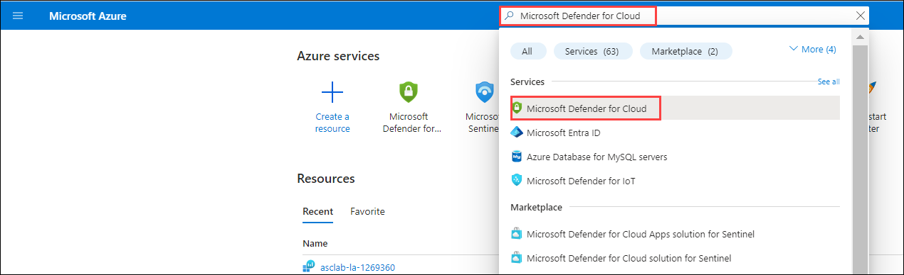

1. From **Microsoft Defender for Cloud** blade, Select **Environment settings**. Here, you'll be able to see the subscription.

    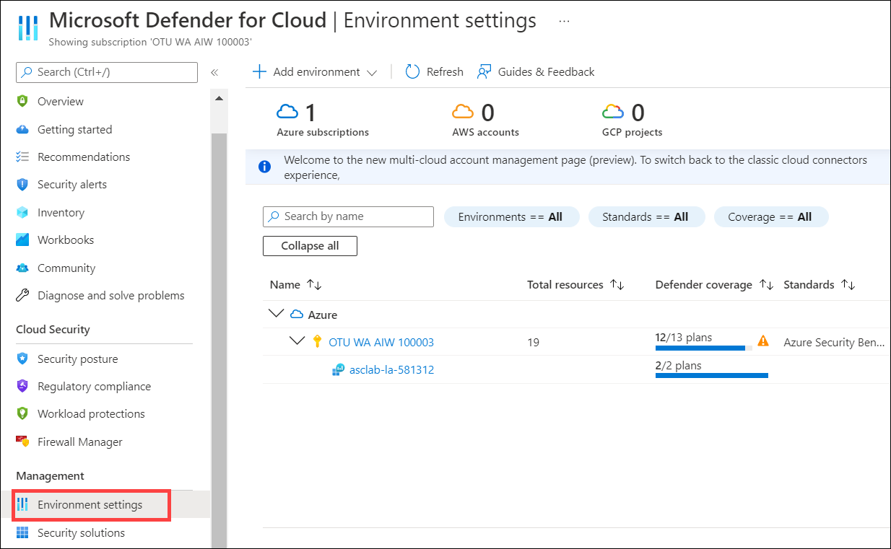
    
1. Select **Your Subscription** under the Environment settings.

    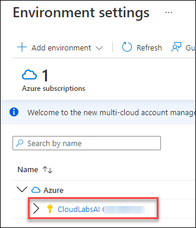

1. Under **Settings** section, click on **Continuous export**.

    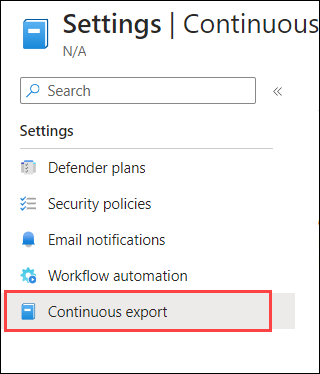

1. Here, you can configure the streaming export setting of Security Center data to multiple export targets either Event Hub or Log Analytics workspace.

1. Select the **Log Analytics workspace (1)** option and follow the below steps:

    - Exported data types:

     - Check the box next to  **Security recommendations (2)**

     - Check the box next to **Secure score (3)**

     - Check the box next to **Security alerts (4)**

         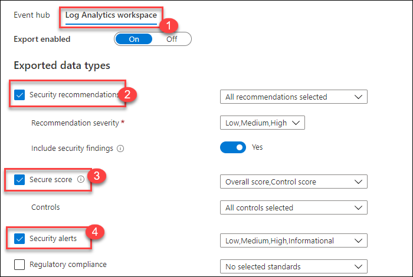
     
     - Export Frequency:

     - Check the box next to **Streaming updates (5)** and **Snapshots(6)**

     - Export configuration:

      - Resource group: Select **asclab (7)** from the drop-down list

     - Export target:

      - Subscription: Select your **Subscription (8)**

      - Select target workspace: Select **asclab-la-<inject key="Deployment ID" enableCopy="false" /> (9)**

     -  Click on **Save (10)**

        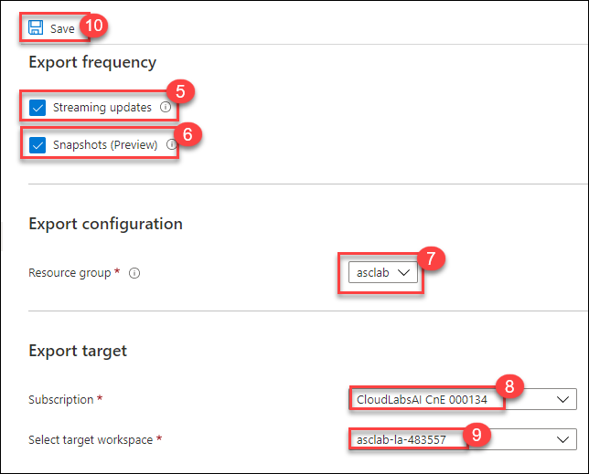

        > **Note:** Exporting Security Center's data also enables you to use experiences such as integration with 3rd-party SIEM and Azure Data Explorer.

1. Search for **Log Analytics workspaces** in the search box located on the top of the **Azure Portal** page and click on it or [click here](https://portal.azure.com/#blade/HubsExtension/BrowseResource/resourceType/Microsoft.OperationalInsights%2Fworkspaces).

1. Click on the **asclab-la-<inject key="Deployment ID" enableCopy="false" /> (1)** workspace and select **Logs (2)**.

    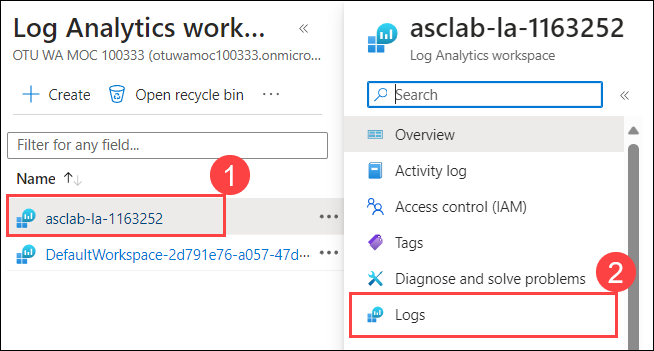 

1. On the welcome page, close the **Queries** window.

    

1. From the left pane, select the **Tables** tab and **enable** the **Show tables with no data** option to see the following tables: `SecurityEvent`, `SecurityBaseline`, `SecurityBaselineSummary` and  `UpdateSummary` in `Security and Audit`.

    

1. Query the tables to validate data streaming - For example, click on **Tables (1)**, expand **Security and Audit (2)** double-click on **Security Event (3)** to open the query window. Now click on **Run (4)** and see the results below.

    
  
   > **Note:** Since the continuous export was just enabled, you may need to wait for some time for new events to show up. It could require up to few hours to provide the information. If you don't see any result, please return later to check again.

### Exercise 2: Integration with Microsoft Sentinel

Integration with Microsoft Sentinel will enable centralized monitoring of alerts and discovery data. Integrating with Microsoft Sentinel allows you to better protect your cloud applications while maintaining your usual security workflow, automating security procedures, and correlating between cloud-based and on-premises events.

In this exercise, you will be integrating the workspace which is previously created integrating it with Microsoft sentinel.

1. Search for **Microsoft Sentinel** in the search box located on the top of the **Azure Portal** page and click on it or [click here](https://portal.azure.com/#blade/Microsoft_Azure_Security_Insights/WorkspaceSelectorBlade).

    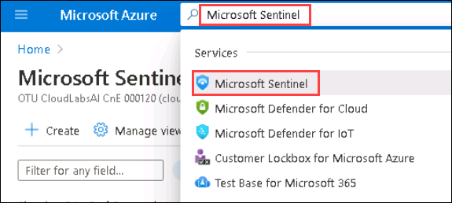

2. On the **Microsoft Sentinel** blade, click on the **Create Microsoft Sentinel** button – for this exercise, we’ll use the same Log Analytics workspace used by the Security Center.
 
    

3. On the **Add Microsoft Sentinel to a workspace**, select **asclab-la-<inject key="Deployment ID" enableCopy="false" />** workspace. Click on **Add**.

    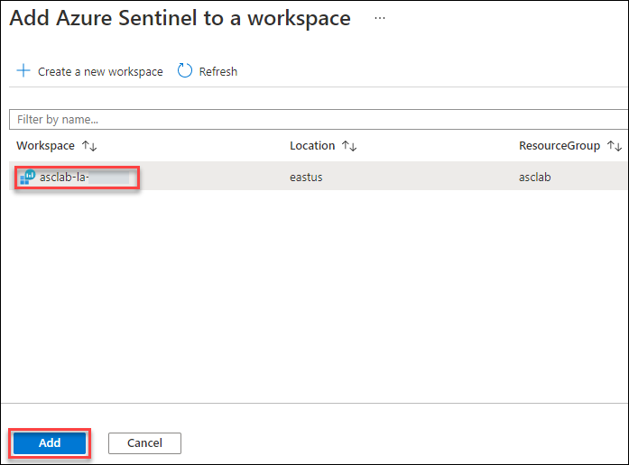

4. Adding Microsoft Sentinel to workspace asclab-la-<inject key="Deployment ID" enableCopy="false" /> is now in progress. This process will take a few minutes to complete. 

5. Once the deployment of the workspace is completed you will get a notification **Successfully added Microsoft Sentinel**. Refresh the web browser page to see the workspace listed on the Microsoft Sentinel page.

   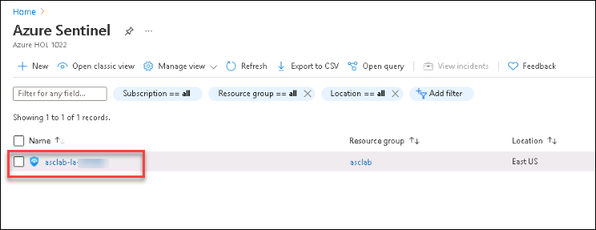

6. Select the workspace **asclab-la-<inject key="Deployment ID" enableCopy="false" />** on the **Microsoft Sentinel** page. 

7. From the Microsoft Sentinel side pane, click on the **Data connectors** under the **Configuration** section.

    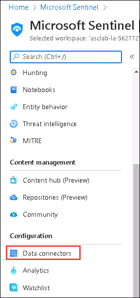
    

8. On the **Data connectors** page, use the search field and type: *Microsoft Defender*. Select the **Subscription-based Microsoft Defender for Cloud (Legacy) (1)** connector and then click on **Open connector page (2)**.

    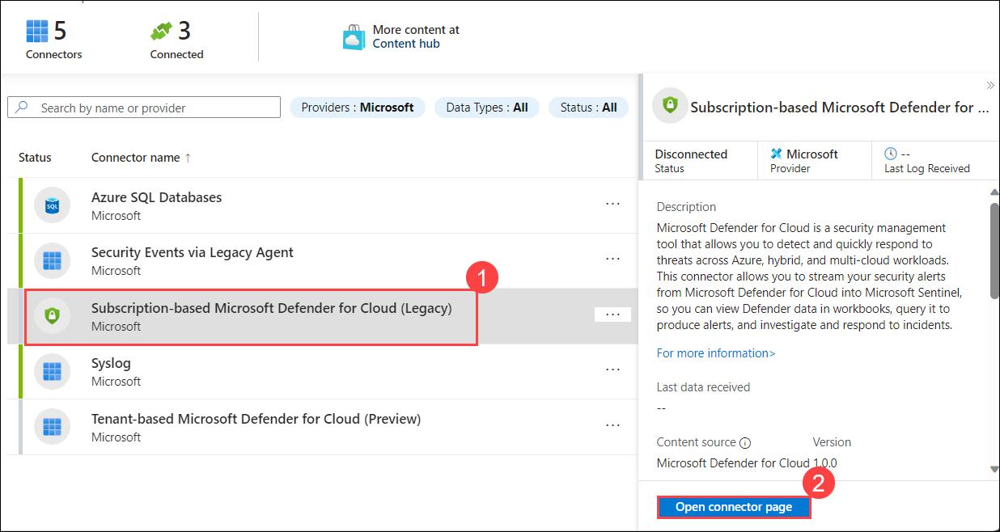
   
   >**Note**: If you didn't find Microsoft Defender for the cloud, follow the below steps; otherwise, continue from step 11.

10. Click the **Content hub (1)** on the **Microsoft Sentinel** blade, search for **Microsoft Defender (2)**, select **Microsoft Defender for Cloud (3)**, and click **Install (4)**.

    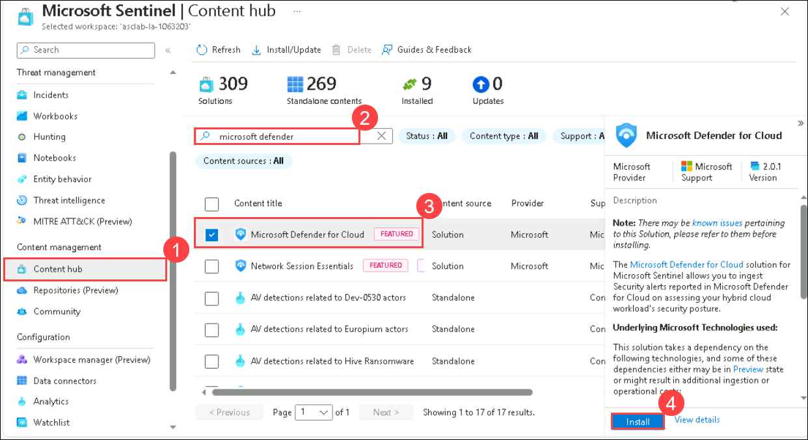

11. On the **Data connectors** page, use the search field and type: *Microsoft Defender*. Select the **Subscription-based Microsoft Defender for Cloud (Legacy) (1)** connector and then click on **Open connector page (2)**.

    

12. On the Configuration section, locate **Your subscription** and change the toggle button to **Connected**.

    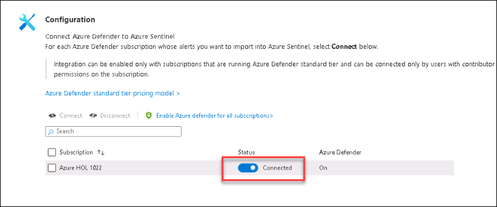

13. On the Create incidents (recommended), click on the **Enable** button to create incidents automatically from all alerts generated in this connected service.

     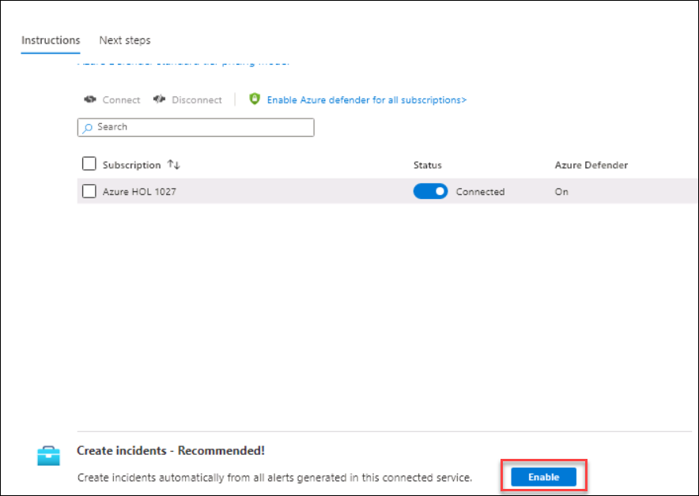
 
    > **Note:** You may have to scroll down to find the option.
    
    > **Note:** If you cannot see the **Enable** button in the Create incidents option, follow the below steps:
    
14. In the Azure portal under Microsoft Sentinel, select **Analytics (1)**. Select the **Rule templates (2)** tab to see all of the analytics rule templates. search for **Create incident (3)** and select **Create incidents based on Microsoft Defender for Cloud (4)**, and click on **Create rule (5)**.

    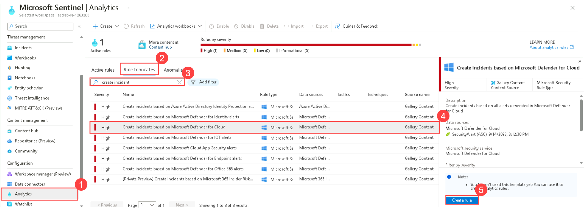

15. On the **Analytics rule wizard - Create a new Microsoft Security rule** pane, You can modify the rule details and choose to filter the alerts that will create incidents by alert severity or by text contained in the alert’s name. For example, if you choose Microsoft Defender for Cloud in the Microsoft security service field and choose High in the Filter by Severity field, only high-severity security alerts will automatically create incidents in Microsoft Sentinel.

    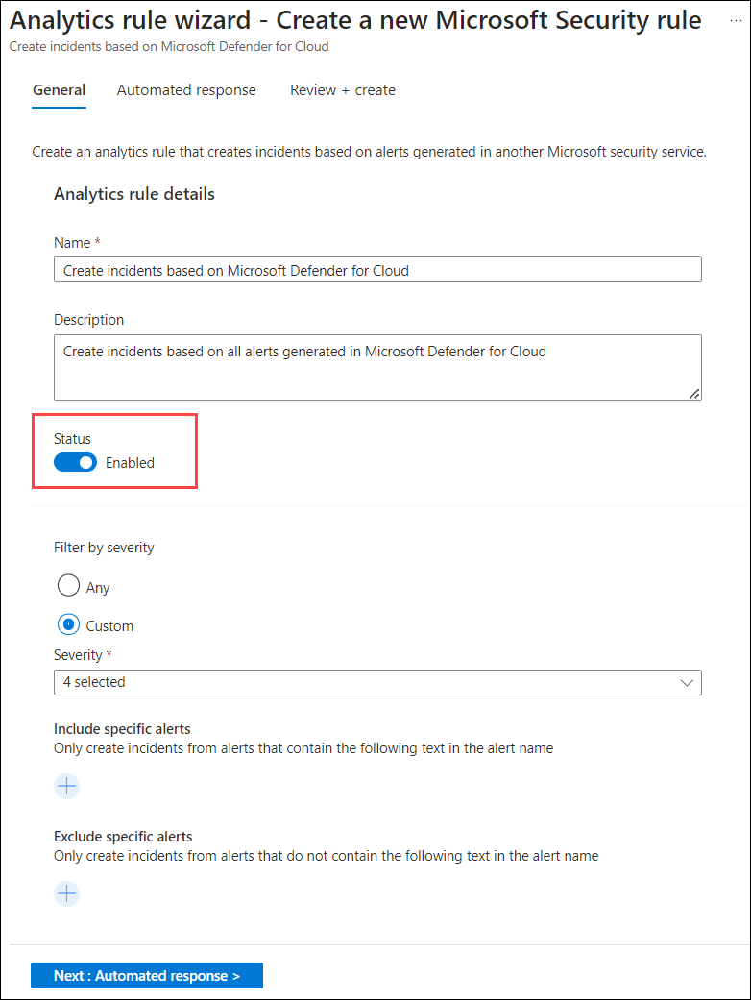

16. Click on **Next: Automated response >** and then click on **Next: Review + Create >** and click on **Save** button.

    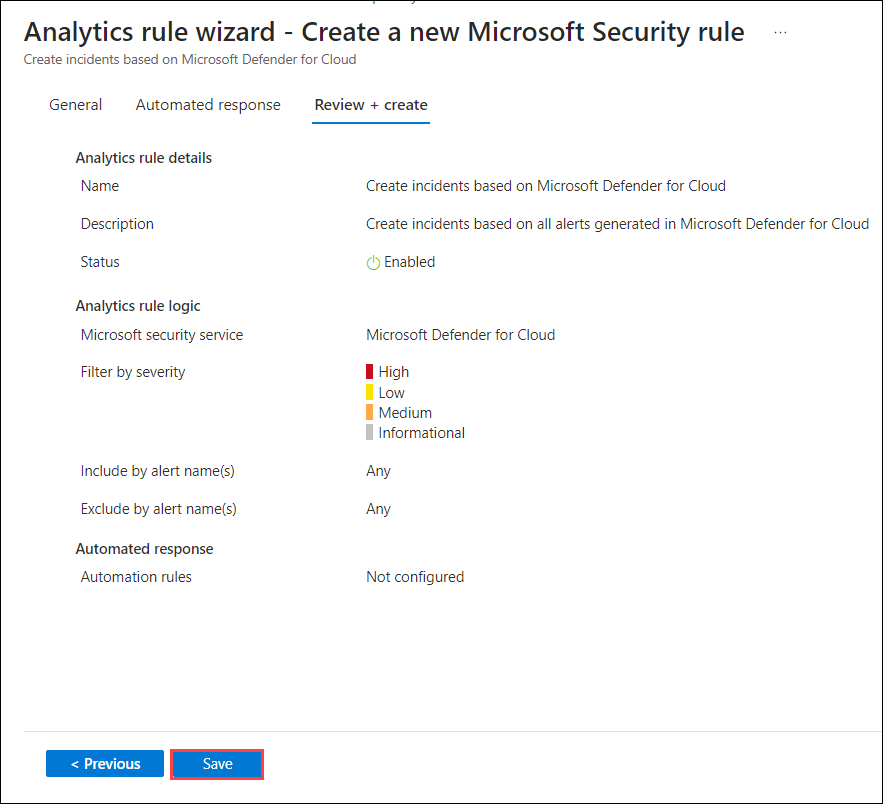

<validation step="9b3b38db-6d01-4df2-a6f9-ef467daa294b" />

> **Congratulations** on completing the task! Now, it's time to validate it. Here are the steps:
 
- Navigate to the Lab Validation Page, from the upper right corner in the lab guide section.
- Hit the Validate button for the corresponding task. If you receive a success message, you can proceed to the next task. 
- If not, carefully read the error message and retry the step, following the instructions in the lab guide.
- If you need any assistance, please contact us at labs-support@spektrasystems.com. We are available 24/7 to help you out.
    
### Summary

In this lab you have completed configuring continuous export for the Log Analytics workspace, exporting security alerts, recommendations, secure score, and security findings, and enabling the integration between Microsoft Defender for Cloud and Microsoft Sentinel.

Now you can move on to the next module by clicking on the Next button at the bottom right of the screen.
