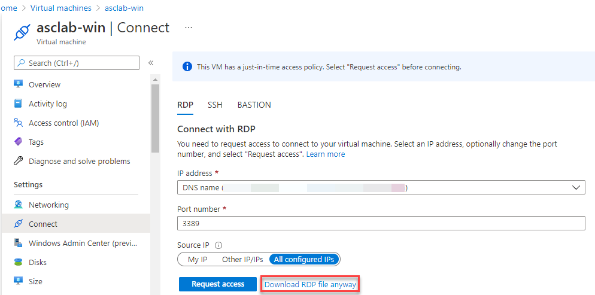
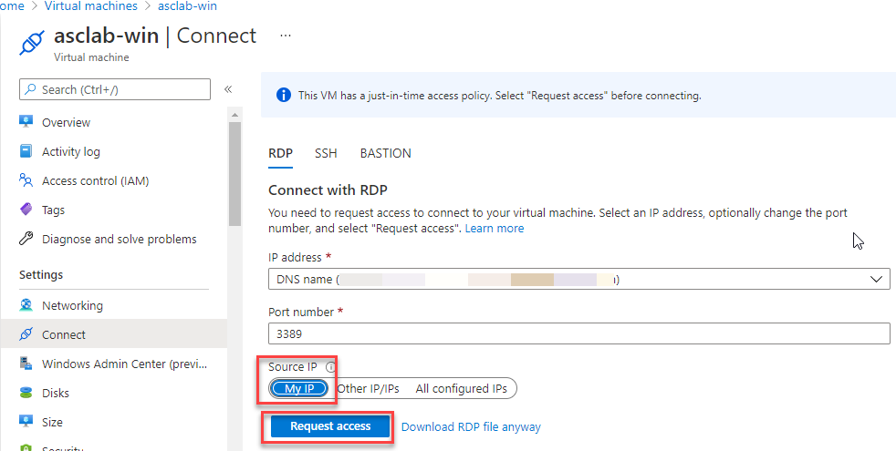
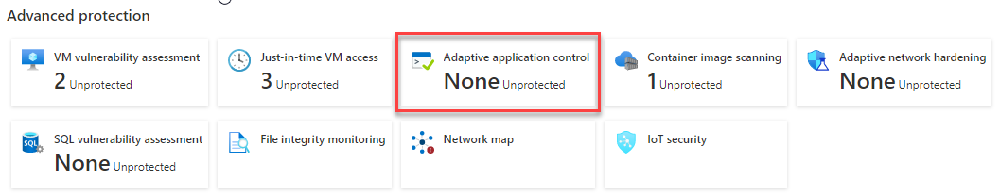
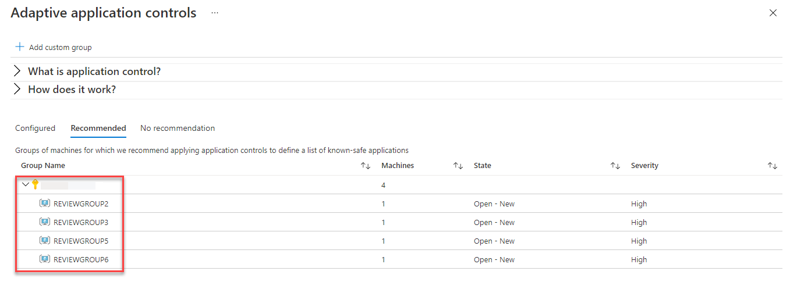
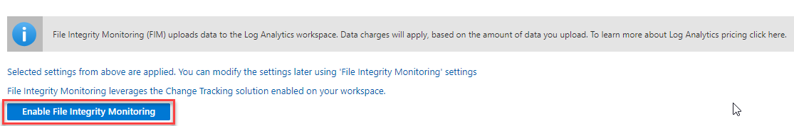

# Module 8 – Advance Cloud Defense

### Overview

In this exercise, you will be exploring the Azure Defender features for advance cloud defence

You will be performing the following activities to achieve the goal.

* Using JIT(Just In Time access to VMs) to reduce attack surface
* Using Application control to deal with malicious and/or unauthorized software
* Using File integrity monitoring (FIM) to monitor Operating System files

### Exercise 1: Using JIT to reduce attack surface

In the simplest terms, the “attack surface” is the sum total of resources exposed to exploit within your enterprise. Defending the attack surface was a lot less complicated when a defined corporate “perimeter” existed, neatly separating a company’s assets from the outside world using **Just-in-time VM access**.

1.	Launch **Azure Portal** using the desktop icon on the **JumpVM** and login with the Azure credentials from the Lab **Environment Details** tab.

2.	Type **Security Center** in the search box located on the top of the **Azure Portal** page and click on it, then select **Azure Defender** under **Cloud Security** from left sidebar.

3.	Navigate to the bottom section under Advanced protection, click on **Just-in-time VM access** (You should see unprotected status number).

4.	Whn you are in the Just-in-time VM access page, select the **Not configure** tab. You should see virtual machines listed: `asclab-linux` and `asclab-win`.

5.	Select **asclab-win** and then click on the **Enable JIT on 1 VM** button.

6.	On the JIT VM access configuration, keep just the **3389 (RDP) port and remove all the others**. To remove, click on the ellipses and then click on **Delete**.

7.	Click **Save** to apply the VM access configuration.

8.	Review the **Configured** tab, now you should see your VM configured: `asclab-win`.

9.	On the Azure portal sidebar, click on **Virtual Machines**.

10.	Click on **asclab-win**.

11.	From the top menu, click on **Connect** button and then select **RDP**.

12.	On the Connect with RDP, click on the **Download RDP file anyway** button. Alternatively, from the VM blade, look for the Public IP address and try to connect using RDP.

13.	Click on the downloaded file to initiate a remote connection to the server. On the warning message, **ignore the message by clicking on Connect**.

14.	You should see the following error message: *Remote Desktop can't connect to the remote computer*. In this scenario, the remote access to the server is not enable.

15.	Return to the VM blade Connect page, On the **Source IP**, select **My IP** and then click on **Request access**. You should now see the following message: *Access approved on port 3389 from the selected IPs. You can now connect.*

16.	Try to connect again to validate your JIT access to the VM. Use the same file you downloaded previously.

17.	Now you should get the prompt for the local admin credentials. **Type your username and password from Environment Details tab** and click **OK**.

18.	You **are now connected to asclab-win** server. Close the remote control session/log off.

### Exercise 2: Adaptive Application Control

Application control helps you deal with malicious and/or unauthorized software, by allowing only specific applications to run on your machines.

1.	Type **Security Center** in the search box located on the top of the **Azure Portal** page and click on it, then select **Azure Defender** under **Cloud Security** from left sidebar.

2.	Navigate to the bottom section under Advanced protection, click on **Adaptive application control**

4.	The Adaptive application controls page opens with your VMs grouped into the following tabs: Configured, Recommended and No recommendations.

5.	Click on the **Recommended** tab.

6.	If this tab does not contain any group yet, it means that Security Center needs at least two weeks of data to define the unique recommendations per group of machines.

### Exercise 3: File Integrity Monitoring

File integrity monitoring (FIM), also known as change monitoring, examines operating system files, Windows registries, application software, Linux system files, and more. It detects and reports changes that might indicate an attack.
It maps the current state of these items with the state during the previous scan and alerts you if any suspicious modifications have been made. To enable FIM, follow the instructions below:

1.	Type **Security Center** in the search box located on the top of the **Azure Portal** page and click on it, then select **Azure Defender** under **Cloud Security** from left sidebar.

2.	Navigate to the bottom section under Advanced protection, click on **File Integrity Monitoring** tile.

3.	On the FIM configuration page, select the **Log Analytics workspace listed** `asclab-la-{DeploymentID}` (or just by clicking on the Upgrade icon - it indicates that FIM is not enabled for the selected workspace).

    **Note**: Deployment ID can be obtained from the Lab Environment output page.

4.	On the Enable FIM window, **review the default recommended settings** for Windows files, Registry and Linux files.

5.	Click on **Enable File Integrity Monitoring** button.

### Summary

  * In this module, you have completed exploring different **Security Center** features - **Used JIT to reduce attack surface**, **Adaptive Application Control** and **File Integrity Monitoring**. You have reached the end of the lab.
