# Module 8 – Advance Cloud Defense

### Overview

In this module, you will be exploring the Microsoft Defender for Cloud features for Advanced Cloud Defense

## Objectives

You will be performing the following activities to achieve the goal:

* Exercise 1: Using JIT to reduce the attack surface
* Exercise 2: File Integrity Monitoring

### Exercise 1: Using JIT to reduce the attack surface

In the simplest terms, the “attack surface” is the sum total of resources exposed to exploit within your enterprise. Defending the attack surface was a lot less complicated when a defined corporate “perimeter” existed, neatly separating a company’s assets from the outside world using **Just-in-time VM access**.

In this exercise, you will be using Just In Time access (JIT) to access your virtual machine.

1. Launch **Azure Portal** using the desktop icon on the **labvm-xxxxxx** and log in with the Azure credentials from the Lab **Environment Details** tab.

1. Type **Microsoft Defender for Cloud** in the search box located on the top of the **Azure Portal** page and click on it.

    

1. Select **Workload protections** under **Cloud Security** from the left side pane.

    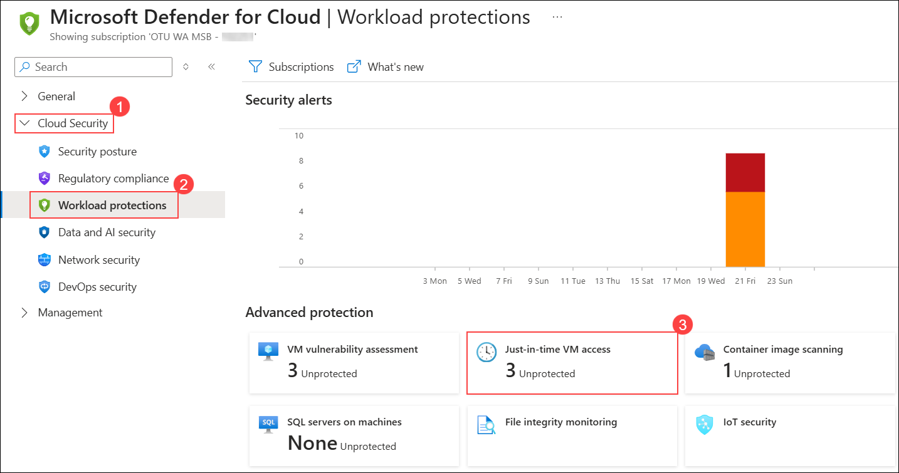

1. When you are on the **Just-in-time VM access** page, select the **Not configured** tab. You should see virtual machines listed: `asclab-linux` and `asclab-win`.
    
    > **Note**: If the virtual machines `asclab-linux` and `asclab-win` are present under the **Unsupported** tab, then follow the below instructions to enable **Just-in-time VM access**.
    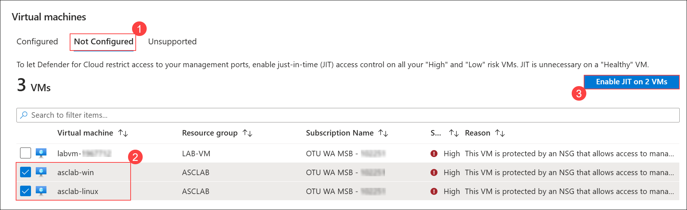

1. Navigate to **asclab** resource group and select **asclab-win** virtual machine.

    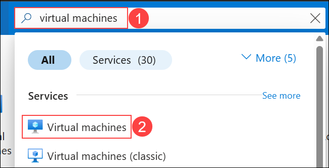

    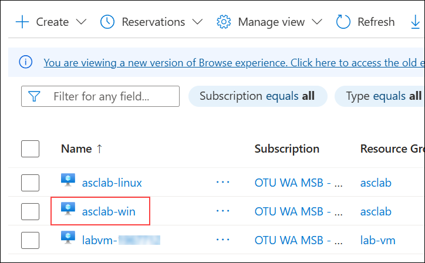

1. Select **Configuration** from the left-hand side menu in **Settings** and click on **Enable Just-in-time**
       
    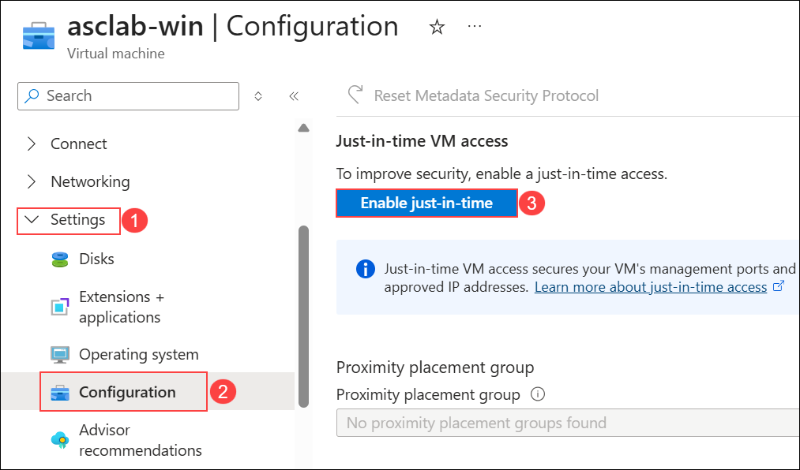
       
1. Navigate back to **Microsoft Defender for Cloud** and select **Workload protections** under **Cloud Security** from the left side pane, then click on **Just-in-time VM access**.

    - Review the **Configured** tab, now you should see your VM configured: `asclab-win`

        
    
1. Select **asclab-win** and then click on the **Enable JIT on 1 VM** button.
    > If you have followed the above instructions to enable **Just-in-time VM access**, you can skip Steps 8-11 and continue from Step 12.
    
    

1. On the **JIT VM access configuration** page, keep just the **3389 (RDP) port** and remove all the other ports listed. To remove, click on the ellipses icon (...) for each port and then click on **Delete**.

1. Click **Save** to apply the VM access configuration.

    

1. Review the **Configured** tab, now you should see your VM configured: `asclab-win`.

1. Type **Virtual machines** in the search box located at the top of the Azure Portal page and click on it.

1. Select the virtual machine **asclab-win**.

    

1. On the VM **Overview** page, if the virtual machine is in a stopped state, click **Start** to power it on.

    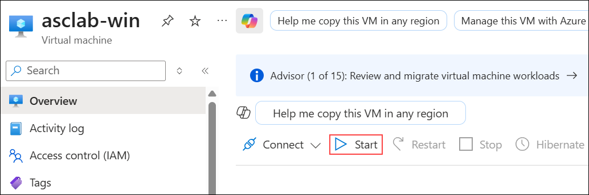

1. On the VM **Overview** page, click **Connect (1)** and select **Connect (2)** from the dropdown.

    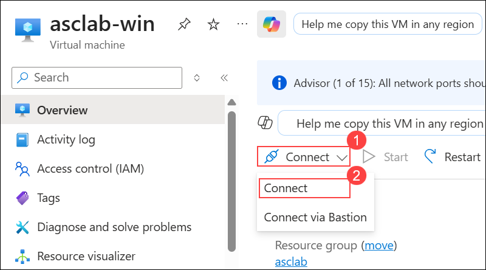

1. On the **Native RDP** page, click **Download RDP file** to download the connection file.

     

    > **Note**: If you get a Downloads notification, select **Keep**

     

1. Click on the downloaded file to initiate a remote connection to the server. On the warning message, ignore the message by clicking on **Connect**.

    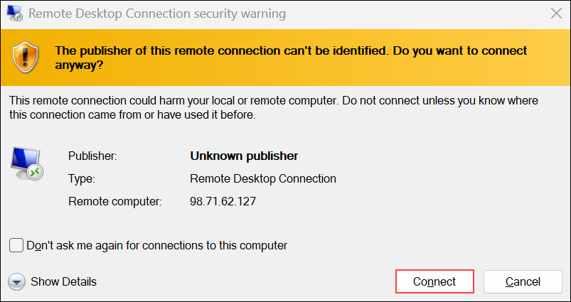

1. You should see the following error message: *Remote Desktop can't connect to the remote computer*. In this scenario, remote access to the server is not enabled. Close the popup window to continue.

    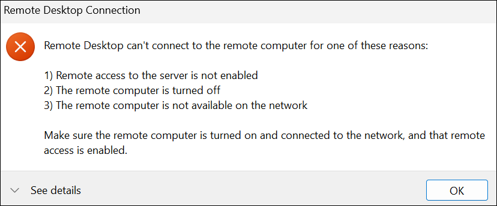

1. Return to the VM blade **Connect** page, click on **Request access** under **Request just-in-time access**, select **Local machine IP** and then click on **Request access**. The access should be approved in a minute. 

     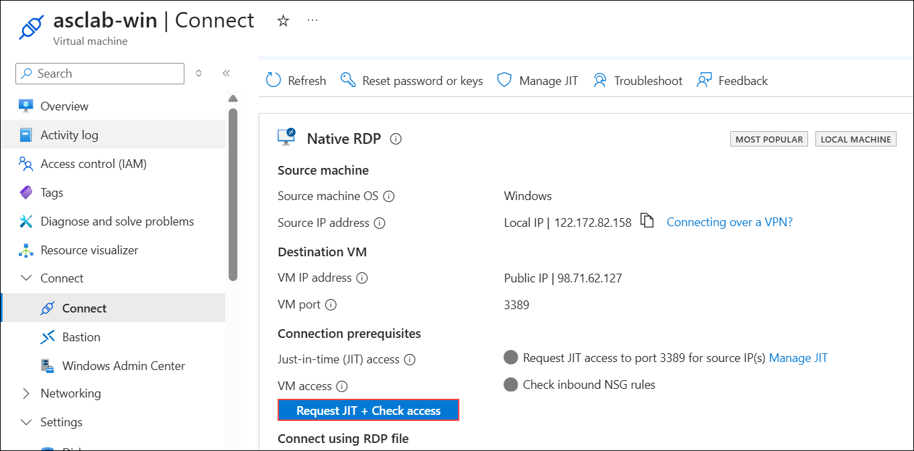
    
1. Verify that **JIT access** is granted and **port 3389** is accessible from the source IP, as indicated by the green checks.

    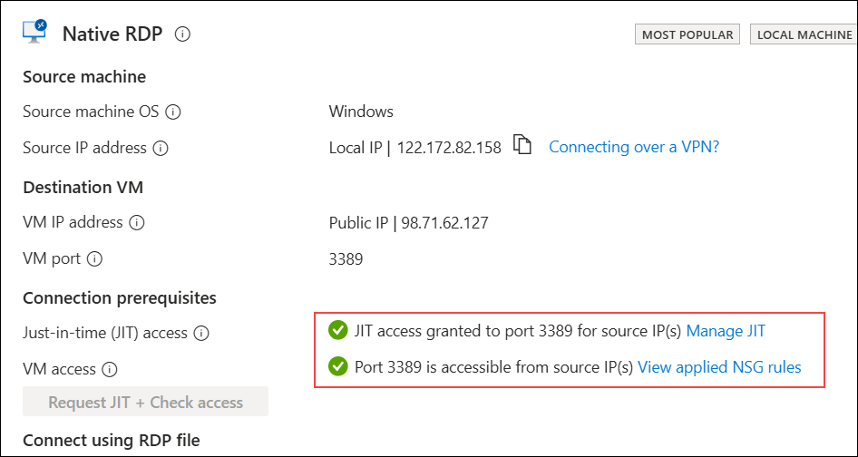

1. Try to connect again to validate your JIT access to the VM. Use the same file you downloaded previously.

    

1. When the Windows Security prompt appears, click **More choices** to select a different account.

    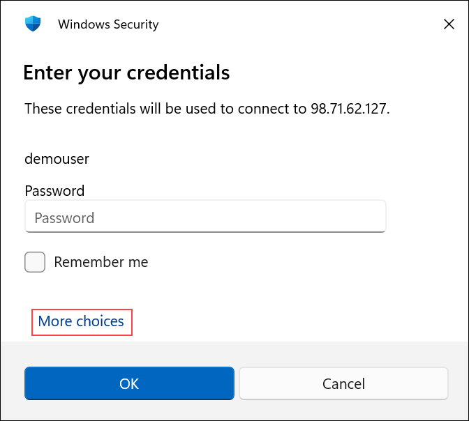

    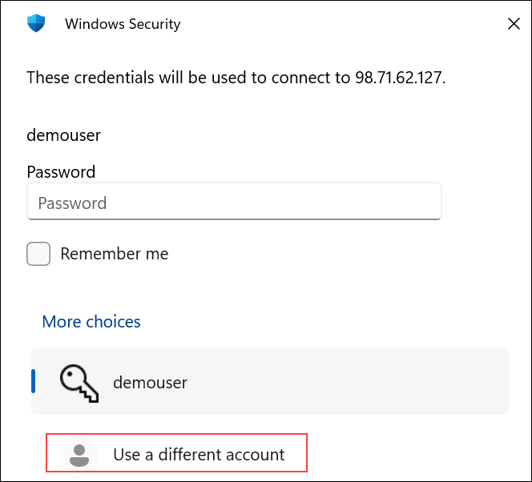

1. Now you should get the prompt for the local admin credentials. Login using the below credentials.
 
      - **VM Username**: .\demouser
      - **VM Password**: <inject key="VM Password"></inject>

          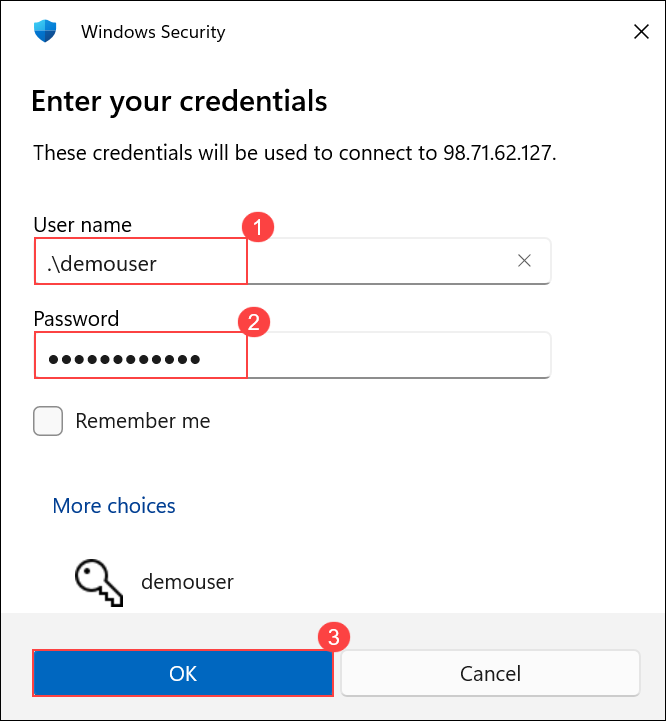

1. When the certificate warning appears, click **Yes** to continue connecting to the virtual machine.

    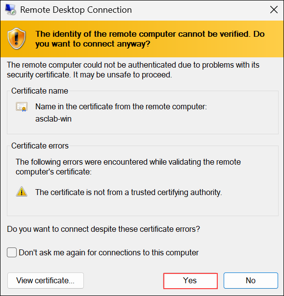

1. You **are now connected to asclab-win** server. Close the remote control session/log off.

    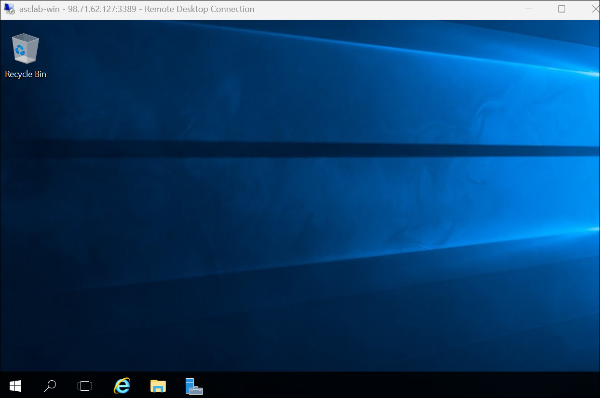 

### Exercise 2: File Integrity Monitoring

File integrity monitoring (FIM), also known as change monitoring, examines operating system files, Windows registries, application software, Linux system files, and more. It detects and reports changes that might indicate an attack.

In this exercise, you will be working with the file integrity monitoring under workload protection in Microsft defender for cloud.

It maps the current state of these items with the state during the previous scan and alerts you if any suspicious modifications have been made. To enable FIM, follow the instructions below:

1. Type **Microsoft Defender for Cloud** in the search box located on the top of the **Azure Portal** page and click on it, then select **Workload protections** under **Cloud Security** from the left side pane.

1. Navigate to the bottom section under Advanced Protection, and click on the **File Integrity Monitoring** tile.

    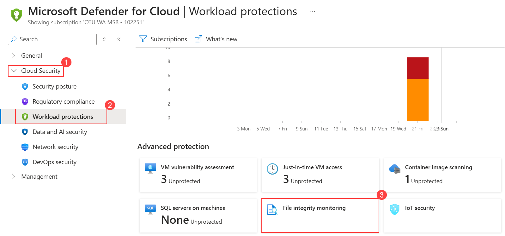

1. On the **File Integrity Monitoring** page, click **Settings** to configure FIM options.

    

1. On the **FIM settings** page, select your **subscription** to view or modify its File Integrity Monitoring configuration.

    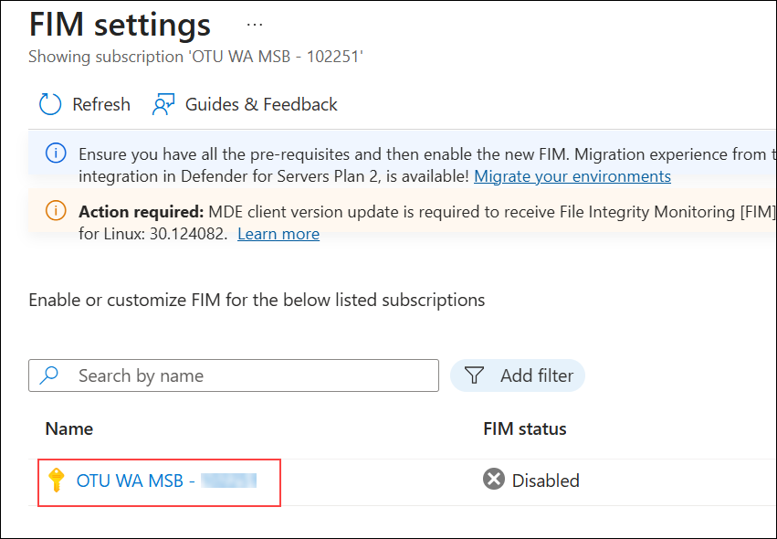

1. On the **FIM configuration** page, select the **Log Analytics workspace** named **asclab-la-<inject key="DeploymentID" enableCopy="false"/> (1)**, then click **Apply (2)** to enable File Integrity Monitoring.

    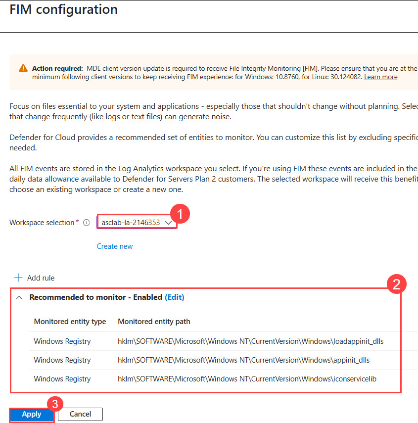

1. On the Enable File Integrity Monitoring window, review the default **recommended settings** for Windows files, Registry, and Linux files.

1. After applying the configuration, verify that the **FIM status** is now shown as **Enabled** for your subscription.

    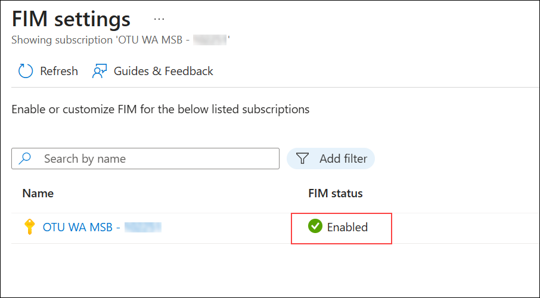
    
## Summary

In this module, you have completed exploring different **Microsoft Defender for Cloud** features - **Used JIT to reduce the attack surface**, **Adaptive Application Control** and **File Integrity Monitoring**. You have reached the end of the lab.
