# Module 8 – Advance Cloud Defense

### Overview

In this exercise, you will be exploring the Microsoft Defender for Cloud features for Advanced Cloud Defense

You will be performing the following activities to achieve the goal:

* Using JIT (just-in-time access to VMs) to reduce the attack surface
* Using Application control to deal with malicious and/or unauthorized software
* Using File integrity monitoring (FIM) to monitor Operating System files

### Exercise 1: Using JIT to reduce the attack surface

In the simplest terms, the “attack surface” is the sum total of resources exposed to exploit within your enterprise. Defending the attack surface was a lot less complicated when a defined corporate “perimeter” existed, neatly separating a company’s assets from the outside world using **Just-in-time VM access**.

1. Launch **Azure Portal** using the desktop icon on the **labvm-xxxxxx** and log in with the Azure credentials from the Lab **Environment Details** tab.

2. Type **Microsoft Defender for Cloud** in the search box located on the top of the **Azure Portal** page and click on it, then select **Workload protections** under **Cloud Security** from the left side pane.

    

3. Navigate to the bottom section under **Advanced protection** and click on **Just-in-time VM access** (You should see unprotected status number).

    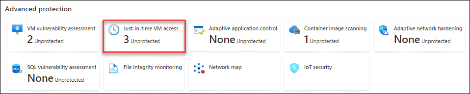

4. When you are on the **Just-in-time VM access** page, select the **Not configured** tab. You should see virtual machines listed: `asclab-linux` and `asclab-win`.
    
    > **Note**: If the virtual machines `asclab-linux` and `asclab-win` are present under the **Unsupported** tab, then follow the below instructions to enable **Just-in-time VM access**.
    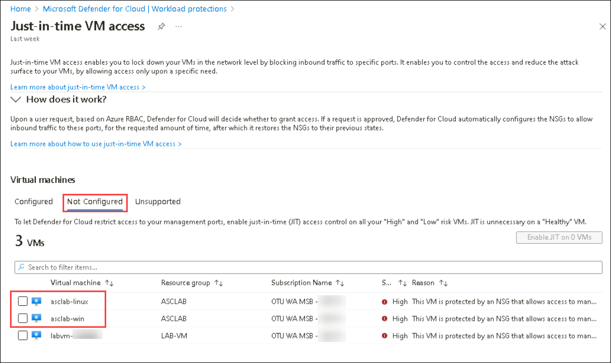

    - Navigate to **asclab** resource group and select **asclab-win** virtual machine.
       - Select **Configuration** from the left-hand side menu and click on **Enable Just-in-time**
       
           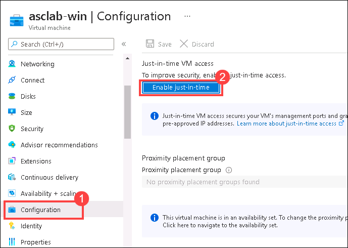
       
       - Navigate back to **Microsoft Defender for Cloud** and select **Workload protections** under **Cloud Security** from the left side pane, then click on **Just-in-time VM access**.
       - Review the **Configured** tab, now you should see your VM configured: `asclab-win`

           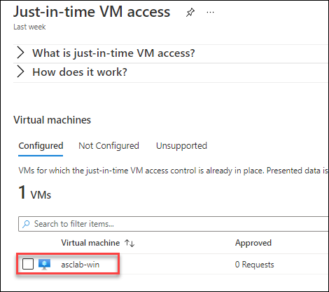
    
5. Select **asclab-win** and then click on the **Enable JIT on 1 VM** button.
    > If you have followed the above instructions to enable **Just-in-time VM access**, you can skip Steps 5-8 and continue from Step 9.
    
    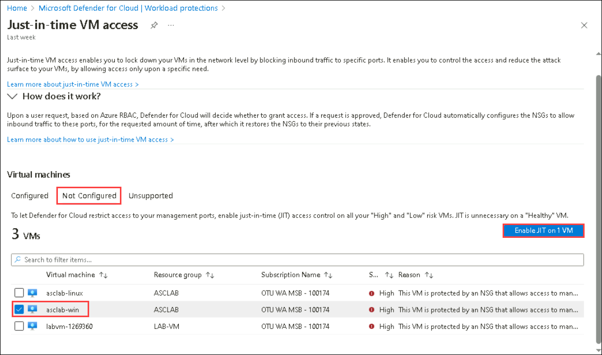

6. On the **JIT VM access configuration** page, keep just the **3389 (RDP) port** and remove all the other ports listed. To remove, click on the ellipses icon (...) for each port and then click on **Delete**.

7. Click **Save** to apply the VM access configuration.

    

8. Review the **Configured** tab, now you should see your VM configured: `asclab-win`.

9. Type **Virtual machines** in the search box located at the top of the Azure Portal page and click on it.

10. Select the virtual machine **asclab-win**.

11. From the left side menu, click on **Connect** button and then in the **Native RDP** tab choose **Select**.

     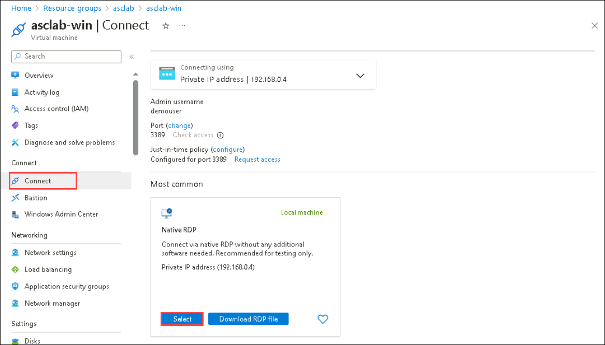

    > **Note**: If you get a pop up window saying **Your Virtual machine is stopped** then select **Start VM**

12. On the **Native RDP** section, click on the **Download RDP file** button. Alternatively, from the VM blade, look for the Public IP address and try to connect using RDP.

     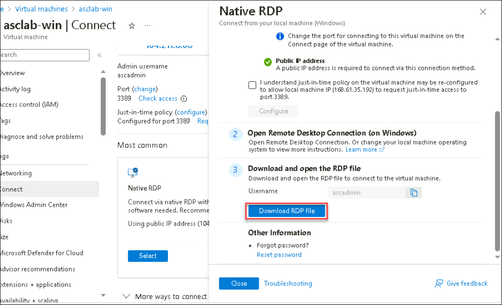

    > **Note**: If you get a Downloads notification, select **Keep**

     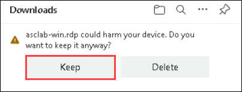

13. Click on the downloaded file to initiate a remote connection to the server. On the warning message, ignore the message by clicking on **Connect**.

14. You should see the following error message: *Remote Desktop can't connect to the remote computer*. In this scenario, remote access to the server is not enabled. Close the popup window to continue.

15. Return to the VM blade **Connect** page, click on **Request access** under **Request just-in-time access**, select **Local machine IP** and then click on **Request access**. The access should be approved in a minute. 

     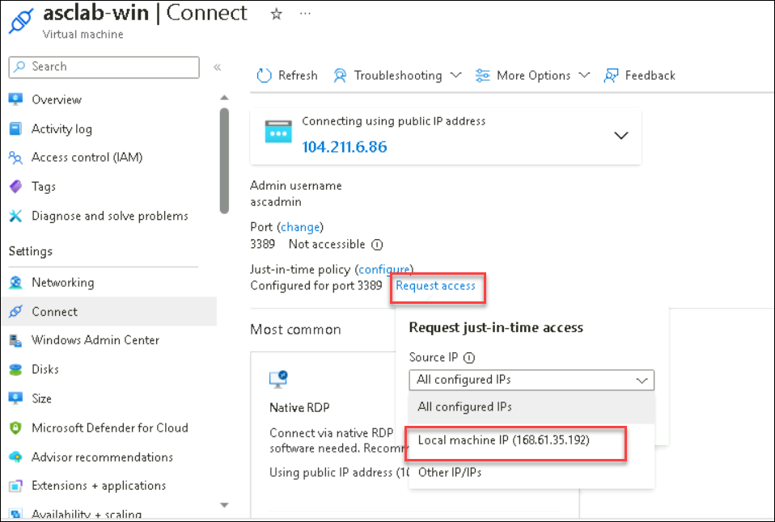

16. Try to connect again to validate your JIT access to the VM. Use the same file you downloaded previously.

17. Now you should get the prompt for the local admin credentials. Login using the below credentials.
 
      - **VM Username**: demouser
      - **VM Password**: <inject key="VM Password"></inject>

18. You **are now connected to asclab-win** server. Close the remote control session/log off.

### Exercise 2: Adaptive Application Control

Application control helps you deal with malicious and/or unauthorized software, by allowing only specific applications to run on your machines.

1. Type **Microsoft Defender for Cloud** in the search box located on the top of the **Azure Portal** page and click on it, then select **Workload protections** under **Cloud Security** from the left side pane.

2. Navigate to the bottom section under Advanced protection, click on **Adaptive application control**

    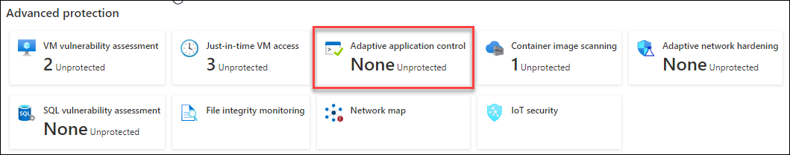

3. The Adaptive application controls page opens with your VMs grouped into the following tabs: Configured, Recommended and No Recommendation.

4. Click on the **Recommended** tab.

    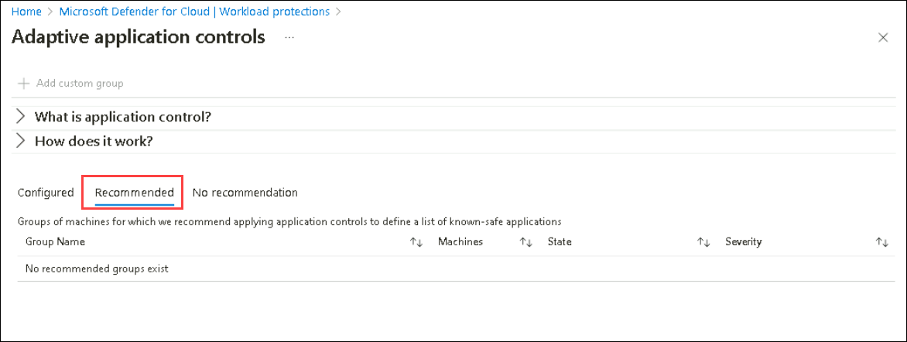

    >**Note:** First-time users will not get any group information under the Group Name section. This is because Microsoft Defender for Cloud needs at least two weeks of data to define the unique recommendations per group of machines. 

### Exercise 3: File Integrity Monitoring

File integrity monitoring (FIM), also known as change monitoring, examines operating system files, Windows registries, application software, Linux system files, and more. It detects and reports changes that might indicate an attack.
It maps the current state of these items with the state during the previous scan and alerts you if any suspicious modifications have been made. To enable FIM, follow the instructions below:

1. Type **Microsoft Defender for Cloud** in the search box located on the top of the **Azure Portal** page and click on it, then select **Workload protections** under **Cloud Security** from the left side pane.

2. Navigate to the bottom section under Advanced Protection, and click on the **File Integrity Monitoring** tile.

    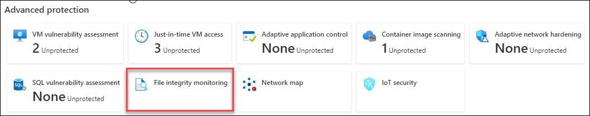

3. On the **File Integrity Monitoring** page, select the listed **Log Analytics workspace** named **asclab-la-<inject key="DeploymentID" enableCopy="false"/>** (or just by clicking on the Enable button - it indicates that File Integrity Monitoring is not enabled for the selected workspace).

   > **Note**: Deployment ID can be obtained from the Lab Environment output page.

   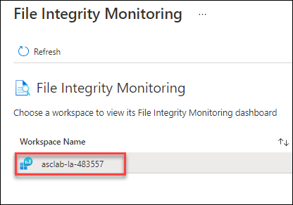

4. On the Enable File Integrity Monitoring window, review the default **recommended settings** for Windows files, Registry, and Linux files.

5. Click on the **Enable File Integrity Monitoring** button.

    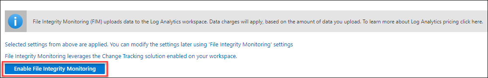

> **Congratulations** on completing the task! Now, it's time to validate it. Here are the steps:
 
- Navigate to the Lab Validation Page, from the upper right corner in the lab guide section.
- Hit the Validate button for the corresponding task. If you receive a success message, you can proceed to the next task. 
- If not, carefully read the error message and retry the step, following the instructions in the lab guide.
- If you need any assistance, please contact us at labs-support@spektrasystems.com. We are available 24/7 to help you out.
    <validation step ="1e2354f0-1f25-4c38-a196-008d267eca18" />
### Summary

  * In this module, you have completed exploring different **Microsoft Defender for Cloud** features - **Used JIT to reduce the attack surface**, **Adaptive Application Control** and **File Integrity Monitoring**. You have reached the end of the lab.
