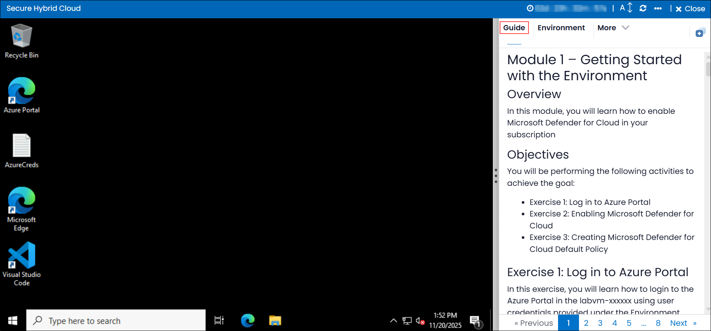
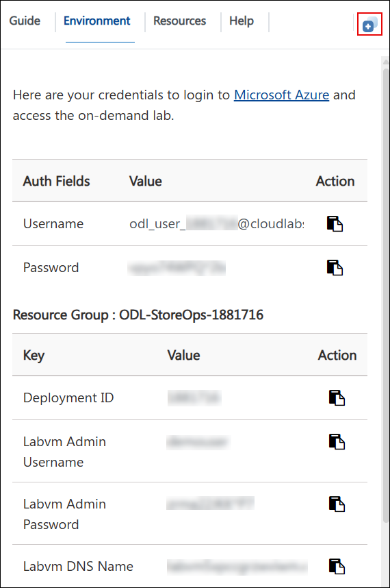
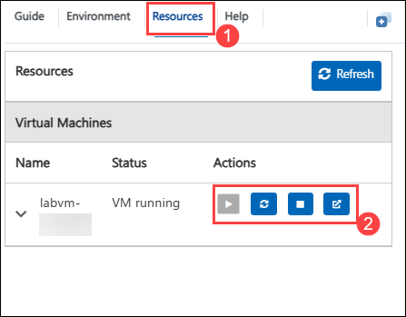
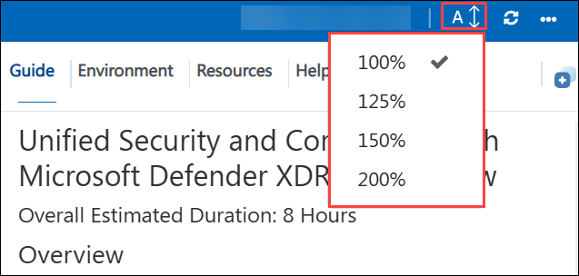
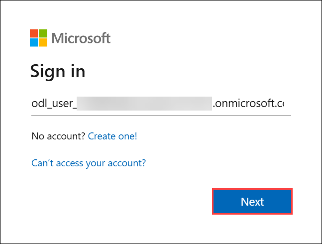
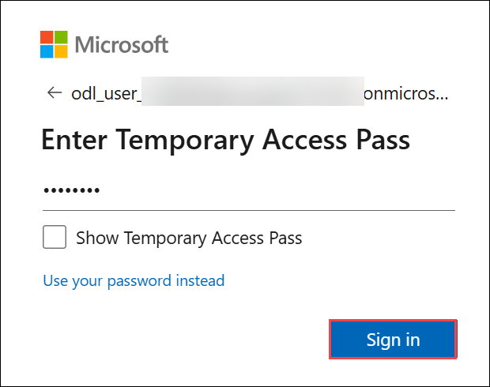
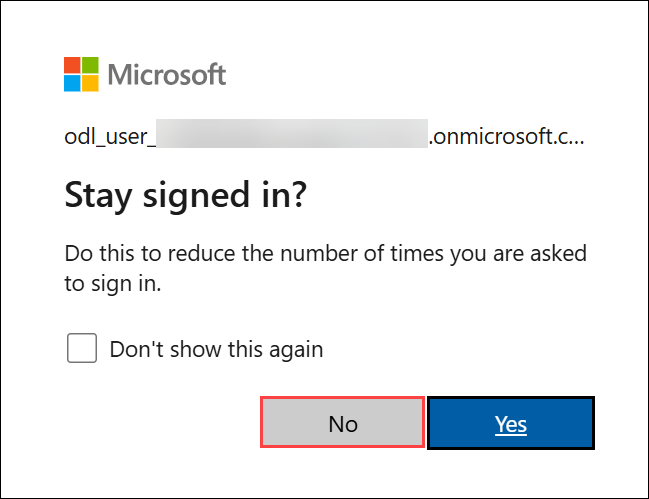

# Secure Hybrid Cloud

## Overview

In this lab, you will learn how to secure hybrid cloud environments using Microsoft Defender for Cloud (formerly Azure Security Center). You will start by enabling Defender for Cloud on your Azure subscription and configuring data collection settings. Next, you will explore the Defender for Cloud dashboard, understand secure scores, recommendations, and inventory capabilities. You will then dive into security policies, regulatory compliance assessments, and methods to improve your secure posture. The lab covers enabling Azure Defender plans for advanced threat protection, exporting security data to a SIEM system, and implementing advanced cloud defense strategies. By the end, you will have hands-on experience in monitoring, assessing, and enhancing the security of your hybrid cloud workloads.

## Objective 

This lab provides practical experience in securing hybrid cloud environments with Microsoft Defender for Cloud. Participants will learn to enable and configure Defender for Cloud, assess security posture through dashboards and recommendations, manage security policies, ensure regulatory compliance, and implement advanced threat protection. The lab also covers integrating security insights with SIEM systems and applying advanced defense techniques to protect Azure, on-premises, and multi-cloud resources.
  
## Getting Started with the Lab
 
Welcome to your Secure Hybrid Cloud workshop! We've prepared a seamless environment for you to familiarize yourself to explore and understand the integrated capabilities of Microsoft Defender XDR and Microsoft Purview in strengthening organizational security and compliance. Through this lab, you will gain hands-on experience in implementing threat protection, investigating incidents, and safeguarding sensitive data across Microsoft 365 services. Let’s begin by making the most of this unified security and compliance experience!

## Accessing Your Lab Environment
 
Once you're ready to dive in, your virtual machine and **Guide** will be right at your fingertips within your web browser.



## Virtual Machine & Lab Guide

Your virtual machine is your workhorse throughout the workshop. The lab guide is your roadmap to success.

## Exploring Your Lab Resources

To get a better understanding of your lab resources and credentials, navigate to the **Environment** tab.

 

## Utilizing the Split Window Feature

For convenience, you can open the lab guide in a separate window by selecting the **Split Window** button from the Top right corner.

 

## Managing Your Virtual Machine

Feel free to **Start, Stop, or Restart (2)** your virtual machine as needed from the **Resources (1)** tab. Your experience is in your hands!

   

## Lab Guide Zoom In/Zoom Out

To adjust the zoom level for the environment page, click the **A↕ : 100%** icon located next to the timer in the lab environment.

  

## Let's Get Started with Microsoft Defender

1. On your virtual machine desktop, double-click the **Microsoft Edge browser** shortcut to open the browser.

1. In the Microsoft Edge browser window, navigate to the Microsoft Defender portal using the URL below:

   ```
   https://security.microsoft.com
   ```

1. When the **Sign in** window is prompted, enter the following **email/username** and then click on **Next**.

     - **Email/Username:** <inject key="AzureAdUserEmail"></inject>

       

1. Now, enter the **Temporary Access Password** and click on **Sign in**.

    - **Password:** <inject key="AzureAdUserPassword"></inject>

      

1. If you see the pop-up **Stay Signed in?**, click **No**.

     

1. If a **Welcome to Microsoft Azure** pop-up window appears, simply click **Cancel** to skip the tour.

## Support Contact

The CloudLabs support team is available 24/7, 365 days a year, via email and live chat to ensure seamless assistance at any time. We offer dedicated support channels tailored specifically for both learners and instructors, ensuring that all your needs are promptly and efficiently addressed.

  Learner Support Contacts:

   - Email Support: cloudlabs-support@spektrasystems.com
   - Live Chat Support: https://cloudlabs.ai/labs-support

Now, click on **Next** from the lower right corner to move on to the next page.

   


### Happy Learning!!
