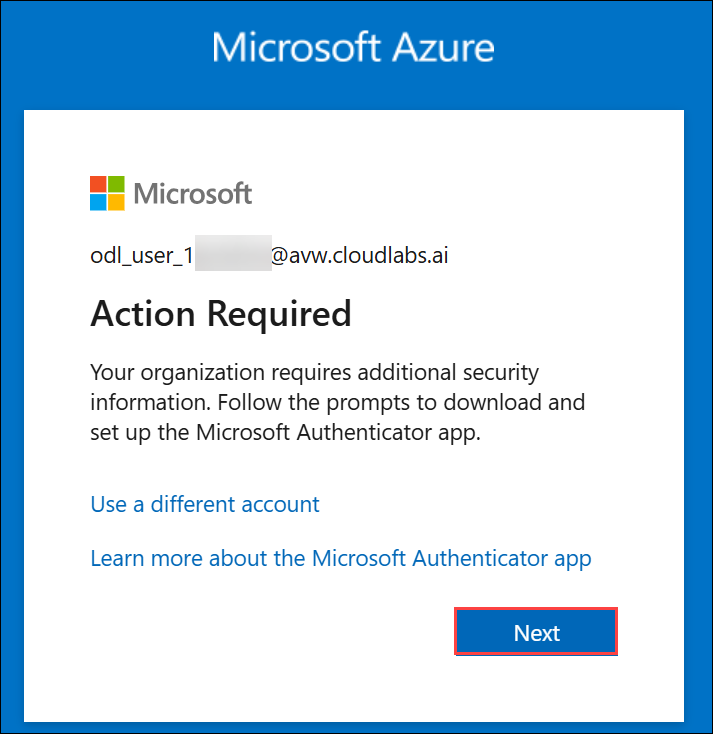
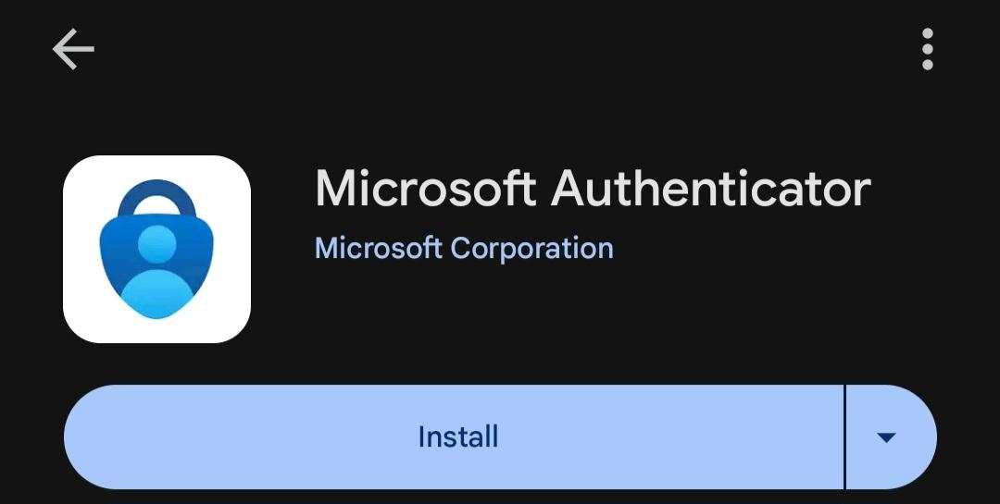
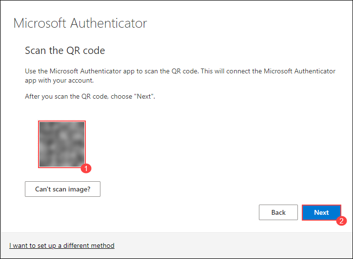
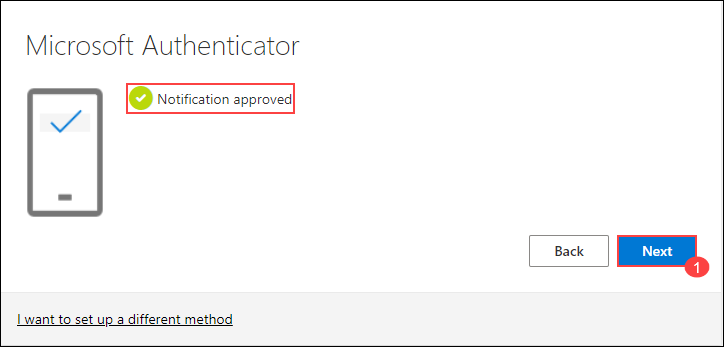

# Unified Security and Compliance with Microsoft Defender XDR and Purview

### Overall Estimated Duration: 6 Hours

## Overview

In this lab, you will explore Microsoft Defender for Office 365 and Microsoft Defender XDR to implement layered protection against phishing, malware, and advanced email threats. You will begin by enabling Microsoft Defender Cloud Security Posture Management (CSPM) and configuring both standard and strict preset security policies. Next, you will create custom Anti-Phishing and Safe Links policies, set up alert rules, and simulate phishing and malware attacks using Attack Simulation Training to evaluate user awareness.

You will then analyze threats using Threat Explorer and real-time detections, investigate user activity, and remediate incidents using Defender XDR through both automated and manual actions. In the later part of the lab, you will transition to Microsoft Purview to focus on information protection by creating and publishing sensitivity labels, configuring message encryption, and classifying files using the Unified Labeling Client. Finally, you will implement and investigate Data Loss Prevention (DLP) policies and alerts to strengthen compliance and ensure end-to-end data security across the Microsoft 365 ecosystem.

## Objective 

This lab provides hands-on experience in securing, classifying, and monitoring organizational data using Microsoft Defender for Office 365, Microsoft Defender XDR, and Microsoft Purview. Participants will learn to configure threat protection policies, simulate and analyze phishing and malware attacks, and remediate incidents using automated investigation workflows. The lab also covers creating and publishing sensitivity labels, configuring message encryption, and implementing Data Loss Prevention (DLP) policies and alerts. By completing these exercises, participants will gain practical skills to strengthen data security, compliance, and threat response across Microsoft 365 environments.

## Prerequisites

Participants should have: 
 
  - Basic understanding of Microsoft 365 security architecture.
  
  - Familiarity with Microsoft Defender for Office 365 and Defender XDR portals.
  
  - Experience with configuring security policies in Microsoft 365.

  - Awareness of phishing, malware, and email-based threat vectors.

  - Familiarity with Microsoft Purview portal.

  - Understanding of Microsoft 365 Defender portal.
  

## Architecture

This architecture flow illustrates the complete security lifecycle for protecting organizational data using Microsoft Defender and Microsoft Purview. It starts with configuring threat protection policies in Microsoft Defender for Office 365 to safeguard users from phishing, malware, and malicious links. Simulated phishing and malware attacks are then executed and analyzed using Microsoft Defender XDR to evaluate detection, response, and user behavior. The workflow continues with Microsoft Purview, where sensitivity labels are created and published to classify data, followed by configuring message encryption and Data Loss Prevention (DLP) policies to protect and monitor sensitive information. Together, these integrated solutions ensure continuous protection, compliance, and visibility across the Microsoft 365 environment.

## Explanation of Components

- **Microsoft Defender for Office 365:** A cloud-based email filtering and threat protection service that safeguards against phishing, malware, and advanced attacks in Microsoft 365.

- **Microsoft Defender XDR:** An integrated security platform that correlates signals across email, identity, endpoints, and cloud apps to detect, investigate, and respond to advanced threats.

- **Cloud Security Posture Management (CSPM):** A set of tools and capabilities within Microsoft Defender to assess, monitor, and improve your organization’s cloud security posture.

- **Anti-Phishing and Safe Links Policies:** Policy configurations that detect and block malicious senders, domains, and URLs, ensuring safe email and link handling.

- **Attack Simulation Training:** A Defender for Office 365 feature that allows security teams to run realistic phishing and malware attack scenarios to train and assess users.

- **Threat Explorer:** A real-time threat analysis tool that provides visibility into malicious emails, URLs, and attachments in your Microsoft 365 environment.

- **Microsoft Purview:** The core compliance and data protection platform. It helps classify, label, monitor, and protect sensitive organizational data across Microsoft 365 services.

- **Sensitivity Labels:** Used to classify and protect content in documents and emails. Labels can enforce encryption, content markings, and access restrictions.

- **Data Loss Prevention (DLP) Policies:** Detect and prevent the sharing of sensitive information such as credit card numbers, personal data, or confidential business content. Policies can trigger alerts, block sharing, or assign training.

- **Message Encryption:** Ensures that email content is protected by applying encryption rules, maintaining confidentiality for both internal and external communications.

## Getting Started with the Lab
 
Welcome to your Unified Security and Compliance with Microsoft Defender XDR and Purview workshop! We've prepared a seamless environment for you to familiarize yourself to explore and understand the integrated capabilities of Microsoft Defender XDR and Microsoft Purview in strengthening organizational security and compliance. Through this lab, you will gain hands-on experience in implementing threat protection, investigating incidents, and safeguarding sensitive data across Microsoft 365 services. Let’s begin by making the most of this unified security and compliance experience!

## Accessing Your Lab Environment
 
Once you're ready to dive in, your virtual machine and **Guide** will be right at your fingertips within your web browser.


## Virtual Machine & Lab Guide

Your virtual machine is your workhorse throughout the workshop. The lab guide is your roadmap to success.

## Exploring Your Lab Resources

To get a better understanding of your lab resources and credentials, navigate to the **Environment** tab.

 

## Utilizing the Split Window Feature

For convenience, you can open the lab guide in a separate window by selecting the **Split Window** button from the Top right corner.

 

## Managing Your Virtual Machine

Feel free to **Start, Stop, or Restart (2)** your virtual machine as needed from the **Resources (1)** tab. Your experience is in your hands!

   

## Lab Guide Zoom In/Zoom Out

To adjust the zoom level for the environment page, click the **A↕ : 100%** icon located next to the timer in the lab environment.

  

## Let's Get Started with Microsoft Defender

1. On your virtual machine desktop, double-click the **Microsoft Edge browser** shortcut to open the browser.

1. In the Microsoft Edge browser window, navigate to the Microsoft Defender portal using the URL below:

   ```
   https://security.microsoft.com
   ```

1. When the **Sign in** window is prompted, enter the following **email/username** and then click on **Next**.

     - **Email/Username:** <inject key="AzureAdUserEmail"></inject>

       

1. Now, enter the **Temporary Access Password** and click on **Sign in**.

    - **Password:** <inject key="AzureAdUserPassword"></inject>

      

1. If you see the pop-up **Stay Signed in?**, click **No**.

     

## Steps to Proceed with MFA Setup if the "Ask Later" Option is Not Visible [Optional]

1. If you see the pop-up **Stay Signed in?**, click **No**.

1. If **Action required** pop-up window appears, click on **Next**.

   

1. On **Start by getting the app** page, click on **Next**.

1. Click on **Next** twice.

1. In **android**, go to the play store and Search for **Microsoft Authenticator** and Tap on **Install**.

   

   > **Note:** For iOS, open the App Store and repeat the steps.

   > **Note:** Skip if already installed.

1. Open the app and tap on **Scan a QR code**.

1. Scan the QR code visible on the screen **(1)** and click on **Next (2)**.

   

1. Enter the digit displayed on the Screen in the Authenticator app on your mobile and tap on **Yes**.

1. Once the notification is approved, click on **Next**.

   

1. Click on **Done**.

1. If prompted to stay signed in, you can click **"No"**.

1. Tap on **Finish** in the Mobile Device.

   > **NOTE:** While logging in again, enter the digits displayed on the screen in the **Authenticator app** and click on Yes.

1. If a **Welcome to Microsoft Azure** pop-up window appears, simply click **Cancel** to skip the tour.

## Support Contact

The CloudLabs support team is available 24/7, 365 days a year, via email and live chat to ensure seamless assistance at any time. We offer dedicated support channels tailored specifically for both learners and instructors, ensuring that all your needs are promptly and efficiently addressed.

  Learner Support Contacts:

   - Email Support: cloudlabs-support@spektrasystems.com
   - Live Chat Support: https://cloudlabs.ai/labs-support

Now, click on **Next** from the lower right corner to move on to the next page.

   

### Happy Learning!!